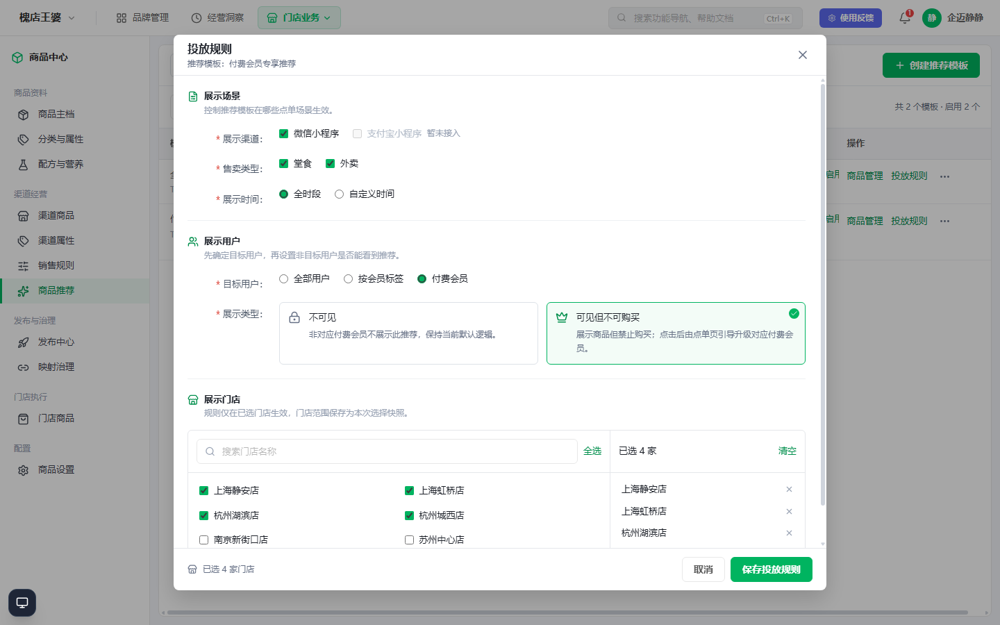

# 【商品推荐】付费会员投放新增展示类型

工作项类型：需求

业务线：平台中心-技术平台部-基础服务组

客户名：无

产品经理：周镇

QA：周镇

## 一、需求背景

商品推荐的现有投放规则可将展示用户设为“付费会员”，非对应付费会员用户默认看不到该推荐。部分商户希望让这些用户看到会员专享商品，但在购买前引导其升级对应的付费会员。

## 二、现状及痛点

现有付费会员投放仅有“非对应用户不可见”的行为，商户不能通过可见的会员商品向非对应用户展示权益并形成升级入口。

## 三、需求目标

在不改变现有推荐活动、模板及其他投放规则的前提下，让商户可配置非对应付费会员用户对该推荐的可见和购买状态；历史配置保持原行为。

## 四、产品方案

### 4.1 付费会员投放的展示类型

- 入口：商品中心 → 商品推荐 → 含商品配置的推荐模板 → 投放规则。
- 仅在“展示用户”选中“付费会员”时，显示必选的“展示类型”；其他展示用户选项不展示、也不应用此配置。
- “不可见”（默认）：非对应付费会员用户看不到该推荐，维持现有行为。
- “可见但不可购买”：非对应用户可看到对应推荐商品，但不能购买；点单页面提供升级对应付费会员的引导。对应的付费会员仍按原有规则正常展示和购买。
- 保存与编辑权限沿用现有投放规则权限，不新增权限点。保存失败保留当前选择，可重新提交；成功后回显已保存值。
- 历史付费会员投放规则及无新字段的存量配置默认按“不可见”处理。

图 4-1：商品推荐 - 付费会员投放规则的展示类型（飞书正文中按约 800px 宽插入）

## 五、业务规则与异常场景

| 用户与配置 | 推荐展示 | 购买与点单处理 |
| --- | --- | --- |
| 对应付费会员；任一展示类型 | 按现有规则展示 | 按现有购买规则处理 |
| 非对应用户；不可见 | 不展示 | 无购买入口 |
| 非对应用户；可见但不可购买 | 展示对应商品 | 禁止购买，提供升级对应付费会员的引导 |

购买资格必须由服务端校验，不能仅依赖前端按钮的禁用状态；未取得对应会员资格时不得通过加购、下单接口绕过限制。升级成功后应重新校验资格；升级失败或资格校验失败时仍不得购买，并沿用现有会员链路的异常反馈。这些是点单端与服务端的实现/验收约束，不在商家投放规则配置界面展示。

## 六、兼容与影响范围

本期仅新增付费会员投放规则下的“展示类型”配置以及其对应的点单展示、购买资格处理。已有推荐活动、推荐模板、商品管理、展示渠道、售卖类型、展示时间、展示门店等能力保持原状；不改变商品、SKU 与会员权益定义。历史规则默认“不可见”。

## 七、验收标准

1. 仅选中“付费会员”时出现必选“展示类型”，选项为“不可见”“可见但不可购买”；新建默认“不可见”。
2. 已有付费会员投放配置不修改时，非对应用户继续不可见；编辑保存后能正确回显新配置。
3. 对应付费会员在任一配置下均按原有规则展示和购买。
4. 非对应用户选择“不可见”时看不到推荐；选择“可见但不可购买”时看得到商品但不能加购或下单，点单页面可引导其升级对应付费会员。
5. 会员升级成功后重新校验资格并允许符合资格的用户购买；升级或校验失败时不得购买，并呈现现有会员链路的失败反馈。
6. 绕过前端直接调用加购或下单接口，服务端仍阻止无资格用户购买。
7. 其他展示用户选项及既有推荐/投放配置不受新字段影响；无编辑权限者无法修改，接口执行现有权限校验。

## 八、本期不做

不改造既有推荐活动、推荐模板、商品管理及其他投放规则；不新建会员权益或独立的升级流程。
