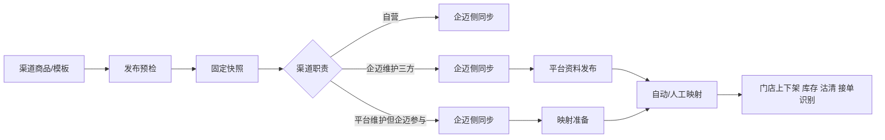

# 商品中心全渠道商品管理产品方案

> 版本：v2.0 · 2026-08-09  
> 文档定位：面向未来 2—3 年的总体产品方案，说明为什么建设、与旧商品中心相比改了什么、核心模型和落地边界。  
> 详细需求权威入口：[全渠道商品管理领域全景与全流程](../需求文档/全渠道商品管理/00-领域全景与全流程.md)。字段、状态、规则、异常、测试和验收以对应 P01—P09、S01 为准。

---

## 1. 方案结论

全渠道商品管理不是再增加一个“平台商品”入口，而是把商品从创建、组织渠道卖法、发布、映射到门店经营形成一条完整链路：

```text
商品主档 → 渠道商品库 → 售卖规则/模板 → 发布中心 → 门店渠道商品/平台商品 → 映射治理 → 门店经营
```

本次方案确认以下核心决策：

1. 商品主档维护统一身份、共用资料和标准结构；渠道商品维护渠道展示、售卖和专属属性。
2. 统一维护与分渠道协作使用同一菜单结构，差异由商品库数量、职责、默认行为和数据权限表达。
3. 统一维护只有一个系统默认渠道商品库；分渠道协作可配置多个渠道商品库。
4. 渠道商品库支持“从已有主档添加”，也可按品牌配置“同时创建主档+渠道商品”；标准商品和套餐商品都支持。
5. 一次创建时共用资料只填写一次，渠道名称、图片、类目、结构和 SKU 售价初始继承主档；渠道专属字段在同一流程补充。
6. 后续维护明确分为“编辑主档”和“编辑渠道资料”，不提供归属不清的组合编辑动作。
7. 渠道商品库是数据权限边界；有菜单权限不代表能查看所有渠道商品库。
8. 平台维护商品资料但企迈参与接单、上下架、库存或沽清时，渠道仍需归入渠道商品库并生成企迈侧商品和映射准备；不发布平台资料。
9. 门店售卖规则承接商品、SKU、公共做法和公共加料的门店渠道例外；商品模板弱化为复杂集合和多字段差异能力。
10. 差异巡检后置，当前优先建设发布和映射闭环。

## 2. 与旧商品中心相比的变化

| 领域 | 旧方式 | 新方案 | 价值 |
|---|---|---|---|
| 商品身份 | 商品档案、模板、平台菜单都可能成为事实来源 | 主档是唯一身份和标准结构来源 | 避免重复商品和字段归属不清 |
| 渠道资料 | 分散在模板、平台菜单、门店商品 | 统一进入渠道商品库 | 形成清晰的品牌级渠道售卖层 |
| 管理模式 | 模式变化导致菜单和入口变化 | 菜单固定，商品库数量和权限变化 | 降低培训和迁移成本 |
| 建品 | 先建主档，再到渠道添加 | 可选已有主档或一次创建两个对象 | 减少重复录入和页面跳转 |
| 组织权限 | 菜单权限常等于全部数据权限 | 菜单+动作+商品库数据权限 | 不同渠道团队互不越权 |
| 商品模板 | 简单和复杂差异都依赖模板 | 售卖规则优先，模板承接复杂差异 | 降低日常操作门槛 |
| 发布 | 同步动作和记录分散 | 固定快照、任务拆分、部分成功、失败重试 | 发布结果可解释、可恢复 |
| 三方平台 | 平台维护常被排除在企迈商品体系外 | 资料维护权与企迈参与能力分开判断 | 保留接单和经营能力 |
| 映射 | 一次性绑定 | 未映射、推荐、冲突、失效、影响和修正闭环 | 在经营异常前发现问题 |
| 门店执行 | 商品、覆盖、分类、属性和区域入口分散 | 收敛为门店商品页内视图 | 高频经营操作更集中 |
| 待办协作 | 靠人工沟通 | 领域事件自动建单、路由、SLA和深链 | 责任清晰，问题不丢失 |

## 3. 目标与非目标

### 3.1 产品目标

- 任一渠道或平台 SKU 可追溯到唯一主档 SKU。
- 用户一次准备商品即可完成多渠道发布，不需要理解内部任务系统。
- 不同团队在授权渠道商品库内独立协作，不越权修改其他渠道。
- 平台维护和企迈维护两种路径都能完成企迈侧商品、映射和门店经营闭环。
- 失败范围可定位、可重试、可审计，历史结果不因后续编辑而改变。

### 3.2 非目标

- 商品中心不接管三方订单、履约、结算和平台营销活动。
- 商品中心不成为平台映射关系的权威存储，映射仍归平台服务。
- 本期不开放没有稳定平台实际值和处置能力的字段差异巡检。
- 本期不建设任意 BPM 或商家自由编排任务流。
- 门店与平台绑定、授权和费用不进入商品中心正式菜单。

## 4. 核心产品模型

| 对象 | 核心职责 | 不承担 |
|---|---|---|
| 商品主档 | 商品身份、公共资料、SPU/SKU、规格、做法、加料、套餐结构 | 渠道售价、前台展示和平台专属资料 |
| 渠道商品库 | 一组渠道共用的品牌级渠道商品集合，也是数据权限边界 | 新商品身份、平台真实商品权威数据 |
| 渠道商品 | 引用主档，默认继承并可覆盖当前商品库前台分类归属，维护渠道展示、售卖、渠道属性、平台类目映射和启用子集 | 独立新增 SKU/做法/加料结构或修改前台分类定义 |
| 商品模板 | 复杂商品集合、门店范围和多字段经营差异 | 新商品来源、日常简单可售限制 |
| 门店售卖规则 | 商品、SKU、公共做法、公共加料的门店渠道可售例外 | 改写商品结构或发布平台资料 |
| 发布批次 | 固定输入快照、拆分企迈/平台任务并聚合结果 | 平台接口调用细节 |
| 门店渠道商品 | 门店在某渠道的企迈侧经营对象 | 平台商品权威资料 |
| 商品映射 | 企迈门店渠道 SKU 与平台 SKU 的有效关系 | 商品身份和商品内容 |

### 4.1 结构继承边界

- SKU、规格、做法、加料和套餐结构归主档维护。
- 前台分类树和主档默认归属由商品主档维护；渠道商品只能从已有启用分类中覆盖当前商品库归属，不能修改分类定义，也不回写主档。
- 渠道商品首次创建默认继承主档当前结构，可禁用其中的子集，但不可新增主档不存在的对象。
- 主档新增结构时生成渠道确认任务；主档停用结构时下游强制停用并形成发布差异。
- 商品模板、门店售卖规则和门店渠道商品只能继续缩小范围，不能突破上游边界。

## 5. 全渠道策略

### 5.1 品牌协作方式

| 方式 | 商品库 | 菜单 | 典型组织 |
|---|---|---|---|
| 统一维护 | 一个品牌默认渠道商品库 | 与分渠道协作相同 | 一个团队维护全部渠道 |
| 分渠道协作 | 多个渠道商品库，一组一库 | 与统一维护相同 | 堂食、外卖、在线点等团队分工 |

切换协作方式只改变商品库数量、归组、职责和权限。有存量商品、模板、发布或映射时必须执行影响分析和迁移，不能通过隐藏菜单完成切换。

### 5.2 渠道资料维护与企迈参与能力

| 场景 | 是否归渠道商品库 | 商品资料 | 企迈侧任务 | 平台资料发布 |
|---|---|---|---|---|
| 自营渠道 | 是 | 企迈维护 | 生成门店渠道商品 | 不涉及 |
| 三方资料由企迈维护 | 是 | 渠道商品+平台专属字段 | 企迈同步+平台发布+映射 | 是 |
| 三方资料由平台维护，企迈参与经营 | 是 | 平台资料由平台维护；企迈侧商品来自所属库 | 企迈同步+映射准备 | 否 |
| 三方资料由平台维护，企迈完全不参与 | 否 | 平台/外部系统 | 无 | 否 |

“资料维护方”和“企迈参与能力”是两个独立维度。不能因为资料由平台维护，就默认渠道不进入商品库。

### 5.3 渠道商品创建方式

品牌可配置：

- **仅从主档添加**：渠道商品页突出“选择已有主档”，不允许维护主档资料。
- **允许同时创建主档+渠道商品**：渠道商品页同时提供“选择已有主档”和“新建商品”；创建标准/套餐时一次填写共用资料并原子生成两个对象。

无论采用哪种方式，后续编辑都明确分为“编辑主档”和“编辑渠道资料”，并分别校验权限。

## 6. 模板与售卖规则分工

| 场景 | 推荐能力 |
|---|---|
| 某些门店不能卖某商品或 SKU | 门店售卖规则 |
| 某些门店不能选择公共做法/加料 | 门店售卖规则，默认作用于全部关联商品，也可限制指定商品 |
| 多个商品需要成组下发并同时覆盖多项资料 | 商品模板 |
| 区域或门店存在复杂展示、价格、结构组合差异 | 商品模板 |

商品模板不再单独占菜单，进入“销售规则”页内并排在“门店售卖规则”之后。模板先选渠道，系统根据渠道商品库自动计算唯一商品来源；来源不唯一时提示拆分。

## 7. 发布、平台和映射闭环



发布中心统一展示批次、任务、SKU 结果、错误原因和重试入口。平台服务消费商品中心的标准快照和能力版本，负责平台转换、调用、平台标识和映射权威关系。

## 8. 权限模型

完整权限由四层共同决定：

```text
菜单权限 × 动作权限 × 渠道商品库数据权限 × 门店/渠道范围权限
```

- 本期渠道商品列表、选择器、导入导出、批量操作、模板和发布必须使用同一商品库权限口径；后续工作台接入时复用该口径。
- 分组可授权给角色、人员或组织，并区分查看、维护和发布能力。
- 跨商品库操作逐项校验，不允许因为拥有“渠道商品”菜单权限而查看所有库。
- 高风险策略切换、发布、映射修正和迁移要求审计；必要时双人复核。

## 9. 目标菜单

```text
商品资料
  商品主档
  分类与属性
  配方与营养

渠道经营
  渠道商品（商品 / 渠道分类 / 渠道属性）
  销售规则（门店售卖规则 / 商品模板 / 价格策略 / 属性互斥 / 必选商品）
  商品推荐

发布与治理
  发布中心
  映射治理

门店执行
  门店商品（商品 / 覆盖门店 / 门店分类 / 门店属性 / 区域策略）

配置
  商品设置（含全渠道商品管理策略入口）
```

不单独展示：商品工作台、全渠道配置、商品模板、差异巡检、门店与平台绑定。商品工作台本期后置，商品中心默认进入商品主档。

## 10. 商品工作台和任务协同（后续规划）

本期不建设商品工作台，不展示左侧菜单，也不建设聚合待办、负责人路由、SLA和任务协同；进入商品中心默认展示商品主档。以下内容只保留为后续立项的产品原则，不进入本期研发测试与验收。

后续工作台只聚合由领域事件产生的商品任务，如资料待完善、渠道待确认、发布失败和映射异常。任务类型由系统内置，负责人通过可配置路由、商品库数据权限和兜底队列计算；不允许商家任意创建业务任务类型。

交互约束：

- 首次进入不自动打开详情抽屉。
- 待处理分类和任务列表不重复展示同一内容。
- 详情抽屉覆盖页面，不挤压列表。
- “去处理”深链到唯一 owning 页面，完成状态以来源事实为准。

## 11. 系统边界

| 能力 | 商品中心 | 平台服务/其他系统 |
|---|---|---|
| 主档、渠道商品、模板、规则 | 权威维护 | 消费标准快照 |
| 发布批次与快照 | 权威维护和任务编排 | 执行平台子任务 |
| 平台字段定义 | 保存配置值并展示 | 提供能力版本、校验和转换规则 |
| 平台商品和 SKU | 展示摘要 | 三方平台/平台服务权威 |
| 映射 | 提供治理入口和状态摘要 | 平台服务权威维护 |
| 订单识别 | 不参与实时接单 | 平台服务按生效映射识别 |
| 门店绑定、授权、费用 | 不进入商品中心菜单 | 渠道授权/平台服务负责 |

## 12. 落地与迁移

落地顺序以 [00 总纲 §15](../需求文档/全渠道商品管理/00-领域全景与全流程.md#15-功能模块落地节奏) 为准：

1. 盘点旧对象、接口、权限和映射。
2. 上线策略、商品库权限和稳定菜单。
3. 上线主档、渠道商品和一次建品。
4. 上线售卖规则、模板、发布和映射闭环。
5. 上线门店执行和任务协同。
6. 按品牌预迁移、对账、灰度切换和回退。
7. 核心链路稳定后再评估差异巡检和开放能力。

迁移期间只能有一个写入权威；旧对象、平台标识、映射和历史订单引用不得因迁移删除或重建。

## 13. 详细需求目录

| 文档 | Owning 能力 |
|---|---|
| P01 | 品牌全渠道策略、商品库分组和权限 |
| P02 | 商品主档、渠道商品库、一次建品和结构继承 |
| P03 | 商品模板和来源自动判定 |
| P04 | 全渠道发布编排 |
| P05 | 门店渠道商品经营 |
| P06 | 三方平台发布与映射协同 |
| P07 | 治理问题及后续差异巡检 |
| P08 | 门店渠道售卖规则 |
| P09 | 渠道商品库联合创建与权限控制补充 |
| S01 | 历史平台菜单数据迁移 |

## 14. 总体验收

- 两种协作方式菜单一致，统一一库、分渠道多库，数据权限真实生效。
- 标准和套餐均可从主档创建、从主档加入渠道商品或按配置一次创建两个对象。
- 共用资料一次填写，渠道专属字段同流程补充，主档/渠道后续编辑无歧义。
- 平台维护资料但企迈参与经营的渠道能够归组、生成企迈侧商品并完成映射，不发布平台资料。
- 售卖规则、模板、发布、映射和门店经营形成可演示闭环；商品工作台不属于本期验收。
- 失败可定位、可重试、可审计；存量品牌可预迁移、对账、灰度切换和回退。
