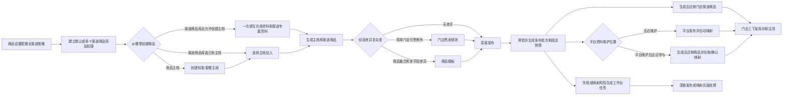
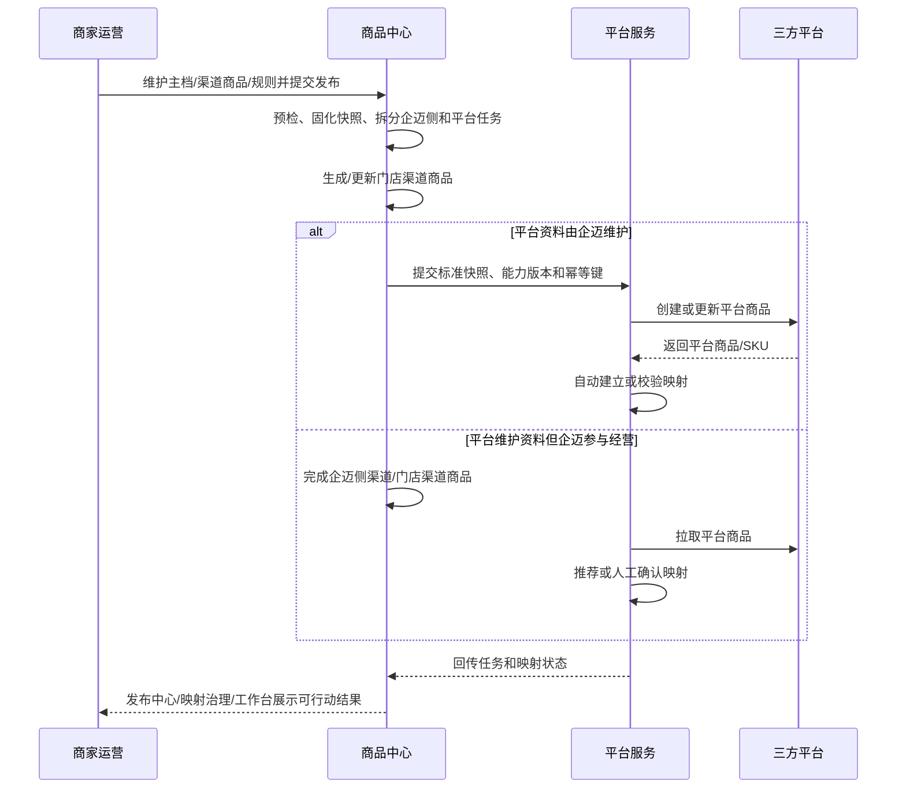
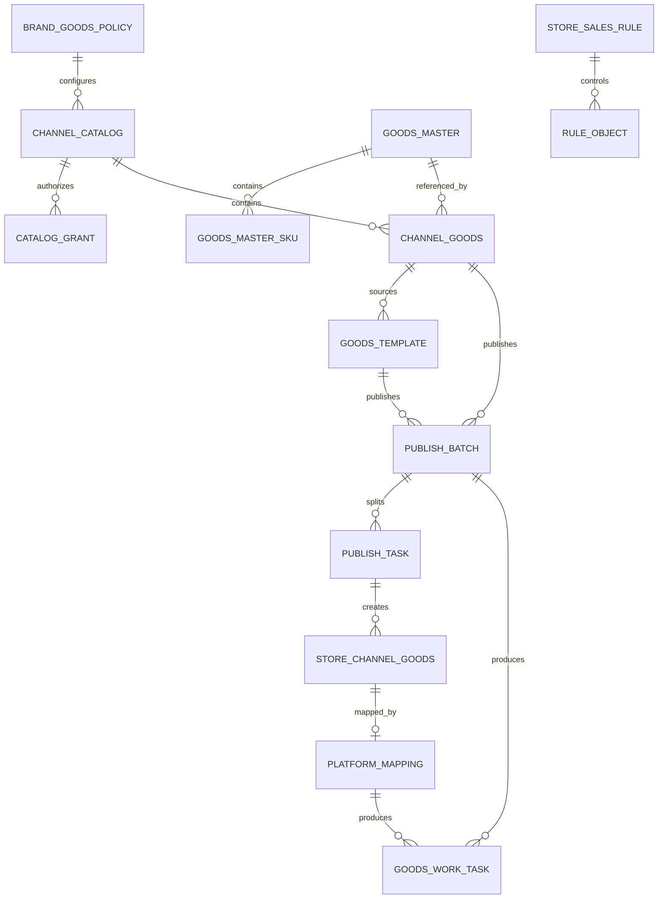
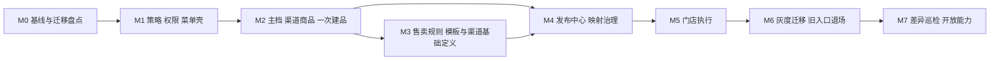

# 商品中心全渠道商品管理：领域全景与全流程

> 文档状态：v2.0 评审稿 · 2026-08-09  
> 文档层级：L0 领域总纲  
> 适用范围：商品中心 PC 后台全渠道商品管理改造  
> 下位文档：P01~P10、S01（商品工作台与任务协同后置）
> 核心结论：新方案不是推翻旧商品中心，而是在原商品库—模板—门店商品基础上补齐渠道商品、稳定菜单、统一发布、映射治理和分组权限；商品工作台本期不建设

---

## 1. 总纲目标

本总纲是全渠道商品管理的唯一方案入口，用于回答：旧商品中心已经有什么、新方案改了什么、各模块如何协作、哪些能力先落地、每个阶段怎样验收和迁移。

各 L1 PRD 只定义自身主对象和功能闭环；跨册对象、菜单、来源、权限、阶段和迁移冲突以本总纲为准。

## 2. 对旧商品中心的整体审视

### 2.1 旧系统已有能力

旧商品中心并非没有全渠道能力，已经具备：

- 品牌商品库、标准商品、套餐、SKU、规格、做法、加料、分类、配方和营养。
- 商品模板和门店商品，用于区域/门店差异和实际经营状态。
- 商品同步、平台菜单同步、同步记录等下发能力。
- 门店渠道商品的上下架、库存、沽清和批量操作。
- 平台服务侧三方商品发布、平台商品拉取、SKU 映射和接单识别。

### 2.2 旧方案的核心问题

| 问题 | 旧体验 | 经营影响 |
|---|---|---|
| 商品身份和渠道卖法混杂 | 主档、模板、平台菜单都承接渠道资料 | 字段归属不清，重复维护 |
| 商品中心与平台服务割裂 | 商品资料、同步、映射分散在不同入口 | 用户不知道从哪里完成一次新品发布 |
| 模板职责过重 | 同时承担商品集合、品牌差异、门店差异和下发 | 简单场景也必须理解模板 |
| 同步只有动作没有发布闭环 | 缺少固定快照、任务拆分、部分成功和失败范围重试 | 结果难追踪，重试可能读取新数据 |
| 映射被当成一次绑定 | 未映射、冲突、失效和影响不成体系 | 影响接单、库存和统计 |
| 组织协作靠约定 | 菜单权限常等于全部数据权限 | 不同渠道团队可能互相越权 |
| 管理模式改变产品结构 | 统一和分渠道模式出现不同菜单和入口 | 切换成本高、培训复杂 |
| 平台维护与企迈参与混为一谈 | 平台维护资料的渠道常被排除在企迈商品库外 | 无法稳定生成企迈侧门店渠道商品和映射准备 |

## 3. 新方案新增与改造功能总表

| 能力 | 与旧系统相比 | 新方案 | Owning PRD | 落地优先级 |
|---|---|---|---|---|
| 商品管理策略 | 新增 | 协作方式、渠道资料维护位置、企迈参与能力、商品库分组、创建方式统一配置；模式变化保存后进入受控迁移 | P01 | 基础前置 |
| 协作方式迁移 | 新增 | 单选只形成草稿，保存时统一校验和确认；迁移期间原模式生效、写入冻结，成功后原子切换 | P01 | 基础前置 |
| 稳定菜单结构 | 改造 | 统一维护与分渠道协作使用同一菜单，差异由数据和权限表达 | P01/00 | 基础前置 |
| 渠道商品库分组权限 | 新增 | 菜单权限+商品库分组数据权限+字段/动作权限 | P01/P02 | 基础前置 |
| 纯净商品主档 | 改造 | 主档只维护身份、共用资料和标准结构 | P02 | 核心底座 |
| 渠道商品库/渠道商品 | 新增 | 承接品牌级渠道售卖资料、分类、属性和平台扩展 | P02 | 核心底座 |
| 渠道一次建品 | 新增 | 可配置仅选主档或同时创建主档+渠道商品，支持标准和套餐 | P01/P02 | 核心底座 |
| 共用资料一次填写 | 新增 | 创建时渠道名称、图片、结构和SKU售价默认继承，不重复填写 | P02 | 核心底座 |
| 主档/渠道编辑分离 | 改造 | 编辑主档与编辑渠道资料为两个明确动作 | P02 | 核心底座 |
| 商品分类与渠道属性 | 新增/收敛 | 后台/前台分类定义及主档默认归属进入商品主档“分类与属性”；渠道商品可覆盖当前商品库前台分类归属，渠道侧“渠道属性”继续承接属性定义且不新增独立左侧菜单 | P02 | 核心底座 |
| 门店售卖规则 | 新增/重构 | 商品、SKU、公共做法、公共加料的门店渠道可售例外 | P08 | 经营规则 |
| 商品模板弱化 | 改造 | 移入销售规则Tab且位于售卖规则后，用于复杂集合/多字段差异 | P03 | 经营规则 |
| 模板来源自动判定 | 新增 | 根据渠道商品库计算唯一来源，不让用户手工选 | P03 | 经营规则 |
| 统一发布中心 | 重构 | 收敛商品同步、菜单同步和记录；固定快照、任务拆分、部分成功、重试 | P04 | 核心闭环 |
| 映射治理 | 重构增强 | 未映射、推荐、冲突、失效、影响、修正和历史形成闭环 | P06 | 核心闭环 |
| 抖音在线点商品管理 | 新增平台专项 | 明确渠道商品—标品、门店渠道商品—逐店点单品、渠道加料—平台加料品的对象关系；品牌标品/加料品在独立同步页管理，点单品随门店下发逐店创建，并补齐门店加料沽清和存量迁移 | P10 | M4~M5 |
| 平台维护+企迈参与 | 新增口径 | 渠道仍归商品库，生成企迈侧渠道/门店渠道商品和映射准备，但不发布平台资料 | P01~P06 | 核心闭环 |
| 门店商品入口收敛 | 改造 | 商品、覆盖门店、门店分类、门店属性、区域策略收进页内视图 | P05 | 门店执行 |
| 商品工作台与任务 | 后续规划 | 本期隐藏菜单，不建设聚合待办、负责人路由、SLA和任务协同；相关页面原型与方案仅作后续参考 | 后续独立PRD | 后续规划 |
| 差异巡检 | 降级/后置 | 本期隐藏独立菜单，优先解决映射；达到能力门槛后再开放 | P07 | 后续规划 |
| 全渠道配置入口 | 入口调整 | 收进商品设置，不单独占低频菜单 | P01 | 基础前置 |
| 门店与平台绑定 | 移出边界 | 归渠道授权/平台服务，不属于商品中心正式菜单 | 平台服务 | 非本方案 |
| 历史平台菜单迁移 | 新增专项 | 盘点、转换、对账、灰度切换和回退 | S01 | 上线前置 |

### 3.1 对商家的直接改善

- 新建商品可以在渠道商品库一次完成，不再强制“先去主档建一次，再回来添加一次”。
- 已有商品仍可直接从主档选择，避免重复建品。
- 不同渠道团队只看到和管理授权商品库。
- 新品发布只提交一次，失败范围可解释、可重试。
- 平台维护商品的客户仍能使用企迈接单、库存和上下架，不会因为“不由企迈维护资料”而缺少企迈侧渠道商品来源。
- 映射问题在经营前暴露并可修复，而不是等到接单、库存或统计出错。

## 4. 建设目标与成功标准

| 目标 | 成功标准 |
|---|---|
| 唯一商品身份 | 任一渠道和平台SKU可追溯到唯一主档SKU |
| 创建效率 | 渠道新建支持标准/套餐一次创建；已有商品无需重建 |
| 职责清晰 | 主档、渠道、模板、门店和平台事实各有唯一 owning 对象 |
| 权限隔离 | 菜单权限不扩大商品库分组数据范围 |
| 发布可靠 | 每次发布有固定快照、明确子任务、部分成功和失败重试 |
| 映射稳定 | 未映射、冲突、失效均有影响、动作和历史 |
| 模式稳定 | 切换协作方式不改变菜单，只走数据迁移和权限调整 |
| 平滑迁移 | 旧菜单和数据按品牌灰度，失败可回退且历史引用不丢失 |

## 5. 产品范围与系统边界

### 5.1 商品中心负责

- P01品牌策略、渠道商品库分组和分组权限。
- P02主档、渠道商品、渠道分类属性、继承与结构确认。
- P03模板及来源判定，P08门店售卖规则和其他销售规则入口。
- P04发布批次、快照、企迈侧任务和统一结果。
- P05门店渠道商品和经营操作。
- P06映射治理统一体验及状态摘要。
- P09渠道商品联合创建与权限补充；P10抖音在线点品牌标品/加料品独立同步、逐店点单品下发、门店数据和加料渠道状态。
- P07治理问题底座；商品工作台和任务协同后置独立立项。

### 5.2 平台服务负责

- 平台能力规则、接口转换和三方平台调用。
- 平台商品/平台SKU事实、平台任务和原始结果。
- 映射权威关系、平台店铺授权和令牌。
- 三方订单接单、退款、履约及实时商品识别。

### 5.3 不在商品中心菜单

- 门店与平台店铺绑定、授权续期、费用和合同开通。
- 三方营销活动、平台补贴、团购券和履约交易。
- 完整平台字段差异巡检（本期后置）。
- 通用开放平台应用管理；商品中心只在后续提供商品API能力说明或跳转。

## 6. 统一产品语言

| 名称 | 定义 | 不是 |
|---|---|---|
| 商品主档 | 品牌内唯一身份、共用资料和标准结构 | 渠道售卖资料或平台商品 |
| 渠道商品库分组 | 共用一套企迈侧售卖资料和渠道商品来源的渠道集合 | 账号组织或平台类型自动分组 |
| 渠道商品库 | 一组渠道的品牌级企迈侧售卖商品集合 | 新商品身份 |
| 渠道商品 | 引用主档并维护渠道销售、展示和专属属性 | 独立SKU结构 |
| 商品模板 | 复杂商品集合、多字段和门店差异配置 | 商品来源或必经发布层 |
| 门店售卖规则 | 对商品/SKU/做法/加料的门店渠道局部例外 | 模板的另一种名称 |
| 发布批次 | 一次提交形成的固定版本业务记录 | 单一平台接口请求 |
| 门店渠道商品 | 具体门店、具体渠道实际经营的企迈侧商品 | 平台真实商品 |
| 商品映射 | 企迈门店渠道SKU与平台SKU的权威对应 | 商品资料复制 |
| 工作任务 | 由领域事件生成、有来源和完成事实的待办 | 用户任意创建的通用工单 |

## 7. 全渠道渠道策略模型

三方商品“由谁维护资料”和“企迈参与哪些经营能力”必须分开配置。

| 渠道场景 | 是否进入商品库分组 | 商品来源 | 发布任务 | 平台资料字段 |
|---|---|---|---|---|
| POS、小程序等自营渠道 | 是 | 所属渠道商品库 | QIMAI_SYNC | 不适用 |
| 三方平台资料由企迈维护并发布 | 是 | 所属渠道商品库 | QIMAI_SYNC + PLATFORM_PUBLISH | 按平台能力展示 |
| 三方平台资料在平台维护，但企迈接单/上下架/库存/沽清 | 是 | 所属渠道商品库中的企迈侧渠道商品 | QIMAI_SYNC + MAPPING_PREPARE；经营时调用平台 | 不展示平台资料字段 |
| 暂不接入且无企迈参与能力 | 否 | 无 | 无 | 不展示 |

统一维护时系统创建一个品牌默认分组，自动包含所有需要进入商品库的渠道；分渠道协作时管理员按资料共享和职责边界建立多个分组。两种模式菜单相同。

## 8. 最终信息架构与菜单

```text
商品资料
  商品主档
  分类与属性
  配方与营养

渠道经营
  渠道商品
    商品 / 渠道分类 / 渠道属性（页内视图）
  销售规则
    门店售卖规则 / 商品模板 / 价格策略 / 属性互斥 / 必选商品（页内Tab）
  商品推荐

发布与治理
  发布中心
  映射治理

门店执行
  门店商品
    商品 / 覆盖门店 / 门店分类 / 门店属性 / 区域策略（页内视图）

配置
  商品设置
    全渠道商品管理策略（低频配置入口）
```

不单独展示：商品工作台、全渠道配置、商品模板、差异巡检、门店与平台绑定。商品工作台和差异巡检后置；全渠道配置、商品模板进入页内入口；门店与平台绑定移出商品中心。进入商品中心默认落到“商品主档”。

### 8.1 核心页面视觉索引

L0 只帮助读者建立模块位置和主任务认知；字段、弹窗、状态与异常仍以对应 L1 的 §8 为准。

**商品资料：商品主档**


- 默认入口；管理品牌商品身份、分类和结构。后台分类与前台分类均可用于定位，渠道差异不在此混合编辑。

**渠道经营：渠道商品库**


- 在获权商品库内准备渠道售卖资料；统一管理和分渠道协作菜单一致，只改变商品库数量、职责和流程。

**发布与治理：发布中心与映射治理**


- 发布中心负责来源、目标、预检、任务和结果；映射治理负责三方渠道的未映射、冲突和失效闭环。

**门店执行：门店商品**


- 维护门店实际可售、上下架、沽清、库存和经营覆盖值，不能反向修改主档或渠道商品结构。

## 9. 全局业务流程



## 10. 全局系统协作



## 11. 全局领域对象关系



### 11.1 继承与覆盖

```text
商品主档
  → 渠道商品：继承共用资料，只显式保存覆盖和渠道专属值
    → 商品模板：可选的商品集合和门店经营覆盖
      → 门店售卖规则：计算局部可售例外
        → 门店渠道商品：承接发布结果和即时经营状态
```

- 规格、做法、加料和套餐结构由主档维护；下游只能缩小启用子集。
- 创建渠道商品时名称、图片、结构和规格售价默认继承，不重复录入。
- 只有用户主动“独立设置”才产生渠道覆盖；恢复跟随时删除覆盖记录。
- 主档新增结构进入渠道待确认；主档停用结构强制下游停用并产生待发布差异。

## 12. 全局功能地图与 PRD 目录

| 编号 | 分册 | 核心能力 | 与旧系统相比 | 推荐阶段 | 依赖 |
|---|---|---|---|---|---|
| P01 | [品牌全渠道商品管理策略](P01-品牌商品管理模式配置.md) | 策略、分组、创建方式、分组权限、协作方式迁移 | 新增 | M1 | 权限/OP/平台能力摘要 |
| P02 | [商品主档与渠道商品库](P02-商品主档与渠道商品库.md) | 双对象、一次建品、继承覆盖、渠道分类属性 | 核心重构 | M2 | P01 |
| P08 | [门店渠道售卖规则](P08-门店渠道售卖规则管控.md) | 商品/SKU/做法/加料门店渠道例外 | 新增 | M3 | P02 |
| P03 | [商品模板与来源判定](P03-商品模板与来源判定.md) | 模板弱化、来源自动、复杂经营差异 | 改造 | M3 | P01、P02、P08 |
| P04 | [全渠道商品发布](P04-全渠道商品发布.md) | 预检、快照、编排、部分成功和重试 | 核心重构 | M4 | P01~P03、P08、P06契约 |
| P06 | [平台发布与映射协同](P06-三方平台发布与映射协同.md) | 平台执行、映射治理和回传 | 核心增强 | M4 | P02、P04、平台服务 |
| P10 | [抖音在线点商品管理](P10-抖音在线点商品管理.md) | 标品/加料品独立同步、逐店点单品下发、门店数据、门店加料沽清和存量迁移 | 新增平台专项 | M4~M5 | P02、P04、P05、P06、S01、平台服务 |
| P05 | [门店渠道商品运营](P05-门店渠道商品运营.md) | 门店商品页内收敛、上下架库存沽清 | 改造增强 | M5 | P04、P06 |
| P09 | [渠道商品库联合创建与权限控制](P09-渠道商品库联合创建与权限控制.md) | 稳定菜单、联合创建和商品库数据权限补充 | 新增补充 | M1~M2 | P01、P02 |
| S01 | [历史平台菜单数据迁移](S01-历史平台菜单数据迁移方案.md) | 盘点、转换、对账、灰度和回退 | 新增专项 | M0~M6 | P01~P06 |
| P07 | [差异巡检与治理](P07-差异巡检与治理.md) | 治理问题底座；字段差异后置 | 降级/后续 | M7 | P04、P06、P09 |

其他既有页面（分类与属性、配方与营养、价格策略、属性互斥、必选商品、商品推荐）按新的菜单和公共交互规范改造，但其已有业务规则不因本方案擅自改写；涉及新渠道商品、商品库权限和发布链路时分别引用 P01、P02、P04。

## 13. 全局权限门禁

| 门禁 | 能力 | 校验范围 |
|---|---|---|
| GATE-01 | 修改品牌策略 | 品牌管理员+全渠道范围；有历史必须迁移 |
| GATE-02 | 查看渠道商品 | 菜单权限+商品库分组VIEW |
| GATE-03 | 编辑渠道商品 | 商品库EDIT+字段权限 |
| GATE-04 | 从渠道入口创建主档 | P01允许+CREATE_MASTER+商品库EDIT |
| GATE-05 | 编辑主档 | MASTER_EDIT；与渠道编辑分开 |
| GATE-06 | 发布 | 来源读取+商品库发布+目标渠道门店权限 |
| GATE-07 | 门店经营操作 | 门店/组织+渠道+动作权限 |
| GATE-08 | 修复映射 | 映射操作权限；平台服务保存权威关系 |
| GATE-09 | 任务协同 | 任务动作权限+来源对象数据权限 |

渠道商品菜单权限不等于全部商品库权限。渠道权限以固定 channelId 为稳定授权基础，再按当前动态渠道分组推导可见 groupId/catalogId；数量、搜索、导入导出、选择器、详情、批量操作和发布都必须使用同一范围解析。分组变化不得自动扩大固定渠道权限。

## 14. 数据权威与失败影响

| 数据 | 权威系统 | 商品中心职责 | 失败影响 |
|---|---|---|---|
| 策略、商品库、主档、渠道商品、模板、规则 | 商品中心 | 原始数据 | 阻断对应编辑/发布 |
| 发布批次和快照 | 商品中心 | 原始数据且不可变 | 缺失不得执行 |
| 门店渠道商品 | 商品中心 | 原始数据 | 缺失阻断映射和经营操作 |
| 平台字段能力和平台任务 | 平台服务 | 展示规则/状态并提交标准快照 | 本平台目标失败，不影响其他渠道 |
| 平台商品和SKU | 平台服务/三方平台 | 展示快照摘要 | 影响映射和平台经营 |
| 映射权威关系 | 平台服务 | 商品中心提供治理入口和状态摘要 | 影响接单、库存、上下架和统计 |
| 任务负责人路由 | 商品中心任务域/权限中心 | 版本化策略和解析结果 | 路由失败进入兜底，不丢任务 |

## 15. 功能模块落地节奏

落地顺序按“先稳定对象与权限，再形成可发布闭环，最后迁移和开放”推进。阶段编号是依赖顺序，不直接等同自然月；各阶段可并行研发，但不得绕过前置验收门禁。

### 15.1 依赖关系



### 15.2 分阶段计划

| 阶段 | 核心目标 | 功能模块 | 可并行工作 | 阶段完成门槛 |
|---|---|---|---|---|
| M0 基线与迁移盘点 | 不破坏旧链路地掌握数据现状 | 旧菜单/路由/表/接口盘点、品牌分类、映射质量、S01预迁移工具骨架、统一状态与错误码 | 平台服务契约盘点、权限模型设计 | 旧对象到新对象映射完整；试点品牌与回退条件确定 |
| M1 策略、权限与稳定菜单 | 让所有下游有唯一策略和数据权限 | P01、商品设置入口、统一菜单壳、商品库分组权限、平台能力摘要、协作方式迁移任务 | 公共选择器、审计、配置影响分析、快照与任务框架 | 两种模式菜单一致；保存校验和迁移状态闭环；失败保持原模式；越权用例通过 |
| M2 商品核心底座 | 建立主档—渠道商品双对象和高效创建 | P02主档/渠道商品、标准/套餐一次建品、选已有主档、继承覆盖、结构确认、渠道分类属性 | 导入导出、批量工具、字段配置适配 | 两种创建策略和标准/套餐全链路通过；无重复字段与半条数据 |
| M3 经营规则与模板收敛 | 用规则承接简单例外、模板承接复杂差异 | P08门店售卖规则、P03模板Tab与来源判定、价格/互斥/必选入口归组 | 商品推荐、规则公共选择器 | 创建时冲突预防；模板来源唯一；平台维护渠道任务语义正确 |
| M4 发布与映射核心闭环 | 完成“准备商品—同步/发布—映射—失败恢复” | P04发布中心、P06映射治理、P10抖音标品/加料品独立同步页及统一门店下发中的逐店点单品任务、平台服务任务契约、固定快照、部分成功重试 | 旧同步记录聚合、新状态回传 | 品牌标品/加料品无需选择门店即可同步；每个目标门店独立创建或更新一个点单品；企迈发布、平台维护和抖音在线点链路端到端通过且失败可定位可重试 |
| M5 门店执行 | 让总部/门店高频经营操作闭环 | P05门店商品页内视图、上下架库存沽清、P10抖音门店商品/规格经营与现有门店加料渠道状态、P07治理底座 | App/POS入口适配；工作台与任务机制仅保留后续方案 | 映射门禁、共享库存、门店加料沽清和部分成功完成验收；抖音门店加料仅支持沽清/恢复，上下架明确禁用并说明；不以工作台作为本期门禁 |
| M6 灰度迁移与旧入口退场 | 安全切换存量客户 | S01正式迁移、P10既有抖音标品/点单品/加料迁移、按品牌灰度、旧路由重定向、观察期、回退、历史只读 | 培训、帮助文档、客服工具 | 对账阻断项为零；抖音对象均映射到正确渠道/门店对象；核心任务成功率达门禁；回退演练通过 |
| M7 后续治理与开放 | 在核心链路稳定后扩大能力 | P07字段差异巡检、版本审核、OpenAPI/Webhook和质量指标 | 新平台能力扩展 | 平台读取与处置能力稳定、误报可控、开放权限审计完备 |

### 15.3 每阶段不能提前做的事

- M1 未完成前，不允许各页面自行写死统一/分渠道模式判断。
- M2 未完成前，不迁移平台菜单商品资料到不稳定的渠道商品模型。
- M3 未完成前，P04预检不得假设模板和售卖规则已完成唯一裁决。
- M4 未完成前，不关闭旧同步和映射入口。
- 本期不建设商品工作台、聚合待办、负责人路由、SLA或任意任务流设计器；相关能力在核心业务事实与任务来源稳定后单独立项。
- M6 未通过前，不强制全量品牌切换。
- 映射治理未稳定、平台实际值拉取和处置动作未完整前，不开放差异巡检独立菜单。

### 15.4 推荐的首个可用版本

首个真正能给试点商家使用的业务闭环应至少包含 M1~M4，而不是只上线新菜单或配置页：

```text
策略与权限 → 主档/渠道商品一次建品 → 售卖规则/模板 → 发布批次 → 企迈侧渠道商品/平台任务 → 映射治理 → 失败重试
```

M5 可随后增强总部和门店效率；M6 才开始大规模迁移。

## 16. 迁移与兼容原则

1. 先建立新对象、来源和权限，再迁移菜单。
2. 旧商品、模板、门店商品、平台ID、映射和订单引用不得因迁移删除或重建。
3. 旧链接携带品牌、门店、渠道和筛选上下文重定向到新入口。
4. 新旧入口并存期间只允许一个写入权威，禁止长期双写。
5. 统一/分渠道切换按P01创建品牌级迁移任务：点选只形成草稿，保存时统一校验；迁移期间原方式继续生效，成功后原子切换，失败保持原方式。历史平台菜单等跨旧系统迁移仍进入S01。
6. 只有发布、映射、门店经营和任务恢复达到阶段门禁后，才关闭旧正式入口。

## 17. 已确认决策与待决项

### 17.1 已确认

- 两种协作方式菜单结构一致，统一维护只有一个品牌默认商品库。
- 渠道商品创建方式由品牌配置，两种协作方式都可使用。
- 一体化创建支持标准和套餐；共用资料一次填写，渠道资料同流程补充。
- 主档和渠道资料后续分开编辑，不使用含义不明的合并维护入口。
- 平台维护资料但使用企迈经营能力的渠道可进入商品库分组。
- 商品库分组具备独立数据权限。
- 商品模板移入销售规则并排在门店售卖规则后，不保留独立菜单。
- 差异巡检本期隐藏，映射治理优先。
- 全渠道策略收进商品设置；门店与平台绑定移出商品中心。
- 协作方式继续使用单选卡；点选不立即生效，保存时统一执行配置与迁移校验，并在一个确认弹窗中说明影响和固定迁移规则。
- 分渠道转统一时选择主商品库、商品取并集；统一转分渠道时全部商品复制到每个目标商品库。迁移期间冻结相关写入，完成前继续使用原方式，失败不切换。
- 首期不建设逐商品冲突处理、商品分配矩阵、迁移暂停取消、部分重试、自助多版本回滚、独立迁移中心和自定义权限合并。
- 商品设置本期只保留全渠道商品管理策略入口；渠道商品常用字段设置、渠道字段覆盖规则暂不开放，渠道表单使用产品预置规则和固定字段归属。
- 京东外卖尚未完成对接，本期不进入全渠道策略、商品库分组、渠道统计、发布和映射范围。
- 商品工作台本期隐藏且不作为正式菜单或验收项；进入商品中心默认展示商品主档，原工作台原型保留为后续规划参考。

### 17.2 待研发/业务确认

- 生产权限码、默认角色、任务路由配置入口和SLA默认值。
- 各平台能力版本、字段定义、授权及收费边界。
- 一体化创建的事务/补偿实现和大批量限额。
- 旧入口并行周期、试点品牌、每阶段量化上线阈值和回退窗口。
- 价格策略、互斥、必选、推荐等既有规则页面的具体迁移批次。

## 18. 总体验收标准

- 00与P01~P10对协作方式、渠道策略、商品库分组、创建方式和本期菜单的描述一致；商品工作台不出现在正式菜单和本期验收中。
- 标准/套餐均能从主档创建、从主档加入渠道库，或按配置一次创建主档+渠道商品。
- 一体化创建共用字段只填写一次；渠道专属字段可补充；主档/渠道编辑入口分开。
- 平台维护资料但使用企迈经营能力的渠道能归组、生成企迈侧渠道/门店渠道商品和映射准备，不发布平台资料。
- 商品库分组权限作用于列表、详情、选择器、导入导出、批量和发布全过程。
- 模板不独立占菜单，来源自动判定；简单门店例外可由P08表达。
- 发布批次、快照、子任务、映射和工作任务可全链路追溯。
- 抖音在线点标品只对应渠道商品，加料品只对应渠道加料；两者从独立同步页按品牌维度同步且不选择门店。点单品按门店/POI一一对应门店渠道商品，即使资料完全一致也不得跨门店共用；逐店点单品成功后生成SKU/POI映射和现有门店加料中的抖音渠道数据。抖音门店加料仅支持沽清/恢复，不支持上架/下架。
- 映射异常有影响和恢复动作；差异巡检在未达开放门槛前不出现在正式菜单。
- 门店与平台绑定不出现在商品中心正式菜单；商品设置提供全渠道策略入口。
- 协作方式切换完成“草稿选择—保存校验—迁移确认—只读进度—成功原子切换/失败保持原模式”闭环，且商品库权限不会因切换自动扩大。
- M0~M7每阶段有明确前置、交付和上线门禁，不以“页面完成”代替业务闭环完成。
