# P01 品牌全渠道商品管理策略与协作方式迁移

> 状态：v1.2 · 2026-08-17
> 文档档位：重档（品牌级高风险配置、异步迁移、权限重算）  
> Owning 能力：品牌全渠道商品管理策略、渠道商品库分组、协作方式迁移  
> 功能前缀：`OCS`  
> 上位文档：[00-领域全景与全流程](00-领域全景与全流程.md)

---

## 1. 业务目标

品牌管理员通过“商品设置 > 全渠道商品管理策略”统一配置协作方式、渠道资料维护位置、企迈参与能力、渠道商品库分组及渠道商品创建方式。

升级到新版商品中心但尚未建立渠道商品库的品牌，不能直接进入空白策略页或渠道商品列表。系统必须先识别“首次启用”状态，引导管理员确认管理方式并完成渠道商品库初始化；初始化全部成功后，品牌才进入正常策略管理状态。

协作方式切换不能只改变菜单或前端展示。当品牌在“统一管理”和“分渠道协作”之间切换时，系统必须把目标配置、商品关系和权限范围作为一个迁移任务处理：完成前继续使用原策略，迁移成功后整体生效，失败不得产生半生效状态。

本期目标：

- 两种协作方式保持相同菜单结构。
- 单选卡点选只形成草稿，不立即生效。
- 点击“保存策略”时一次完成普通配置校验、迁移校验、影响说明和确认。
- 迁移期间原策略继续生效，策略及受影响渠道商品库不可写，并展示真实任务进度。
- 迁移成功后原子切换；失败时原策略、原权限和业务读取不变。

## 2. 范围

### 2.1 本期范围

- 查询当前生效策略和最近迁移状态；识别当前页面内的未保存草稿（本期不做跨设备、跨刷新草稿暂存）。
- 编辑协作方式、商品库分组、渠道归属、资料维护位置、企迈参与能力和渠道商品创建方式。
- 保存未改变协作方式的普通策略变更。
- 保存改变协作方式的完整目标配置，执行迁移前校验和确认。
- 分渠道协作转统一管理：商品库合并、商品去重、权限收敛、对账和原子切换。
- 统一管理转分渠道协作：商品全量复制、权限恢复/收敛、对账和原子切换。
- 迁移快照、进度、失败原因、整体重试和操作审计。
- 首次启用识别、初始化引导、初始化确认、后台任务进度、失败重试和完成跳转。
- 统一管理首次初始化时创建一个品牌默认商品库，并把全部现有商品主档加入该库；分渠道协作首次初始化只创建商品库和渠道归属，不自动加入主档商品。

### 2.2 本期不做

- 不建设逐商品/逐字段冲突处理中心。
- 不提供商品分配矩阵；统一转分渠道时全部商品复制到每个目标商品库。
- 不允许迁移期间继续编辑目标策略或受影响渠道商品。
- 不提供暂停、取消、单条跳过、部分重试和商家自助多版本回滚。
- 不建设独立迁移中心；状态直接在策略页展示。
- 不提供自定义权限合并向导；采用“不自动扩大权限”的固定规则。
- 不因模式变化增删菜单，不重建平台商品ID、映射、历史发布快照和订单引用。
- 京东外卖当前尚未完成业务对接，本期不进入渠道策略列表、商品库分组、渠道统计、保存校验和迁移范围；后续完成平台能力确认后按新渠道接入流程开放。
- “渠道商品常用字段设置”和“渠道字段覆盖规则”本期不提供商品设置入口；当前渠道表单按产品预置字段分组和已确认的主档/渠道字段归属展示。

## 3. 功能地图与功能点清单

| 功能编号 | 功能名称 | 使用方/触发方 | 入口或触发 | 主要业务结果 | 状态 | 关联规则 |
|---|---|---|---|---|---|---|
| OCS-F001 | 查看当前策略与状态 | 品牌管理员 | 商品设置进入策略页 | 展示生效配置、草稿和迁移状态 | 本期新增 | R001、R012 |
| OCS-F002 | 编辑策略草稿 | 品牌管理员 | 点选或修改配置 | 只更新草稿并提示未保存 | 本期改造 | R001、R002 |
| OCS-F003 | 保存普通策略变更 | 品牌管理员 | 协作方式未变时保存 | 新配置原子保存，不创建迁移任务 | 本期改造 | R003、R004 |
| OCS-F004 | 保存前统一校验 | 保存事件 | 协作方式变化时保存 | 返回阻断项、通过项和影响摘要 | 本期新增 | R004~R008 |
| OCS-F005 | 确认并创建迁移任务 | 品牌管理员 | 确认弹窗“开始迁移” | 生成目标配置快照和唯一任务 | 本期新增 | R009、R010 |
| OCS-F006 | 创建迁移快照 | 系统任务 | 任务启动 | 保存原配置、商品关系和权限 | 本期新增 | R011 |
| OCS-F007 | 合并为统一商品库 | 系统任务 | 分渠道转统一 | 商品取并集并生成一个默认商品库 | 本期新增 | R013 |
| OCS-F008 | 拆分为多个商品库 | 系统任务 | 统一转分渠道 | 全部商品复制到每个目标商品库 | 本期新增 | R014 |
| OCS-F009 | 重算商品库权限 | 系统任务 | 数据迁移后 | 权限不扩大且保留管理员兜底 | 本期新增 | R015 |
| OCS-F010 | 查看迁移进度与结果 | 品牌管理员 | 进行中或最近任务 | 展示阶段、进度、范围和结果 | 本期新增 | R012、R016 |
| OCS-F011 | 失败后整体重试 | 品牌管理员 | 失败状态操作 | 重新校验、重新快照并完整执行 | 本期新增 | R017 |
| OCS-F012 | 策略与迁移审计 | 系统事件 | 保存、确认、状态变化 | 记录前后版本、范围和结果 | 本期新增 | R018 |
| OCS-F013 | 配置三方渠道维护策略 | 品牌管理员 | 渠道策略表 | 设置资料维护位置和企迈参与能力 | 本期新增 | R019 |
| OCS-F014 | 管理渠道商品库与渠道归属 | 品牌管理员 | 商品库区、渠道总表 | 新建、重命名、删除商品库并设置渠道唯一归属 | 本期新增 | R007、R020 |
| OCS-F015 | 配置渠道商品创建方式 | 品牌管理员 | 创建方式单选 | 限制渠道商品只能选主档或允许联合创建 | 本期新增 | R021 |
| OCS-F016 | 放弃草稿与离开保护 | 品牌管理员 | 放弃改动、离开页面 | 防止未保存配置丢失并恢复生效配置 | 本期新增 | R022 |
| OCS-F017 | 识别首次启用并展示引导 | 系统/品牌管理员 | 策略页或渠道商品页 | 未初始化品牌进入专用空状态，不伪装成无数据 | 本期新增 | R023 |
| OCS-F018 | 配置并确认首次初始化 | 品牌管理员 | 首次初始化向导 | 确认管理方式、建品方式、商品库及渠道归属 | 本期新增 | R024~R026 |
| OCS-F019 | 执行首次初始化任务 | 系统任务 | 用户确认初始化 | 原子创建策略、商品库、渠道归属及初始商品关系 | 本期新增 | R024~R027 |

### 3.1 场景覆盖总览

| 场景 | 用户目标 | 主要功能 | 页面结果 | 是否创建后台任务 |
|---|---|---|---|---|
| 首次进入/刷新 | 确认当前真正生效的策略 | F001 | 展示服务端生效配置并恢复任务状态；未保存页面草稿不跨刷新恢复 | 否 |
| 新版首次启用 | 建立品牌第一版全渠道策略与商品库 | F017~F019 | 展示引导；统一管理初始化全部现有主档，分渠道协作初始化空商品库 | 是（初始化任务） |
| 修改三方渠道策略 | 调整资料维护方和企迈参与能力 | F002、F013、F003 | 形成草稿，保存后整体生效 | 否 |
| 管理商品库与渠道归属 | 调整渠道经营分工 | F002、F014、F003 | 形成草稿，保存后产生待发布差异 | 否 |
| 修改渠道商品创建方式 | 调整渠道团队建品能力 | F002、F015、F003 | 仅影响保存后的新操作，不改既有商品 | 否 |
| 放弃修改/带草稿离开 | 恢复生效配置或避免误丢草稿 | F016 | 二次确认后放弃，或继续编辑 | 否 |
| 统一管理→分渠道协作 | 建立多个渠道商品库 | F004~F010 | 校验、确认、执行全量初始化并原子切换 | 是 |
| 分渠道协作→统一管理 | 合并多个渠道商品库 | F004~F010 | 选择主商品库、合并去重并原子切换 | 是 |
| 迁移失败/状态暂不可查 | 保持经营稳定并恢复任务 | F010~F011 | 原策略继续生效，可刷新状态或整体重试 | 已有任务 |
| 无编辑/迁移权限 | 安全查看策略 | F001 | 页面只读；无迁移权限不提供开始迁移动作 | 否 |
| 并发修改/重复提交 | 防止覆盖和重复任务 | F003~F005 | 版本冲突要求刷新；重复点击只产生一次结果 | 视请求结果 |

## 4. 端到端业务流程

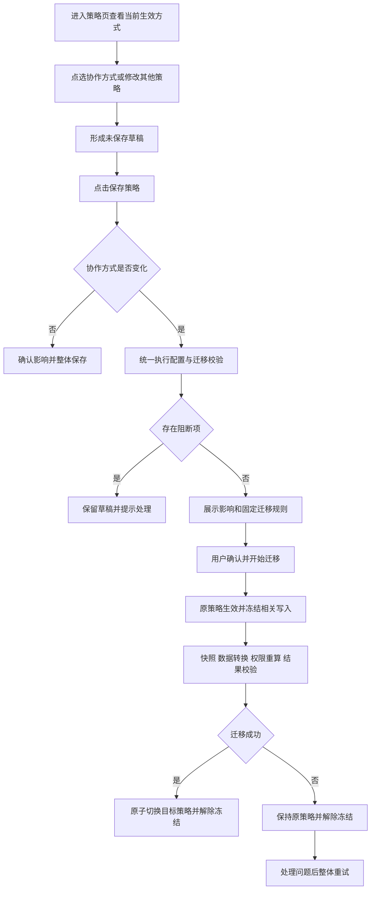

### 4.1 首次启用流程

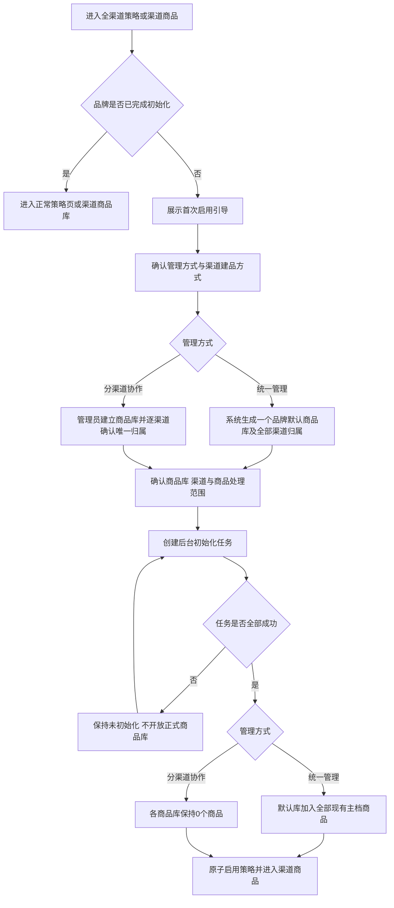

## 5. 系统交互

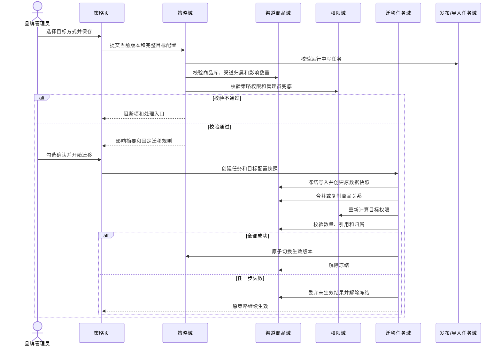

处理约束：如果用户同时修改协作方式和其他策略字段，本次全部草稿形成一份目标配置快照。迁移成功后整体生效；失败时全部保持原配置，不允许其他字段提前生效。

### 5.1 首次初始化系统交互

首次初始化不属于“已有策略之间的迁移”，不生成来源策略快照，也不套用统一转分渠道的全量复制规则。页面提交完整初始配置和幂等键；服务端再次确认品牌仍为未初始化状态，创建初始化任务，在任务隔离区完成商品库、渠道归属、初始授权和商品关系写入。全部校验成功后一次提交第一版正式策略；任一步失败时删除/隔离未生效结果，品牌仍保持未初始化。

## 6. 领域对象

### 6.1 对象关系

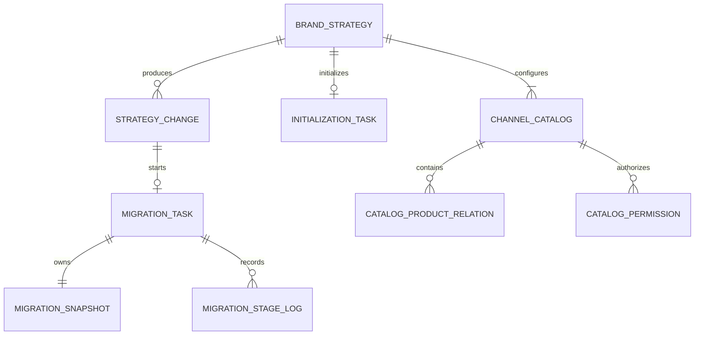

### 6.2 品牌商品策略

权威来源：商品中心策略域。

| 字段 | 类型 | 必填 | 业务含义 | 可选值/约束 | 敏感 |
|---|---|---|---|---|---|
| strategyId | ID | 是 | 策略唯一标识 | 品牌内唯一 | 否 |
| brandId | ID | 是 | 所属品牌 | 一个品牌一条生效策略 | 否 |
| effectiveMode | 枚举 | 条件必填 | 当前真正生效的方式 | 未初始化时为空；初始化成功后为`UNIFIED` / `CHANNEL_COLLABORATION` | 否 |
| pendingMode | 枚举 | 否 | 迁移目标方式 | 仅迁移中存在 | 否 |
| status | 枚举 | 是 | 策略状态 | `UNINITIALIZED`未初始化 / `INITIALIZING`初始化中 / `INITIALIZATION_FAILED`初始化失败 / `NORMAL`正常 / `MIGRATING`迁移中 | 否 |
| channelConfig | JSON | 是 | 渠道维护位置和企迈参与能力 | 每个启用渠道一项 | 否 |
| catalogConfig | JSON | 条件必填 | 商品库分组及渠道归属 | 未初始化时为空；统一恰好一个，分渠道至少一个 | 否 |
| creationMode | 枚举 | 是 | 渠道商品创建方式 | `SELECT_MASTER_ONLY` / `CREATE_MASTER_AND_CHANNEL` | 否 |
| version | 整数 | 是 | 配置乐观锁版本 | 每次成功保存递增 | 否 |

#### 6.2.1 channelConfig 项结构

| 字段 | 类型 | 必填 | 来源/可否修改 | 业务规则 |
|---|---|---|---|---|
| channelCode | 枚举 | 是 | 平台接入清单；只读 | 本期仅允许第11节列出的渠道，不接收京东外卖 |
| channelName | 文本 | 是 | 渠道服务；只读 | 仅用于展示，不作为关联键 |
| channelType | 枚举 | 是 | 渠道服务；只读 | `SELF_OWNED`自有链路 / `THIRD_PARTY`三方渠道 |
| maintenanceOwner | 枚举 | 是 | 三方渠道可改，自有链路固定 | `QIMAI`企迈维护 / `PLATFORM`平台维护 |
| supportedCapabilities | 枚举数组 | 是 | 平台能力服务；只读 | 当前已对接能力全集，取值`ORDER`/`PUBLISH`/`ON_OFF_SHELF`/`INVENTORY` |
| qimaiCapabilities | 枚举数组 | 是 | 用户在supportedCapabilities内选择 | 任一能力开启则catalogId必填；未支持能力不得提交 |
| catalogId | ID | 条件必填 | 用户从有权目标库单选 | 企迈参与时必填且品牌内有效；完全不参与时可空 |

#### 6.2.2 catalogConfig 项结构

| 字段 | 类型 | 必填 | 来源/可否修改 | 业务规则 |
|---|---|---|---|---|
| catalogId | ID | 条件必填 | 既有库只读；新建草稿为空 | 服务端创建后回填，后续改名不得变化 |
| catalogName | 文本 | 是 | 用户输入 | 1~30字符，去除首尾空格后品牌内唯一 |
| catalogStatus | 枚举 | 是 | 服务端计算 | `EXISTING` / `TO_CREATE` / `TO_UPDATE` / `TO_DELETE`；前端不得伪造越权删除 |
| channelCodes | 枚举数组 | 是 | 根据channelConfig.catalogId反向计算 | 每个需归库渠道只出现一次；作为展示摘要，不接受双份不一致提交 |
| productCount | 整数 | 是 | 渠道商品域；只读 | 用于影响分析和删除校验，不由前端提交修改 |
| administratorCount | 整数 | 是 | 权限域；只读 | 迁移目标必须大于等于1 |

提交口径：前端提交完整目标策略、当前version和幂等键；服务端以`channelConfig[].catalogId`作为渠道归属权威输入，重新计算商品库渠道摘要、权限和影响数量。页面显示用名称、数量和能力摘要不得作为服务端业务判定依据。

### 6.3 策略迁移任务

权威来源：商品中心迁移任务域。

| 字段 | 类型 | 必填 | 业务含义 | 可选值/约束 | 敏感 |
|---|---|---|---|---|---|
| taskId | ID | 是 | 迁移任务编号 | 品牌内唯一 | 否 |
| sourceMode/targetMode | 枚举 | 是 | 原/目标方式 | 两者必须不同 | 否 |
| primaryCatalogId | ID | 条件必填 | 合并时主商品库 | 分渠道转统一必填 | 否 |
| targetConfig | JSON | 是 | 待生效完整配置 | 执行期间不可修改 | 否 |
| status | 枚举 | 是 | 任务状态 | `CREATED` / `SNAPSHOTTING` / `MIGRATING` / `VERIFYING` / `SWITCHING` / `SUCCEEDED` / `FAILED` | 否 |
| progress | 整数 | 是 | 真实任务进度 | 0~100，只增不减 | 否 |
| currentStage | 文本 | 是 | 当前阶段 | 与status对应 | 否 |
| failureCode/reason | 文本 | 条件必填 | 失败分类和商家可理解原因 | FAILED时必填 | 否 |
| startedAt/finishedAt | 时间 | 条件必填 | 起止时间 | 服务端写入 | 否 |

### 6.4 迁移快照与日志

| 对象 | 核心内容 | 约束 |
|---|---|---|
| 迁移快照 | 原策略、商品库、渠道归属、商品关系、权限关系、数量摘要 | 任务内唯一、不可修改 |
| 阶段日志 | 阶段、开始/结束、处理数量、结果、失败码 | 追加写，不覆盖历史 |

### 6.5 首次初始化任务

权威来源：商品中心策略任务域。初始化任务与协作方式迁移任务共用后台任务基础设施，但任务类型、输入和数据处理规则独立。

| 字段 | 类型 | 必填 | 业务含义 | 可选值/约束 | 敏感 |
|---|---|---|---|---|---|
| taskId | ID | 是 | 初始化任务编号 | 品牌内唯一 | 否 |
| taskType | 枚举 | 是 | 任务类型 | 固定`INITIALIZATION` | 否 |
| targetMode | 枚举 | 是 | 首次启用的管理方式 | `UNIFIED` / `CHANNEL_COLLABORATION` | 否 |
| targetConfig | JSON | 是 | 待启用的第一版完整策略 | 创建后不可修改 | 否 |
| masterProductScope | 枚举 | 是 | 初始主档商品范围 | 统一管理固定`ALL_EXISTING`；分渠道协作固定`NONE` | 否 |
| catalogCount/channelCount/masterProductCount | 整数 | 是 | 影响摘要和对账基线 | 由服务端重新计算，不接受前端数量作为判定 | 否 |
| status | 枚举 | 是 | 任务状态 | `CREATED` / `CREATING_CATALOGS` / `CREATING_RELATIONS` / `VERIFYING` / `SWITCHING` / `SUCCEEDED` / `FAILED` | 否 |
| progress/currentStage | 整数/文本 | 是 | 真实进度和当前阶段 | 0~100，进度只增不减 | 否 |
| failureCode/reason | 文本 | 条件必填 | 失败原因 | FAILED时必填 | 否 |
| startedAt/finishedAt | 时间 | 条件必填 | 起止时间 | 服务端写入 | 否 |

## 7. 主对象状态机

主对象：策略迁移任务。

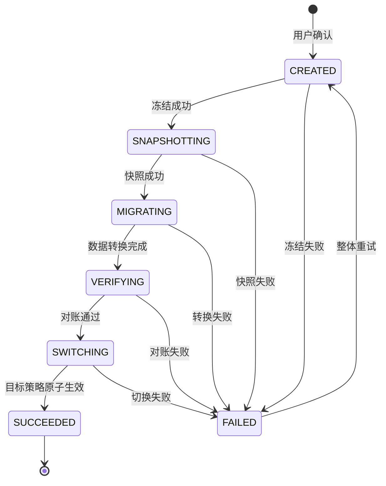

| 状态 | 含义 | 生效策略 | 页面动作 |
|---|---|---|---|
| CREATED/SNAPSHOTTING/MIGRATING/VERIFYING/SWITCHING | 任务执行中 | 原策略 | 只可查看进度 |
| SUCCEEDED | 目标策略已生效 | 目标策略 | 查看结果/审计 |
| FAILED | 任务失败且已解除冻结 | 原策略 | 查看原因/整体重试 |

### 7.1 状态流转明细

| 当前状态 | 触发事件 | 前置条件 | 下一状态 | 生效数据 | 页面表现/可执行动作 |
|---|---|---|---|---|---|
| 无任务 | 用户确认开始迁移 | 校验通过、风险确认完成、幂等键有效 | CREATED | 原策略 | 关闭确认弹窗，显示任务卡并锁定相关写入 |
| CREATED | 冻结与任务初始化成功 | 品牌无其他运行中迁移 | SNAPSHOTTING | 原策略 | 显示“准备安全快照” |
| CREATED | 冻结或初始化失败 | - | FAILED | 原策略 | 解除已取得的锁，显示失败原因和整体重试 |
| SNAPSHOTTING | 原配置、关系、权限快照完整 | 快照可校验读取 | MIGRATING | 原策略 | 显示“迁移商品关系” |
| SNAPSHOTTING | 快照不完整或写入失败 | - | FAILED | 原策略 | 丢弃未完成快照，不进入数据转换 |
| MIGRATING | 合并/复制及渠道归属转换完成 | 中间数据仅任务可见 | VERIFYING | 原策略 | 显示“校验商品、映射和权限” |
| MIGRATING | 任一转换失败 | - | FAILED | 原策略 | 中间结果不进入正式查询 |
| VERIFYING | 数量、身份、映射、引用、权限对账通过 | 目标至少一名管理员 | SWITCHING | 原策略 | 显示“切换生效配置” |
| VERIFYING | 任一对账失败 | - | FAILED | 原策略 | 展示失败阶段和可理解原因 |
| SWITCHING | 配置版本与关系版本原子提交成功 | 审计记录成功 | SUCCEEDED | 目标策略 | 更新当前生效方式并解除冻结 |
| SWITCHING | 原子提交或关键审计失败 | - | FAILED | 原策略 | 回收未生效目标版本并解除冻结 |
| FAILED | 用户选择整体重试 | 当前无新写任务、权限与配置版本仍有效 | CREATED | 原策略 | 生成新的尝试编号并重新快照，不从中间续跑 |
| SUCCEEDED | 用户刷新/重新进入 | - | SUCCEEDED | 目标策略 | 展示完成时间和结果摘要，可收起状态卡 |

### 7.2 首次初始化状态流转

| 当前策略/任务状态 | 触发事件 | 前置条件 | 下一状态 | 正式可读数据 | 页面表现/可执行动作 |
|---|---|---|---|---|---|
| UNINITIALIZED/无任务 | 进入策略页或渠道商品页 | 品牌已升级新版且不存在有效策略、有效商品库 | UNINITIALIZED | 商品主档仍可读；无正式渠道商品库 | 展示首次启用引导，可返回商品主档 |
| UNINITIALIZED/无任务 | 确认并开始初始化 | 初始配置完整、权限通过、幂等键有效 | INITIALIZING/CREATED | 不开放未完成商品库 | 进入真实进度页，禁止重复提交 |
| INITIALIZING/CREATED | 商品库和授权创建完成 | 商品库名称、渠道唯一归属、管理员校验通过 | INITIALIZING/CREATING_RELATIONS | 仍不开放正式商品库 | 统一管理显示“加入现有主档”；分渠道协作显示“保存渠道归属” |
| INITIALIZING/CREATING_RELATIONS | 关系处理完成 | 统一管理已写入全部现有主档关系；分渠道协作关系数为0 | INITIALIZING/VERIFYING | 仍不开放正式商品库 | 展示“校验初始化结果” |
| INITIALIZING/VERIFYING | 数量、归属和权限对账通过 | 每个目标库至少一名管理员 | INITIALIZING/SWITCHING | 仍不开放正式商品库 | 提交第一版正式策略 |
| INITIALIZING/SWITCHING | 第一版策略原子提交成功 | 审计记录成功 | INITIALIZED/SUCCEEDED | 正式策略、商品库、授权和初始商品关系同时可读 | 展示完成摘要和“进入渠道商品” |
| INITIALIZING/任一非终态 | 任一步失败 | - | INITIALIZATION_FAILED/FAILED | 保持无正式策略、无正式渠道商品库 | 展示失败阶段和整体重试；不展示半成品 |
| INITIALIZATION_FAILED/FAILED | 整体重试 | 重新校验通过 | INITIALIZING/CREATED | 仍保持未初始化 | 生成新尝试并从头执行，不从失败阶段续跑 |

## 8. 页面功能与交互说明

> 图文说明口径：页面图用于帮助产品、研发和测试快速定位功能区域，图片下方的说明用于解释该区域的目标、动作与状态。图片不能替代后续字段表、业务规则、权限和异常恢复要求；原型样式调整时，业务规则仍以本文为准。

### 8.1 策略页字段与控件

#### 8.1.1 页面图示与区域说明

**页面图示：全渠道商品管理策略页**

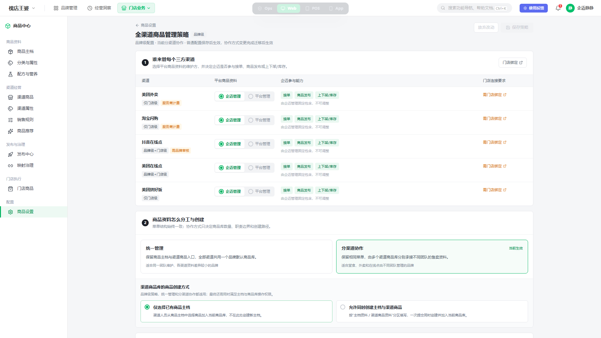

**功能与交互说明**

- **页面目标**：由品牌管理员在一个页面完成三方渠道维护方、企迈参与能力、协作方式、渠道商品创建方式和商品库归属配置。
- **区域 1——谁来管每个三方渠道**：逐渠道确定平台商品资料由企迈还是平台维护，并展示企迈参与接单、商品发布、上下架或库存的能力。
- **区域 2——商品资料怎么分工与创建**：选择统一管理或分渠道协作；两种方式菜单结构一致，只改变商品库数量和职责。下方单独配置渠道商品是否允许联合创建主档。
- **区域 3——确认每个渠道的商品来源**：统一管理时全部渠道进入品牌默认商品库；分渠道协作时逐渠道选择唯一商品库。
- **页头动作**：“保存策略”只在有变更且非迁移中可用；“放弃改动”恢复当前生效配置。

#### 8.1.2 字段与控件规则

| 页面/容器 | 字段或控件 | 类型 | 数据来源 | 必填 | 默认/显示规则 | 用户/权限 | 校验与操作反馈 | 提交后的数据变化 | 异常与恢复 |
|---|---|---|---|---|---|---|---|---|---|
| 页头 | 当前生效方式 | 状态文字 | strategy.effectiveMode | 是 | 始终显示服务端生效值 | 全部可见；不可修改 | 不随单选草稿变化 | 仅迁移成功后更新 | 读取失败不展示推断值 |
| 页头 | 未保存变更 | 状态提示 | 当前页面草稿与effective配置比较 | 否 | 有差异时显示 | view+edit可见 | 保存/放弃后消失 | 无服务端数据变化 | 刷新后本地草稿不恢复 |
| 页头 | 保存策略 | 主按钮 | 页面状态 | - | 无变更、保存中、迁移中禁用 | strategy.edit；迁移还需strategy.migrate | 点击后按模式是否变化进入普通确认或迁移校验 | 普通保存递增version；迁移创建targetConfig | 失败保留草稿；超时按幂等键查结果 |
| 页头 | 放弃改动 | 次按钮 | 页面草稿状态 | - | 有未保存变更时可用 | strategy.edit | 二次确认后丢弃全部草稿 | 无 | 继续编辑则完整保留草稿 |
| 协作方式 | 统一管理/分渠道协作 | 单选卡 | strategy.effectiveMode/页面草稿 | 是 | 当前值标“当前生效”，另一值点选后标“待切换” | strategy.edit；迁移中只读 | 点选只改草稿并联动目标商品库结构 | 迁移成功后更新effectiveMode | 校验阻断时返回修改并保留选择 |
| 商品库区 | 商品库名称 | 文本 | catalogConfig | 是 | 统一固定一个默认库；分渠道至少一个 | strategy.edit且有对应catalog管理范围 | 1~30字符、品牌内唯一 | 普通保存创建/改名/删除空库；模式变化进入targetConfig | 重复/在用库删除时定位并保留草稿 |
| 渠道总表 | 渠道商品库 | 单选下拉 | catalogConfig、用户可见库 | 条件必填 | 任一企迈参与能力开启时必填 | strategy.edit且有渠道/目标库权限 | 一个渠道唯一归属；无权库不可选择 | 普通保存只改后续来源；迁移按目标配置转换 | 目标失效/无权时要求刷新重选 |
| 渠道总表 | 资料维护位置 | 单选 | channelConfig、平台能力服务 | 是 | 三方渠道为企迈/平台；自有链路固定 | strategy.edit | 与企迈参与能力、归库要求联动 | 普通保存更新职责，不删除商品/映射 | 能力服务不可用时该渠道不可修改 |
| 渠道总表 | 企迈参与能力 | 多选 | 平台已对接能力、channelConfig | 是 | 仅展示已对接的接单/上下架/库存等能力 | strategy.edit；不支持能力禁用 | 任一启用则必须归库 | 保存后生成待映射/待发布或停止写入事项 | 保存前能力变化需重新校验 |
| 创建方式 | 仅选主档/允许联合创建 | 单选 | strategy.creationMode | 是 | 默认仅允许从主档选择 | strategy.edit；实际动作叠加主档权限 | 点选只改草稿 | 普通保存后改变后续入口，不改既有商品 | 无主档权限时联合创建动作不展示 |
| 迁移状态卡 | 方向、任务号、阶段、进度、范围、时间 | 状态卡 | 迁移任务服务 | - | 进行中常驻；失败常驻；成功可收起 | strategy.view；重试需strategy.migrate | 进度来自后台；重试前重新校验 | 成功切换正式版本，失败不改正式数据 | 状态未知显示重试获取，不推断结果 |

离开页面时有未保存草稿，提示“放弃修改/继续编辑”。迁移中页面不可编辑，离开不触发未保存提示。

#### 8.1.3 页面状态与权限表现

| 页面状态 | 进入条件 | 展示 | 可用动作 | 异常/恢复 |
|---|---|---|---|---|
| 首次加载 | 进入策略页 | 页面骨架和加载状态，不先展示默认值 | 无 | 任一权威数据未返回前禁止编辑 |
| 正常可编辑 | 有view、edit权限且无迁移任务 | 当前生效配置；无变更时保存/放弃禁用 | 修改配置 | 服务端仍需按品牌和权限重新鉴权 |
| 有未保存草稿 | 草稿与effective配置不同 | “有未保存的变更”；变化项展示待修改状态 | 保存策略、放弃改动 | 刷新/离开前触发保护；不将本地草稿误认为生效配置 |
| 只读查看 | 有view、无edit权限 | 展示完整配置，所有表单只读 | 查看迁移状态 | 不展示可造成误解的保存入口 |
| 无查看权限 | 无strategy.view | 无业务数据 | 返回有权限页面 | 展示统一无权限页，不泄露渠道、商品库和任务范围 |
| 保存中 | 已提交普通保存或创建任务请求 | 按钮加载，表单暂时只读 | 无 | 幂等完成后恢复；超时可查询结果，不重复创建 |
| 迁移中 | 存在运行中迁移任务 | 原生效配置、目标摘要、真实任务进度 | 查看任务 | 策略及受影响渠道商品写入锁定，查询不受影响 |
| 迁移失败 | 最近任务FAILED | 原策略、失败阶段、原因、任务号 | 重新校验并整体重试 | 重试前重新读取配置版本和依赖状态 |
| 页面读取失败 | 策略或任务服务不可用 | 全页错误状态 | 重新加载 | 禁止用缓存值编辑或保存 |
| 部分依赖不可用 | 单个渠道能力服务不可用 | 对应渠道显示“能力暂不可用” | 可编辑其他不相关配置 | 禁止修改、保存依赖该渠道能力的配置；恢复后重新校验 |

### 8.2 三方渠道维护策略与企迈参与能力

每个已接入三方渠道只允许选择一种资料维护位置；“企迈参与能力”描述企迈是否参与接单、上下架或库存等经营动作，不等同于平台商品资料由企迈维护。

| 场景 | 资料维护位置 | 企迈参与能力 | 是否必须归属渠道商品库 | 商品及映射处理 | 页面联动 |
|---|---|---|---|---|---|
| 企迈管理平台资料 | 企迈维护 | 按已对接能力固定展示，不允许关闭必要能力 | 是 | 企迈维护渠道资料并发布；门店使用企迈下发商品 | 商品库选择必填，展示平台专属字段维护能力 |
| 平台管理且企迈不参与 | 平台维护 | 全部关闭 | 否 | 不要求创建企迈侧渠道商品和映射 | 商品库选择可为空；不计入未归属阻断 |
| 平台管理但企迈参与经营 | 平台维护 | 接单、上下架、库存至少一项开启 | 是 | 仍需下发企迈侧门店渠道商品用于映射；不由企迈维护平台专属资料 | 商品库选择必填；平台字段只读/不出现，但映射与门店下发仍可用 |

字段与动作规则：

- 切换资料维护位置或能力只修改草稿；保存前需重新校验平台实际已开通能力，不允许配置平台未支持的能力。
- 从“企迈管理”改为“平台管理”不会删除平台商品、映射和历史发布记录；仅改变后续资料维护和发布职责，并生成待处理影响摘要。
- 从“不参与”开启任一企迈能力时，必须先选择渠道商品库；保存成功后才允许从该商品库建立企迈商品并完成门店/平台映射。
- 从“企迈参与”关闭为“不参与”时，已有商品和映射不删除，停止后续企迈侧经营写入；确认摘要需展示受影响商品和门店数量。
- POS、小程序堂食、小程序外卖属于企迈自有链路，维护位置和核心能力固定展示，不作为三方维护方式单选项。

### 8.3 渠道商品库与渠道归属管理

#### 8.3.1 商品库结构规则

- 统一管理始终只有一个“品牌默认商品库”，所有需要企迈参与的渠道归入该库；不展示新建、删除和渠道改库操作。
- 分渠道协作至少保留一个渠道商品库，支持新建、重命名和调整渠道归属；每个需企迈参与的渠道必须且只能归属一个商品库。
- 商品库是数据权限边界。页面只展示操作者有查看权限的商品库，但发起品牌级迁移必须拥有全部商品库范围权限。
- 普通调整渠道归属只改变该渠道后续读取、发布和新建商品的来源，不自动复制、移动或删除两个商品库中的商品；保存后生成待发布/待映射差异，由后续任务处理。

#### 8.3.2 商品库操作

| 操作 | 输入/前置 | 校验 | 成功结果 | 失败/恢复 |
|---|---|---|---|---|
| 新建商品库 | 名称；分渠道协作草稿 | 名称必填、品牌内不重复，1~30字符 | 草稿中增加空商品库；保存后创建正式库 | 定位名称字段并保留其他草稿 |
| 重命名 | 新名称；有该库管理权限 | 同名、长度、非法字符校验 | 仅修改展示名称，不改变catalogId、商品和权限关系 | 恢复原名称或继续编辑 |
| 删除商品库 | 分渠道协作且不是最后一个库 | 仅当无归属渠道、无商品关系、无运行中任务时允许 | 从草稿移除；保存后删除空库 | 有渠道、商品或任务时阻断并提供查看入口 |
| 调整渠道归属 | 选择目标商品库 | 渠道需在操作者有权范围；目标库有效 | 保存后更新渠道唯一归属并产生影响摘要 | 无权或目标失效时刷新并重新选择 |

### 8.4 渠道商品创建方式

| 配置值 | 渠道商品页新增入口 | 主档维护权限 | 保存后的作用范围 |
|---|---|---|---|
| 仅允许从商品主档选择 | 主按钮为“选择已有主档” | 渠道商品页不可编辑主档资料 | 仅限制后续新建和编辑入口；既有商品关系不变 |
| 允许创建主档与渠道商品 | 同时提供“选择已有主档”“新建标准商品”“新建套餐商品” | 只有同时具备主档创建/编辑权限时才提供相应动作 | 新建时一次提交主档和渠道商品；公共资料只填写一次并默认继承 |

- 修改该配置属于普通策略保存，不创建协作方式迁移任务。
- 配置不能替代权限：允许联合创建但用户无主档创建权限时，只展示“选择已有主档”。
- 标准商品、套餐商品继续使用各自可选商品类目和表单规则，不因入口位于渠道商品页而改变。
- 既有渠道商品的主档、渠道商品身份和字段归属不重建；配置切换后只改变可用动作。

### 8.5 草稿、放弃与离开保护

| 触发 | 条件 | 交互 | 结果 |
|---|---|---|---|
| 点击“放弃改动” | 存在未保存草稿 | 二次确认“放弃后不可恢复” | 丢弃全部草稿，重新显示服务端生效配置 |
| 切换菜单/返回 | 存在未保存草稿 | 弹窗提供“继续编辑”“放弃并离开” | 继续编辑关闭弹窗；放弃后离开 |
| 刷新/关闭浏览器 | 存在未保存草稿 | 浏览器离开保护 | 确认离开则不保存本地草稿 |
| 保存成功 | 普通保存完成或迁移任务创建成功 | 不再提示未保存 | 普通保存显示新配置；迁移显示目标快照和原生效配置 |
| 迁移中离开 | 无可编辑草稿 | 不触发草稿提示 | 任务后台继续，返回后恢复进度 |

### 8.6 普通策略保存

协作方式未变化时，点击“保存策略”仍校验权限、字段完整性、渠道归属、依赖能力和配置版本。通过后先展示普通影响摘要，用户确认后原子保存，不创建迁移任务。

| 变更类型 | 确认摘要必须展示 | 保存结果 | 下游处理 |
|---|---|---|---|
| 三方资料维护位置/企迈能力 | 变更前后、受影响渠道、商品、门店及能力 | 新职责整体生效 | 生成对应待发布、待映射或停止企迈经营写入事项 |
| 商品库名称 | 原名称、新名称 | 仅名称变化 | 不触发商品搬迁和发布 |
| 渠道商品库归属 | 渠道、原库、目标库、影响商品和门店 | 更新后续来源关系 | 不自动搬商品；生成待发布/待映射差异 |
| 渠道商品创建方式 | 原方式、新方式、受影响入口 | 改变后续可用动作 | 不改既有商品 |
| 多项同时修改 | 按上述类别合并展示 | 同一配置版本整体提交 | 任一保存失败则全部不生效 |

操作要求：点击“取消”返回并保留草稿；点击“确认保存”后按钮加载且不可重复提交；成功提示版本与生效时间；失败保留草稿并定位错误；发生版本冲突时不得自动覆盖，用户刷新后重新编辑。

### 8.7 协作方式迁移确认弹窗

协作方式变化时，点击“保存策略”后打开迁移确认弹窗。两种切换方向共用弹窗外壳和任务机制，但迁移目标、必填选择、数据处理规则与风险说明不同，必须按以下两个场景分别渲染，不能只替换方向文案。

#### 8.7.1 统一管理切换为分渠道协作

**页面图示：建立多个目标商品库并全量初始化**

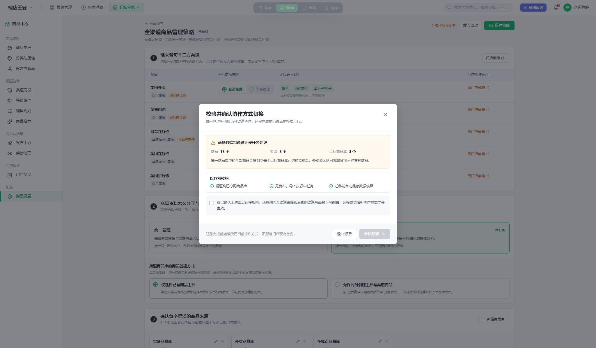

**功能与交互说明**

- **触发条件**：当前生效方式为“统一管理”，用户在策略页选择“分渠道协作”，完成目标商品库及渠道归属配置后点击“保存策略”。
- **保存前准备**：目标配置至少包含一个渠道商品库；每个需要企迈参与经营的渠道必须且只能归属一个目标商品库。商品库的新建、命名和渠道归属在策略页完成，弹窗只展示结果；需要调整时点击“返回修改”。
- **影响摘要**：展示商品数量、涉及渠道数量和目标商品库数量，并明确迁移成功前仍使用统一管理方式。
- **商品处理**：统一商品库中的全部商品复制到每个目标商品库，各库以同一商品主档身份初始化，不能产生新的 SPU/SKU 身份。
- **渠道资料处理**：公共渠道资料随商品关系复制；平台专属资料和映射关系按原渠道迁入该渠道所属商品库，不在多个商品库间互相覆盖。
- **后续经营**：切换完成后，各渠道团队可在有权限的商品库中批量移出本团队不经营的商品；本期不在迁移前提供逐商品分配矩阵。
- **权限处理**：有历史商品库授权快照时恢复匹配授权；新建或无法匹配的商品库只授予品牌全范围管理员，不自动向普通账号扩大数据权限。
- **阻断校验**：存在未归属渠道、没有目标商品库、目标商品库无管理员、运行中的发布/导入写任务或配置版本冲突时，禁止开始迁移。
- **风险确认文案**：需明确“所有商品将复制到每个目标商品库，迁移期间策略及受影响渠道商品不可编辑，迁移成功后分渠道协作才生效”。

#### 8.7.2 分渠道协作切换为统一管理

**页面图示：合并多个商品库并选择重复资料优先来源**

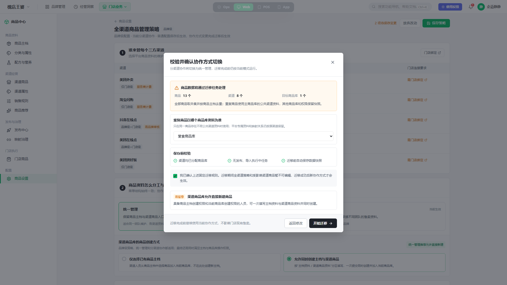

**功能与交互说明**

- **触发条件**：当前生效方式为“分渠道协作”，用户在策略页选择“统一管理”后点击“保存策略”。
- **目标结构**：迁移后仅保留一个品牌默认渠道商品库，所有需要企迈参与经营的渠道归入该默认库。
- **必填选择**：用户必须选择一个现有渠道商品库作为“主商品库”。未选择时“开始迁移”禁用；只有一个现有商品库时系统可默认选中，但仍需展示给用户确认。
- **影响摘要**：展示商品数量、涉及渠道数量和目标商品库数量，并明确原商品库、商品关系和权限会先生成快照，不直接删除。
- **商品处理**：按商品主档身份对多个商品库商品取并集并去重；只存在于非主商品库的商品也必须进入品牌默认商品库，不得丢失。
- **重复资料处理**：同一商品存在多份公共渠道资料时，优先采用主商品库资料；主商品库不存在该商品时取最后更新时间最新的一份，同时间按商品库 ID 升序确定。该规则不修改商品主档。
- **平台资料与映射**：平台专属资料和平台映射仍按原渠道保留，不因选择主商品库而被另一渠道资料覆盖或重建。
- **权限处理**：原商品库授权写入迁移快照；统一后的默认库按匹配授权恢复，无法匹配时仅授予品牌全范围管理员，不把某一渠道团队的局部权限自动扩大为全渠道权限。
- **阻断校验**：主商品库未选择、目标无管理员、运行中的发布/导入写任务或配置版本冲突时，禁止开始迁移。
- **风险确认文案**：需明确“多个商品库将合并并去重，重复公共渠道资料按所选主商品库优先，迁移期间策略及受影响渠道商品不可编辑，迁移成功后统一管理才生效”。

#### 8.7.3 两种场景的字段差异

| 字段/控件 | 统一管理 → 分渠道协作 | 分渠道协作 → 统一管理 | 通用规则 |
|---|---|---|---|
| 切换方向 | 展示“统一管理 → 分渠道协作” | 展示“分渠道协作 → 统一管理” | 只读，必须与当前生效方式不同 |
| 商品、渠道数量 | 展示 | 展示 | 来自保存前影响分析，不承诺迁移耗时 |
| 目标商品库数量 | 展示多个目标库数量 | 固定展示 1 个 | 只读 |
| 目标商品库及渠道归属 | 必须在策略页完成；弹窗只读展示/汇总 | 全部渠道归入品牌默认商品库 | 返回修改后保留草稿 |
| 主商品库 | 不展示 | 条件必填，展示现有有权商品库 | 用于确定重复公共渠道资料优先来源 |
| 固定迁移规则 | 全量复制到每个目标库 | 取并集、按主档去重并合并到默认库 | 只读，不允许用户修改算法 |
| 权限处理说明 | 恢复匹配授权；新库只授予品牌管理员 | 收敛为默认库授权，禁止扩大局部权限 | 只读 |
| 校验结果 | 校验目标库、渠道归属、管理员、运行中任务和版本 | 校验主商品库、管理员、运行中任务和版本 | 阻断项与通过项分组展示 |
| 风险确认 | 确认全量复制及迁移锁定 | 确认合并去重规则及迁移锁定 | 无阻断项时可勾选；未勾选不能开始迁移 |

| 操作 | 禁用条件 | 点击后行为 | 成功结果 | 失败恢复 |
|---|---|---|---|---|
| 返回修改 | 无 | 关闭弹窗并保留草稿 | 回到策略页 | 无 |
| 重新校验 | 请求中 | 读取最新配置及依赖状态 | 刷新校验结果 | 失败时禁止确认 |
| 开始迁移 | 有阻断项、必填不全、未勾选确认 | 创建任务和目标配置快照 | 页面进入迁移中只读态 | 创建失败不冻结，草稿保留 |

### 8.8 迁移进度、结果与恢复

**页面图示：协作方式迁移进度状态**

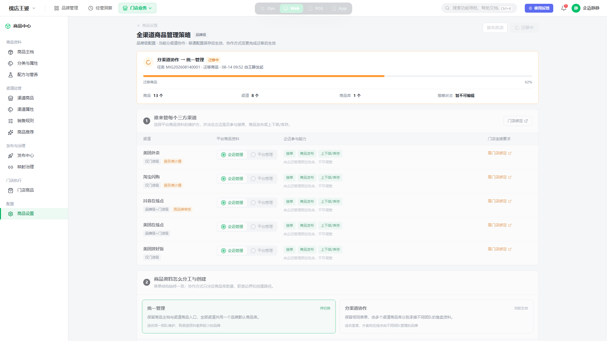

**功能与交互说明**

- **展示位置**：迁移任务创建成功后，状态卡常驻策略页顶部，刷新或重新登录后仍需恢复。
- **进度口径**：展示切换方向、任务编号、当前阶段、后台真实进度、商品、渠道、商品库数量及发起信息，不使用前端估算进度。
- **生效口径**：迁移成功前页面始终标明原方式继续生效；目标方式仅显示“待切换”。
- **只读规则**：迁移中策略页和受影响渠道商品库禁止写入，页头保存动作不可用，但菜单结构和查询能力不变化。
- **完成与失败**：成功后更新当前生效方式并允许收起状态卡；失败时展示失败阶段、原因、原方式仍生效及整体重试入口。

#### 8.8.1 迁移进行中

状态卡至少展示：切换方向、任务编号、当前阶段、真实进度、已处理/总商品数、商品库数、渠道数、开始时间、发起人和“当前仍按原模式运行”。进度只允许前进；任务阶段变化但百分比未变化时仍更新阶段文字和最近更新时间。

- 页面刷新、重新登录或换设备后，根据品牌查询唯一运行中任务并恢复，不依赖浏览器本地状态。
- 策略表单及受影响渠道商品库写操作只读；发布、导入等新增写任务也应被服务端锁阻断。
- 查询任务状态暂时失败时，不将任务推断为成功或失败，展示“状态获取失败”和“重新获取”；原策略继续生效。

#### 8.8.2 迁移成功

| 展示项/动作 | 规则 |
|---|---|
| 当前生效方式 | 更新为目标方式，并清除“待切换” |
| 结果摘要 | 展示完成时间、商品/渠道/商品库处理数量、权限处理摘要和任务号 |
| 页面数据 | 重新读取正式策略、商品库关系和权限，不直接复用迁移中缓存 |
| 写入能力 | 解除冻结；按新策略与最新权限开放 |
| 查看详情 | 打开只读任务详情/审计，不回到确认弹窗 |
| 收起状态卡 | 只影响页面展示，不删除任务和审计记录 |

#### 8.8.3 迁移失败与整体重试

| 展示项/动作 | 规则 |
|---|---|
| 当前生效方式 | 明确展示原方式仍生效 |
| 失败信息 | 展示失败阶段、错误码、商家可理解原因、任务号和失败时间 |
| 中间数据 | 不进入正式查询、发布和门店经营；解除相关写锁 |
| 重新校验 | 重新读取配置版本、写任务、商品库、管理员和权限，不沿用上次通过结果 |
| 整体重试 | 校验通过后创建新的尝试编号和快照，完整执行所有阶段；不从失败阶段续跑 |
| 返回修改 | 若失败原因需修改目标配置，允许结束失败态并回到草稿；保存时重新创建迁移任务 |

#### 8.8.4 任务创建失败与未知结果

- “开始迁移”请求明确失败：不冻结、不清空草稿、不产生运行中状态；弹窗保留并提示重试。
- 请求超时或前端未收到结果：先按幂等键查询任务；查询到任务则进入进度态，确认无任务后才允许再次提交。
- 状态服务不可用：页面保持只读保护，直到服务端明确不存在运行中任务；禁止仅凭前端超时解除锁定。

### 8.9 首次启用与渠道商品库初始化

#### 8.9.1 识别条件、入口与第一步

**页面图示：商品设置中的首次启用入口**

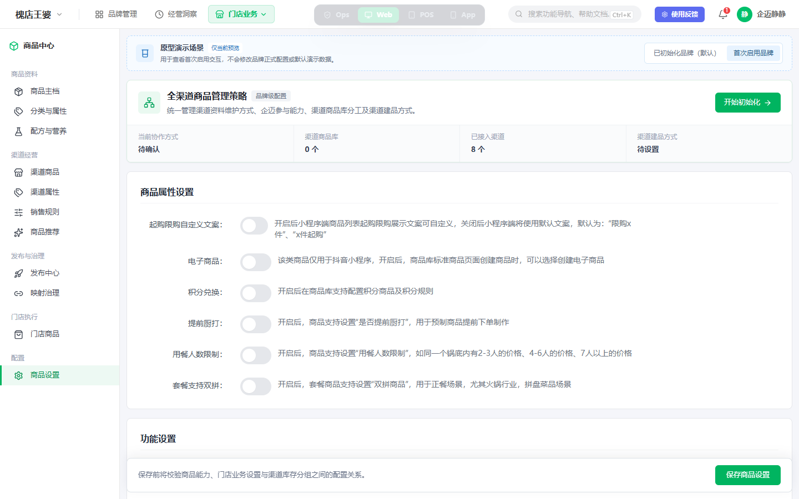

**页面图示：确认首次管理方式与渠道建品方式**

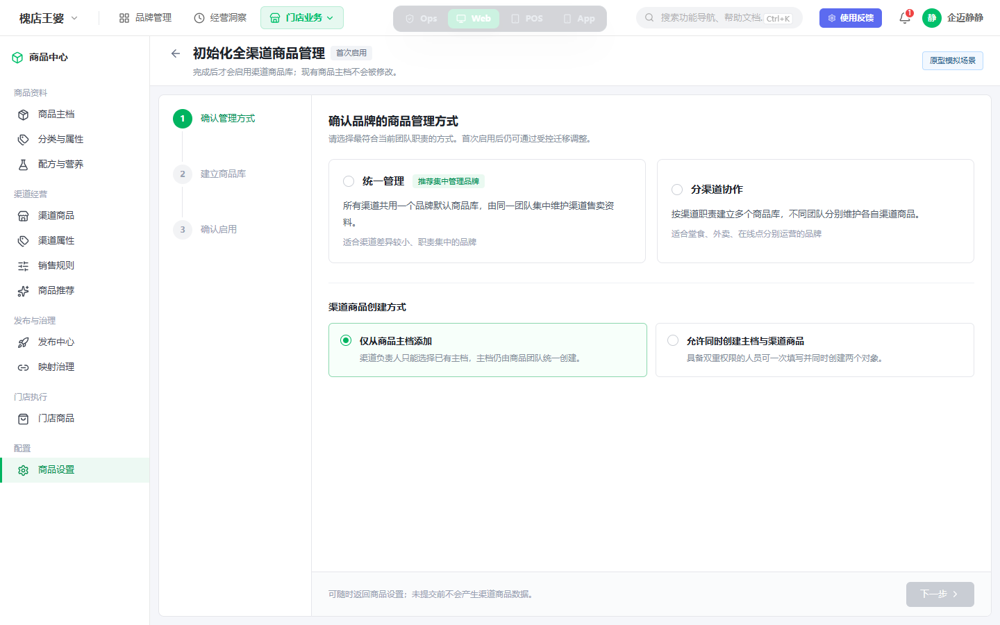

**功能与交互说明**

- **识别口径**：品牌已开通新版商品中心，且策略域明确返回`UNINITIALIZED`。不能仅根据“渠道商品为0”或“商品库为0”由前端推断，因为正常经营品牌也可能暂时没有商品。
- **入口表现**：商品设置中的策略卡展示“待初始化、0个渠道商品库、协作方式待确认”；主按钮为“开始初始化”。渠道商品菜单仍保留，进入后展示同一初始化空状态和“开始初始化”，不得展示普通筛选表格或误报“暂无商品”。
- **默认兼容**：已初始化品牌继续进入现有策略页和渠道商品库；原型中的“已初始化品牌/首次启用品牌”切换仅用于演示，不属于正式产品配置项。
- **第一步输入**：管理员必须选择“统一管理”或“分渠道协作”；渠道商品创建方式默认“仅从商品主档添加”，可改为“允许同时创建主档与渠道商品”。两项均只形成初始化草稿。
- **离开规则**：未提交前返回商品设置或商品主档不产生策略、商品库、渠道商品或任务；再次进入时本期重新填写，不做跨刷新草稿暂存。

| 字段/控件 | 类型 | 必填 | 默认/显示 | 校验与联动 | 权限 | 保存结果 |
|---|---|---|---|---|---|---|
| 管理方式 | 单选卡 | 是 | 无默认值，必须主动确认 | 选择统一管理时第二步固定一个默认库；选择分渠道协作时第二步开放建库和渠道归属 | strategy.edit | 写入初始化targetConfig，成功前不成为effectiveMode |
| 渠道商品创建方式 | 单选卡 | 是 | 默认仅从主档添加 | 联合创建只影响初始化完成后的渠道商品新增入口，仍叠加主档权限 | strategy.edit | 成功后成为creationMode，不创建额外商品 |
| 下一步 | 主按钮 | - | 未选择管理方式时禁用 | 点击只进入第二步，不请求服务端创建数据 | 同上 | 无正式数据变化 |

#### 8.9.2 统一管理初始化

**页面图示：统一管理的商品库与现有主档处理**

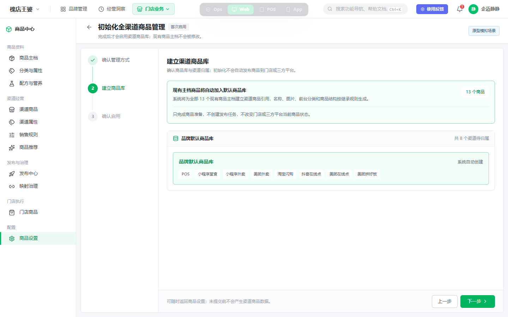

**页面图示：统一管理初始化确认**

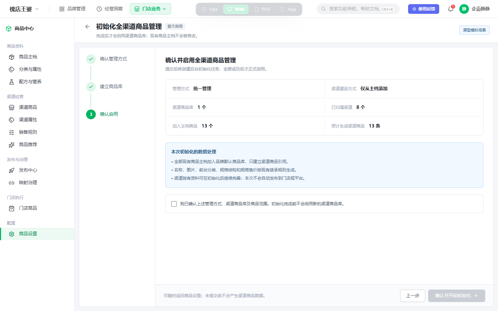

- 系统固定创建一个“品牌默认商品库”，把本期已接入且需要企迈参与的全部渠道归入该库；用户不新建商品库、不修改渠道归属。
- 影响分析以提交时服务端数据为准，把全部未删除的现有商品主档加入默认商品库。只创建渠道商品关系和按继承规则生成的渠道资料，不修改商品主档身份、字段和状态。
- 商品名称、图片、默认前台分类、规格结构和规格售价按现有主档继承规则生成；渠道独有资料保持待完善，由用户初始化后维护。
- 不创建发布任务，不自动下发门店或三方平台，不改变现有门店/平台商品状态。主档数量在确认前发生变化时，服务端返回最新影响数量，用户重新确认后再提交。
- 第三步必须展示：管理方式、建品方式、商品库1个、已归属渠道数、加入主档商品数、预计生成渠道商品关系数，以及“不自动发布”的结果说明。

#### 8.9.3 分渠道协作初始化

**页面图示：分渠道协作的建库与渠道归属**

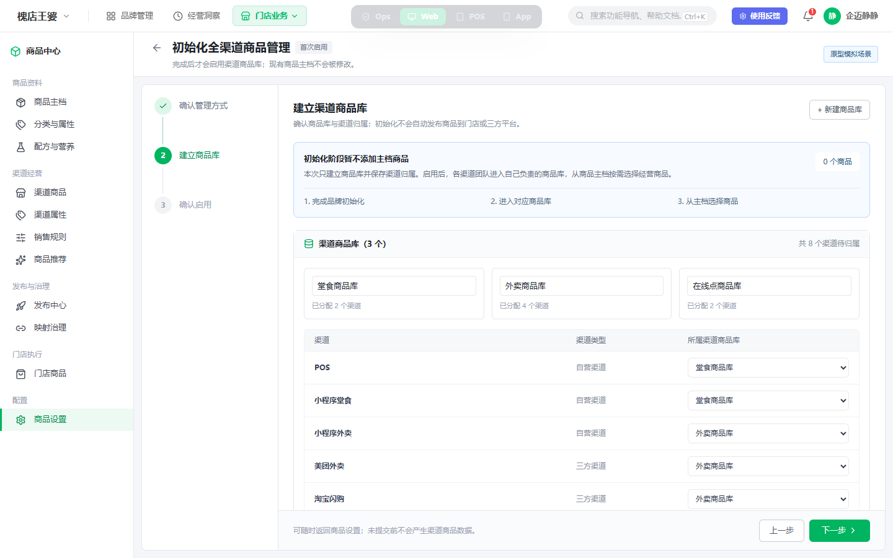

**页面图示：分渠道协作初始化确认**

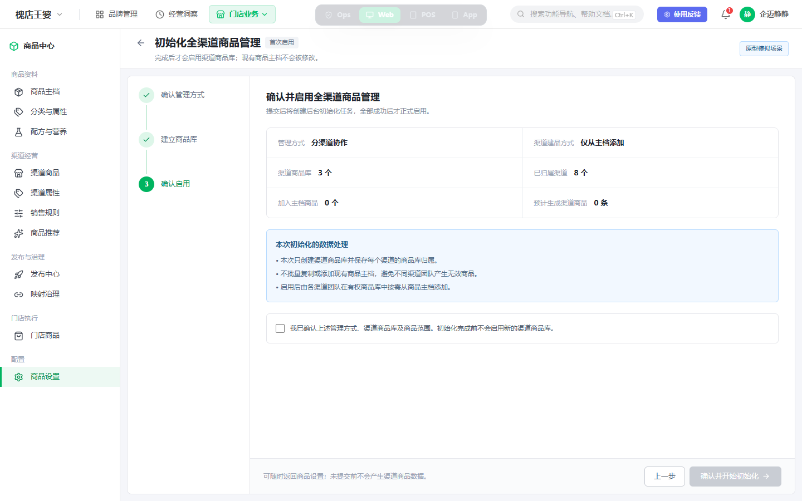

- 页面可预置建议商品库名称和渠道分组，但管理员可新建、改名并逐渠道调整；至少保留一个商品库，商品库名称1~30字符且品牌内唯一。
- 每个本期接入且需要企迈参与的渠道必须且只能归属一个目标商品库；存在未归属渠道时“下一步”禁用并定位提示。
- 初始化阶段所有目标商品库的初始商品数固定为0，不把主档商品复制到多个商品库。完成后由各渠道团队在各自有权商品库中按需选择主档商品，避免一次产生大量本渠道不经营的商品。
- 第三步必须展示：管理方式、建品方式、商品库数量、已归属渠道数、加入主档商品0个、预计生成渠道商品0条，并明确后续“进入对应商品库→从主档选择商品”的动作。
- 初始化只负责第一版商品库结构和渠道归属，不替代商品库数据权限配置。每个目标库至少有一名品牌管理员；普通账号只能在初始化完成后看到其被授权的商品库。

#### 8.9.4 确认、后台任务、完成与失败

| 页面阶段/控件 | 显示与禁用规则 | 点击/系统行为 | 成功结果 | 失败与恢复 |
|---|---|---|---|---|
| 确认勾选 | 第三步固定展示；未勾选时“确认并开始初始化”禁用 | 确认管理方式、商品库、渠道归属和商品范围 | 允许提交 | 无 |
| 确认并开始初始化 | 表单完整、无运行中任务且有权限时可用 | 携带完整targetConfig、当前影响版本和幂等键创建初始化任务 | 关闭编辑向导，进入进度页 | 明确失败时保留草稿；超时先按幂等键查询任务 |
| 初始化进度 | 任务非终态时常驻 | 展示任务号、真实阶段、真实进度、商品库/渠道/商品处理数 | 全部成功后显示完成摘要 | 状态暂不可查时不推断完成，提供重新获取 |
| 进入渠道商品 | 仅SUCCEEDED展示 | 重新读取正式策略、商品库和权限后进入渠道商品页 | 统一管理显示默认库全部初始商品；分渠道协作显示有权商品库且初始为空 | 正式数据读取失败时留在结果页并提供重试 |
| 整体重试 | 仅FAILED且有权限展示 | 重新校验品牌未初始化、渠道、名称、权限和影响数量，从头创建新尝试 | 新任务进入CREATED | 仍失败时保持未初始化，历史尝试可审计 |

初始化任务执行期间，策略状态为`INITIALIZING`，策略页与渠道商品页只展示进度，不提供普通策略编辑和渠道商品写入。初始化成功前不产生任何正式可查询的渠道商品库；失败时品牌继续保持`UNINITIALIZED`，商品主档不受影响。

## 9. 无直接页面的系统功能说明

| 功能编号 | 系统功能 | 触发时机/输入 | 处理步骤与规则 | 数据与状态变化 | 完成标志 | 幂等/并发 | 权限与异常恢复 | 追溯 |
|---|---|---|---|---|---|---|---|---|
| OCS-F006 | 创建快照 | 任务CREATED；输入taskId、原/目标版本 | 读取原策略→商品库/渠道归属→商品关系→平台映射摘要→权限→数量摘要；任一读取失败则终止 | 生成只读MIGRATION_SNAPSHOT；任务转SNAPSHOTTING/MIGRATING | 快照各分区完整、数量校验通过且可按taskId读取 | taskId内幂等；品牌级任务锁 | 仅任务服务身份可写；失败解除锁，原策略不变 | R010~R012、TC010、AC004 |
| OCS-F007 | 合并商品库 | 分渠道→统一；输入快照、主商品库 | 建临时默认库→按主档身份取并集→按优先规则合并公共资料→保留渠道专属资料、映射与引用→迁渠道归属 | 仅写任务隔离区，不改正式catalog关系 | 一个默认库；商品身份、映射、引用和数量对账通过 | 品牌级互斥；关系写入按taskId幂等 | 任务身份；失败丢弃隔离结果 | R013、TC006~TC007、AC005 |
| OCS-F008 | 拆分商品库 | 统一→分渠道；输入快照、目标商品库及渠道归属 | 建/恢复目标库→把统一库全部商品关系复制到每个目标库→按渠道迁专属资料和映射→校验完整性 | 仅写任务隔离区，不改正式catalog关系 | 每个目标库获得完整商品集且渠道唯一归属 | 品牌级互斥；库内关系按taskId幂等 | 任务身份；任一库失败则全部不切换 | R014、TC008、AC006 |
| OCS-F009 | 权限重算 | 数据转换完成；输入原授权、历史快照、目标库 | 匹配历史授权→生成目标授权→校验不扩大普通账号范围→校验每库管理员 | 生成待生效权限版本 | 授权差异校验通过且每个目标库至少一名管理员 | 权限版本锁；重复计算结果一致 | 任务身份；失败阻断切换，不修改正式授权 | R015、TC009、AC007 |
| OCS-F012 | 审计 | 保存、确认、阶段、重试、结果事件 | 追加操作者、前后版本、目标摘要、范围、阶段耗时、错误码、重试关系和结果 | 追加审计记录，不覆盖历史 | 可按brandId、taskId和配置版本查询完整链路 | 事件ID幂等、仅追加写 | 系统事件写入；关键确认/最终结果审计失败阻断切换 | R018、TC016、AC009 |
| OCS-F019 | 执行首次初始化 | taskType=INITIALIZATION；输入完整初始配置、影响版本和幂等键 | 再验未初始化状态→创建任务隔离区→创建商品库和初始授权→保存渠道唯一归属→统一管理加入全部现有主档或分渠道保持0商品→数量/权限对账→原子提交第一版策略 | 任务阶段递进；成功后策略转NORMAL，失败转INITIALIZATION_FAILED且无正式商品库 | 正式策略、商品库、授权及商品关系同时可读，数量对账通过 | 品牌级互斥；同一幂等键只产生一个任务；关系写入按taskId幂等 | 任务身份写入；失败丢弃隔离结果并可整体重试 | R023~R027、TC036~TC044、AC015~AC017 |

## 10. 业务规则矩阵

| 规则号 | 功能/适用范围 | 触发与前置 | 处理逻辑、默认值与优先级 | 通过结果 | 不通过/错误码 | 生效与恢复 |
|---|---|---|---|---|---|---|
| OCS-R001 | F001~F002；协作方式 | 用户点选另一方式 | 只写页面草稿；effectiveMode以服务端生效版本为唯一来源 | 标记“待切换” | 无 | 普通离开丢弃；迁移成功后才生效 |
| OCS-R002 | F002；全商品中心菜单 | 查询或切换方式 | 两种方式菜单结构固定一致；只改变商品库数量、职责和权限边界 | 菜单不变化 | 禁止通过隐藏“渠道经营”实现统一管理 | 始终 |
| OCS-R003 | F003~F005；整份策略 | 保存任一或多项草稿 | 所有草稿形成同一targetConfig；配置字段不得分批先生效 | 普通保存原子提交或迁移成功整体提交 | 任一字段/任务失败则全部不生效 | 失败保留草稿或原配置 |
| OCS-R004 | F003~F005；并发编辑 | 提交时携带页面读取的version | 请求版本必须等于当前version，服务端校验优先于业务保存 | 继续处理 | `OCS-409-CONFIG_CHANGED` | 刷新后重新编辑，不自动合并 |
| OCS-R005 | F004；品牌任务 | 保存模式变化/重试 | 一个品牌最多一个非终态迁移任务；幂等查询优先 | 继续校验 | `OCS-409-MIGRATION_RUNNING` | 现有任务终态后可再次发起 |
| OCS-R006 | F004；受影响商品库 | 迁移前校验 | 发布、导入、批改等写任务均须终态；任务状态查不到按阻断处理 | 继续校验 | `OCS-409-WRITE_TASK_RUNNING` | 写任务完成后重新校验 |
| OCS-R007 | F004、F014；渠道归属 | 普通保存或迁移前 | 任一企迈参与能力开启，则渠道必须且只能归属一个有效商品库；全关闭时允许不归属 | 归属校验通过 | `OCS-422-CHANNEL_UNASSIGNED` | 返回定位渠道；补齐后重试 |
| OCS-R008 | F004；权限/管理员 | 发起品牌级迁移 | 操作者须有migrate及全部商品库查看范围；每个目标库至少一名管理员 | 继续 | `OCS-403-NO_PERMISSION` / `OCS-422-NO_ADMIN` | 补权限/管理员后重新校验 |
| OCS-R009 | F005；确认弹窗 | 校验无阻断项 | 方向特有必填完整且勾选风险确认；分转统时主商品库必填 | 创建任务可用 | 按钮禁用或`OCS-422-PRIMARY_CATALOG_REQUIRED` | 返回修改保留草稿 |
| OCS-R010 | F005；任务创建 | 用户确认开始迁移 | 先以幂等键创建任务，成功后再冻结；超时先查任务结果 | 进入任务态 | 创建明确失败时不冻结、不清草稿 | 查询到任务则恢复进度；确认无任务才可重提 |
| OCS-R011 | F006；快照 | 任务创建并冻结成功 | 原配置、关系、映射摘要、引用摘要、权限和数量均完整才进入转换 | 任务进入MIGRATING | 快照失败，任务FAILED | 解除冻结，原策略不变 |
| OCS-R012 | F001、F010；线上读取 | 任务未SUCCEEDED | 正式查询始终读取原版本；目标数据只在任务隔离区可见 | 经营不受半成品影响 | 禁止目标中间数据进入发布/门店读取 | 成功原子切换；失败丢弃中间结果 |
| OCS-R013 | F007；分渠道→统一 | 快照成功且主商品库已确定 | 商品按主档身份取并集；公共资料优先主库，主库无商品时取更新时间最新，同时间catalogId升序；平台专属资料/映射按渠道保留 | 一个默认库且对账通过 | `OCS-500-VERIFY_FAILED` | 成功切换；失败保留原库和原策略 |
| OCS-R014 | F008；统一→分渠道 | 快照成功且目标库/归属完整 | 统一库全部商品复制到每个目标库；保留同一SPU/SKU身份；专属资料和映射按渠道进入所属库 | 各目标库完整初始化 | 任一库对账失败`OCS-500-VERIFY_FAILED` | 全部成功才切换，失败不部分生效 |
| OCS-R015 | F009；商品库权限 | 数据转换完成 | 历史快照优先恢复匹配授权；无匹配/新库只授予品牌全范围管理员；普通账号权限不得扩大 | 权限差异校验通过 | 无管理员或权限扩大则任务失败 | 成功随目标策略生效；失败保持原授权 |
| OCS-R016 | F002、F010；迁移锁 | 任务为非终态 | 策略、受影响渠道商品、发布/导入新增写入服务端拒绝；查询继续 | 页面只读并显示进度 | `OCS-423-MIGRATION_LOCKED` | 任务终态解除；状态未知时不由前端解除 |
| OCS-R017 | F011；整体重试 | FAILED且用户有migrate权限 | 重新校验、生成新尝试编号和快照并完整执行；不从失败阶段续跑 | 新尝试进入CREATED | 校验不通过则保持FAILED | 原任务保留并通过retryFrom关联新任务 |
| OCS-R018 | F012；全流程 | 保存、确认、阶段、重试、结果 | 关键事件追加审计，事件ID幂等；确认和最终结果审计优先级高 | 链路可追溯 | 关键审计失败阻断切换 | 审计恢复后可整体重试 |
| OCS-R019 | F013；三方渠道维护 | 修改维护位置/企迈能力 | 企迈维护必须归库；平台维护且企迈参与任一经营能力也必须归库；平台维护且企迈完全不参与可不归库 | 形成合法草稿并进入普通保存 | 能力不可用`OCS-503-CHANNEL_CAPABILITY_UNAVAILABLE` | 保存成功后生效；不删除历史商品和映射 |
| OCS-R020 | F014；商品库管理 | 新建/改名/删除/改归属 | 名称品牌内唯一；分渠道至少一库；仅无渠道、无商品、无任务的空库可删除；普通改归属不自动搬商品 | 更新草稿/普通保存 | `OCS-409-CATALOG_IN_USE` / `OCS-422-CATALOG_NAME_DUPLICATED` | 保存失败保留草稿；已有正式关系不变 |
| OCS-R021 | F015；创建方式 | 普通保存成功后 | 默认`SELECT_MASTER_ONLY`；联合创建仍叠加主档创建/编辑权限；仅影响后续动作 | 渠道商品入口按配置和权限展示 | 无权动作服务端返回`OCS-403-NO_PERMISSION` | 切换配置不重建既有商品 |
| OCS-R022 | F016；未保存草稿 | 草稿与生效配置不同且用户放弃/离开 | 明确确认后才丢弃全部草稿；迁移任务创建成功后草稿转为targetConfig，不再视作未保存 | 恢复生效配置或安全离开 | 无 | 继续编辑时完整保留草稿 |
| OCS-R023 | F017；首次启用识别 | 进入策略页或渠道商品页 | 只以策略域`UNINITIALIZED`为准；不得根据商品库/商品数量前端推断；已初始化品牌不显示初始化向导 | 进入专用引导或正常页面 | 状态读取失败时展示读取失败，不允许初始化 | 重新读取权威状态 |
| OCS-R024 | F018~F019；统一管理首次初始化 | 目标方式为UNIFIED | 固定创建一个品牌默认商品库并归属全部本期渠道；把提交时全部未删除现有主档加入该库，只建渠道关系和继承资料，不发布、不回写主档 | 商品库数=1，关系数=确认后的主档数 | 数量/关系校验失败`OCS-500-INITIALIZATION_FAILED` | 不提交第一版策略，保持UNINITIALIZED并整体重试 |
| OCS-R025 | F018~F019；分渠道协作首次初始化 | 目标方式为CHANNEL_COLLABORATION | 至少一个商品库、名称唯一、渠道唯一归属；初始商品范围固定NONE，所有库商品关系数为0 | 商品库和归属生效，商品关系数=0 | 未归属/重名复用现有错误码；任务失败返回初始化失败 | 保持UNINITIALIZED；修改草稿或整体重试 |
| OCS-R026 | F018~F019；初始化提交 | 用户确认并提交 | 服务端重算渠道、主档和商品库数量并校验版本；全部结果在任务隔离区完成后原子提交；不允许部分商品库提前可见 | 策略、商品库、授权和关系同时生效 | `OCS-409-ALREADY_INITIALIZED` / `OCS-409-INITIALIZATION_RUNNING` / `OCS-409-CONFIG_CHANGED` | 查询既有任务或刷新正式策略，不重复提交 |
| OCS-R027 | F018~F019；初始化权限 | 查看/提交初始化 | 查看需strategy.view；提交需strategy.edit、catalog.permission.manage和品牌全部渠道范围；每库至少一名品牌管理员，普通账号不自动获得全库权限 | 继续创建任务 | `OCS-403-NO_PERMISSION` / `OCS-422-NO_ADMIN` | 补齐权限/管理员后重新校验 |

## 11. 数据来源与权威系统

| 数据 | 权威系统 | 用途 | 失败影响 |
|---|---|---|---|
| 策略、目标配置、迁移任务 | 商品中心策略/任务域 | 查询、编辑和迁移 | 读取失败禁止编辑 |
| 商品库、渠道商品关系 | 商品中心渠道商品域 | 影响分析和迁移 | 校验失败阻断 |
| 商品库授权 | 权限域/商品中心授权域 | 权限影响和目标授权 | 失败阻断切换 |
| 发布、导入等运行任务 | 商品中心任务域 | 写任务互斥 | 查询失败按阻断处理 |
| 渠道能力摘要 | 平台服务 | 判断资料维护位置与企迈参与 | 不可用时禁止修改相关渠道 |
| 平台ID、映射、订单引用 | 平台服务/订单域 | 只校验，不改写 | 不得删除或重建 |

本期接入渠道口径为：POS、小程序堂食、小程序外卖、美团外卖、淘宝闪购、抖音在线点、美团在线点和美团拼好饭。京东外卖不返回到策略页，也不计入任何影响数量。

## 12. 权限门禁

| 权限 | 作用 | 无权表现 |
|---|---|---|
| strategy.view | 查看策略和迁移状态 | 无权限页 |
| strategy.edit | 编辑普通策略 | 字段只读 |
| strategy.migrate | 发起迁移和整体重试 | 可查看，不显示/禁用开始迁移 |
| catalog.view.all | 读取全部商品库影响范围 | 不得执行品牌级迁移 |
| catalog.permission.manage | 管理目标商品库授权 | 不自动授予操作者 |
| audit.view | 查看完整审计 | 只显示任务摘要 |

服务端必须重新鉴权。只拥有部分商品库权限的用户不能发起品牌级协作方式迁移。

首次初始化同样属于品牌级高风险操作：只拥有部分渠道范围的用户可查看“尚未初始化”，但不能提交第一版策略；系统不能因为商品库尚未创建而绕过品牌范围和管理员校验。

## 13. 异常恢复与断点续办

| 异常 | 系统行为 | 用户表现 | 恢复 |
|---|---|---|---|
| 配置版本变化 | 拒绝保存 | 提示已被他人修改 | 刷新后重新编辑 |
| 有运行中写任务 | 不创建迁移 | 展示任务及入口 | 完成任务后重新校验 |
| 快照/转换/权限/对账失败 | 不切换，解除冻结 | 原策略继续生效并显示失败阶段 | 整体重试 |
| 页面刷新或重新登录 | 从任务服务恢复 | 继续显示真实进度 | 无需保持页面打开 |
| 任务状态暂不可查 | 不推断结果 | 显示获取失败和刷新 | 查询恢复后继续 |
| 创建任务接口失败 | 不冻结、不切换 | 保留草稿 | 重新提交 |
| 首次初始化任一步失败 | 不提交第一版策略，不开放任务隔离区数据 | 显示失败阶段、失败原因及“仍未启用” | 处理依赖后整体重试；商品主档保持不变 |
| 初始化期间刷新/重新登录 | 按品牌恢复唯一运行中初始化任务 | 继续显示真实阶段与进度 | 完成后重新读取正式策略；未知时保持保护态 |
| 初始化提交时品牌已被他人完成 | 拒绝创建重复任务 | 提示品牌已经完成初始化 | 刷新进入正式策略页 |

## 14. 错误文案

| 错误码 | 用户文案 | 动作 |
|---|---|---|
| OCS-409-CONFIG_CHANGED | 管理策略已被其他人修改，请刷新后重新确认。 | 刷新 |
| OCS-409-MIGRATION_RUNNING | 当前已有协作方式迁移任务，完成前不能再次修改策略。 | 查看进度 |
| OCS-409-WRITE_TASK_RUNNING | 仍有受影响的发布或导入任务运行中，请处理完成后重试。 | 查看任务 |
| OCS-422-CHANNEL_UNASSIGNED | 存在未归属商品库的企迈参与渠道，请先完成渠道归属。 | 返回修改 |
| OCS-422-PRIMARY_CATALOG_REQUIRED | 请选择合并后的主商品库。 | 选择主库 |
| OCS-422-NO_ADMIN | 迁移后没有可管理商品库的管理员，请先配置管理员。 | 配置权限 |
| OCS-422-CATALOG_NAME_DUPLICATED | 商品库名称已存在，请修改后再保存。 | 定位商品库名称 |
| OCS-409-CATALOG_IN_USE | 该商品库仍有关联渠道、商品或运行中任务，暂不能删除。 | 查看关联并返回修改 |
| OCS-423-MIGRATION_LOCKED | 协作方式正在迁移，当前内容暂不可修改。 | 查看进度 |
| OCS-503-CHANNEL_CAPABILITY_UNAVAILABLE | 当前无法获取该渠道的企迈参与能力，请稍后重试。 | 重新获取 |
| OCS-500-SNAPSHOT_FAILED | 安全快照创建失败，未切换管理方式。 | 整体重试 |
| OCS-500-VERIFY_FAILED | 迁移结果校验未通过，仍按原管理方式运行。 | 查看原因并重试 |
| OCS-409-ALREADY_INITIALIZED | 该品牌已完成全渠道商品初始化，请刷新查看最新策略。 | 刷新 |
| OCS-409-INITIALIZATION_RUNNING | 全渠道商品初始化正在进行，请查看当前进度。 | 查看进度 |
| OCS-500-INITIALIZATION_FAILED | 渠道商品库初始化未完成，品牌仍处于未启用状态。 | 查看原因并整体重试 |

## 15. 日志、审计与通知

必须记录：操作者、品牌、任务类型、原/目标版本和方式、目标配置摘要、主商品库、商品库/渠道/商品数量、初始化商品范围、权限处理摘要、确认时间、任务阶段、失败码、重试关系和最终结果。

- 成功：通知发起人和品牌商品管理员，新方式已生效。
- 失败：通知发起人和品牌商品管理员，原方式仍生效并提供任务入口。
- 首次初始化失败：通知发起人品牌仍未启用全渠道商品管理，不使用“原方式仍生效”文案。
- 本期不要求逐阶段通知，不写产品行为埋点。

## 16. 非功能要求

- 保存、确认和重试使用幂等键，重复点击不得生成多个任务。
- 一个品牌同一时刻最多一个运行中的初始化或协作方式迁移任务。
- 进度必须来源于真实后台阶段；页面关闭不影响执行。
- 生效版本切换原子化，禁止新模式配旧商品关系。
- 中间数据与正式查询隔离，失败结果不得进入发布和门店经营。
- 首次初始化也必须异步、幂等并原子生效；初始化失败不得产生可被渠道商品、发布或门店查询到的半成品商品库。
- 数据量大时异步执行；展示影响数量，但本期不承诺固定完成时长。
- 快照和审计保留周期沿用平台高风险配置统一规范，由系统级合规策略控制；本页面不提供商家自定义保留时长。

## 17. 测试用例矩阵

| 用例号 | 覆盖功能/规则 | 前置条件 | 操作/触发 | 预期页面与业务结果 | 状态/数据校验 |
|---|---|---|---|---|---|
| OCS-TC001 | F001~F002/R001~R002 | 当前统一管理，有edit权限 | 点选分渠道协作但不保存 | 显示“待切换”，菜单结构不变 | effectiveMode仍为UNIFIED，未创建任务 |
| OCS-TC002 | F001/权限 | 仅strategy.view | 进入页面 | 配置完整可见但所有字段只读 | 无保存请求；敏感操作不展示 |
| OCS-TC003 | F001/权限 | 无strategy.view | 进入页面 | 展示无权限页 | 不返回渠道、商品库和任务数据 |
| OCS-TC004 | F016/R022 | 存在多项未保存草稿 | 点击放弃并确认 | 页面恢复生效配置 | 草稿清空，version/effective配置不变 |
| OCS-TC005 | F016/R022 | 存在未保存草稿 | 切换菜单，选择继续编辑 | 停留当前页且草稿完整 | 不发保存/删除请求 |
| OCS-TC006 | F013/R019 | 平台维护且企迈能力全关 | 不选择商品库并保存 | 普通保存可通过 | 渠道catalogId可为空，不生成迁移任务 |
| OCS-TC007 | F013/R019、R007 | 平台维护，开启接单 | 不选择商品库并保存 | 阻断并定位该渠道 | 返回CHANNEL_UNASSIGNED，配置不生效 |
| OCS-TC008 | F013/R019 | 平台维护且企迈参与经营 | 选择商品库后保存 | 保存成功，显示映射/下发影响 | 不开放平台专属资料维护；既有映射不删除 |
| OCS-TC009 | F013/R019 | 渠道能力服务不可用 | 修改该渠道并保存 | 显示能力暂不可用并阻断相关修改 | 返回CHANNEL_CAPABILITY_UNAVAILABLE；其他生效配置不变 |
| OCS-TC010 | F014/R020 | 分渠道协作，有catalog管理权限 | 新建唯一名称商品库并保存 | 商品库创建成功 | catalogId新建、名称唯一、version递增 |
| OCS-TC011 | F014/R020 | 已有同名商品库 | 新建/改为同名后保存 | 定位名称并提示重复 | 不创建/改名，其他草稿保留 |
| OCS-TC012 | F014/R020 | 商品库仍有渠道或商品 | 删除商品库 | 删除被阻断并可查看关联 | 返回CATALOG_IN_USE，正式关系不变 |
| OCS-TC013 | F014/R020 | 空商品库且不是最后一个 | 删除并保存 | 空库删除成功 | 其他商品库、商品和权限关系不变 |
| OCS-TC014 | F014/R020 | 渠道由A库改至B库 | 普通保存 | 展示受影响摘要并保存 | 仅渠道归属变化；商品关系不自动搬迁；产生待发布/映射差异 |
| OCS-TC015 | F015/R021 | 联合创建配置开启，用户无主档创建权限 | 进入渠道商品页 | 仅可选择已有主档 | 服务端拒绝越权新建，既有商品不变 |
| OCS-TC016 | F015/R021 | 有标准/套餐主档创建权限 | 开启联合创建并进入渠道商品页 | 可新建标准、套餐或选已有主档 | 商品类型类目规则不变；一次保存创建两个对象 |
| OCS-TC017 | F003/R003~R004 | 只修改创建方式 | 确认普通影响并保存 | 普通保存成功，无迁移进度卡 | 策略version递增，无migrationTask |
| OCS-TC018 | F003/R003 | 同时改渠道能力、归属和创建方式 | 普通保存接口其中一项失败 | 页面保留全部草稿并提示失败 | 所有生效字段保持旧版本，不部分生效 |
| OCS-TC019 | F003~F005/R004 | 两人并发编辑 | 后提交者保存 | 提示配置已变化并要求刷新 | 返回CONFIG_CHANGED，不覆盖新version |
| OCS-TC020 | F004/R006 | 受影响范围存在发布中任务 | 切换方式并保存 | 校验阻断并提供任务入口 | 不创建migrationTask，不冻结 |
| OCS-TC021 | F004/R007~R008 | 目标存在未归属渠道或无管理员 | 保存目标方式 | 分别定位阻断项 | 不创建任务；返回对应错误码 |
| OCS-TC022 | F004/R008 | 用户仅有部分商品库数据权限 | 发起品牌级迁移 | 可查看但不能开始迁移 | 服务端返回NO_PERMISSION |
| OCS-TC023 | F005/R009 | 分渠道转统一未选主商品库/未确认风险 | 查看确认弹窗 | 开始迁移禁用并定位缺项 | 不产生任务 |
| OCS-TC024 | F005/R010 | 快速重复点击开始迁移 | 连续提交同一幂等键 | 只进入一个进度态 | 品牌仅一个taskId |
| OCS-TC025 | F005/R010 | 创建请求超时但服务端已成功 | 页面按幂等键查询 | 恢复已创建任务进度，不再次创建 | 仅一个taskId，草稿已转targetConfig |
| OCS-TC026 | F007/R013 | 多库存在重复主档和不同公共资料 | 选择主库并迁移 | 商品去重，公共资料按优先规则生成 | SPU/SKU、平台ID、映射、订单引用均保持 |
| OCS-TC027 | F007/R013 | 商品仅存在非主库 | 合并 | 商品仍进入默认库 | 并集数量正确，不丢商品 |
| OCS-TC028 | F008/R014 | 统一转三个目标库 | 迁移 | 三库均得到完整商品集 | 每库商品关系数=统一库关系数，身份不重建 |
| OCS-TC029 | F009/R015 | 普通用户原仅有一个库权限 | 合并/拆分 | 不自动获得其他库全量权限 | 授权差异无扩大；各目标库有管理员 |
| OCS-TC030 | F006~F010/R011~R016 | 迁移运行中 | 编辑策略、渠道商品或发起发布/导入 | 页面只读，写请求被阻断，查询可用 | 正式读取仍为原版本，返回MIGRATION_LOCKED |
| OCS-TC031 | F010/R012 | 迁移成功 | 刷新/重新登录 | 目标策略、结果摘要和新权限恢复 | effectiveMode切换、目标关系正式可读、锁解除 |
| OCS-TC032 | F010/R012 | 转换或对账失败 | 查看任务和业务页面 | 显示失败阶段；原策略继续生效 | 正式版本、商品关系、权限均未改变，锁解除 |
| OCS-TC033 | F010/R012 | 任务状态接口暂不可查 | 刷新页面 | 显示状态获取失败，不推断终态 | 页面保持保护态，恢复后继续显示真实状态 |
| OCS-TC034 | F011/R017 | 失败后依赖问题已处理 | 整体重试 | 重新校验、快照和完整执行 | 新task/attempt关联原任务，不部分续跑 |
| OCS-TC035 | F012/R018 | 普通保存、成功迁移和失败重试各一例 | 查看审计 | 前后版本、确认人、范围、阶段和重试关系完整 | 可按brandId/taskId/version追溯 |
| OCS-TC036 | F017/R023 | 品牌状态UNINITIALIZED | 分别进入商品设置、策略页和渠道商品页 | 设置卡显示待初始化；策略/渠道商品展示专用引导，不展示普通空列表 | 未创建策略、商品库或任务 |
| OCS-TC037 | F017/R023 | 已初始化但渠道商品数为0 | 进入策略页和渠道商品页 | 进入正常页面，不出现首次初始化引导 | 识别依据为策略状态而非商品数量 |
| OCS-TC038 | F018/R024 | 未初始化且有13个未删除主档 | 选择统一管理进入第二、三步 | 固定1个默认库、全部渠道归属、加入主档13个、预计关系13条 | 未提交前无正式数据写入 |
| OCS-TC039 | F019/R024、R026 | 统一管理初始化确认完成 | 提交并等待成功 | 创建默认库并加入全部现有主档；不创建发布任务 | strategy=NORMAL/effectiveMode=UNIFIED；商品关系数=确认后的主档数；主档无修改 |
| OCS-TC040 | F018/R025 | 选择分渠道协作且有3个目标库 | 调整渠道归属进入确认 | 展示3个库、全部渠道、加入主档0个、预计关系0条 | 未归属渠道时下一步禁用；补齐后可继续 |
| OCS-TC041 | F019/R025~R026 | 分渠道协作初始化确认完成 | 提交并等待成功 | 创建目标库、渠道归属和管理员授权，各库初始为空 | strategy=NORMAL/effectiveMode=CHANNEL_COLLABORATION；商品关系总数=0 |
| OCS-TC042 | F019/R026 | 初始化运行中 | 刷新、重复提交或进入渠道商品 | 恢复唯一进度页，不能重复提交或操作渠道商品 | 品牌仅一个非终态初始化任务；无正式商品库可读 |
| OCS-TC043 | F019/R026 | 创建库、商品关系或对账任一步失败 | 查看结果并整体重试 | 明确仍未启用，修复后从头重试 | strategy=INITIALIZATION_FAILED；主档和正式渠道商品库无变化；新尝试关联原任务 |
| OCS-TC044 | F018~F019/R027 | 仅有部分渠道范围或缺少管理员 | 尝试提交初始化 | 按权限/管理员原因阻断，不创建任务 | 返回NO_PERMISSION或NO_ADMIN，不泄露无权范围明细 |

## 18. 验收标准

| AC编号 | 功能编号 | 验收场景 | 可观察结果 | 证据 |
|---|---|---|---|---|
| OCS-AC001 | F001~F002 | 选择但未保存 | 当前生效与待切换明确区分，菜单不变化 | effectiveMode未变 |
| OCS-AC002 | F003 | 普通策略保存 | 整体生效且无迁移任务 | 策略版本递增 |
| OCS-AC003 | F004~F005 | 模式变化保存 | 一个弹窗完成校验、影响和确认；阻断不可绕过 | 校验和确认记录 |
| OCS-AC004 | F006~F010 | 迁移中 | 原策略持续生效、相关页面只读、真实进度可恢复 | 快照和阶段日志 |
| OCS-AC005 | F007 | 分渠道转统一 | 一个默认库、商品并集、按固定规则去重 | 前后数量对账 |
| OCS-AC006 | F008 | 统一转分渠道 | 每个目标库获得完整商品集 | 各库关系对账 |
| OCS-AC007 | F009 | 权限迁移 | 原部分范围用户未自动升级 | 授权差异 |
| OCS-AC008 | F010~F011 | 迁移失败 | 原策略和权限不变，可整体重试 | 失败日志和尝试关联 |
| OCS-AC009 | F012 | 高风险审计 | 可追溯操作者、范围、版本和结果 | 审计记录 |
| OCS-AC010 | F013 | 三方渠道策略 | 三类维护/参与场景按规则联动商品库和字段能力 | 保存版本、渠道配置、影响摘要 |
| OCS-AC011 | F014 | 商品库与归属管理 | 合法新建/改名/空库删除可保存；在用库删除被阻断；改归属不自动搬商品 | catalog、channel归属和差异任务记录 |
| OCS-AC012 | F015 | 创建方式 | 渠道商品新增入口同时受策略和主档权限控制，既有商品不重建 | 策略版本、权限校验和商品身份 |
| OCS-AC013 | F016 | 草稿保护 | 放弃后恢复生效配置；离开前可继续编辑；保存后不再误提示 | 无非预期策略写入、草稿状态正确 |
| OCS-AC014 | F001~F016 | 异常与恢复 | 读取失败不可编辑；状态未知不误判；重复提交不产生重复任务 | 错误码、幂等键、任务数和正式版本 |
| OCS-AC015 | F017 | 首次启用识别 | 未初始化品牌在策略和渠道商品入口看到专用引导；正常空库品牌不误触发 | 策略状态、页面截图、无正式商品库 |
| OCS-AC016 | F018~F019 | 统一管理首次初始化 | 一个默认商品库归属全部渠道，加入全部现有主档；不改主档、不自动发布 | 策略/商品库/商品关系数量对账、发布任务数、主档审计 |
| OCS-AC017 | F018~F019 | 分渠道协作首次初始化 | 按配置创建多个商品库和唯一渠道归属，初始商品关系为0，后续按权限从主档添加 | 商品库/渠道归属/权限/商品关系数量对账 |

### 18.1 功能覆盖与追溯

| 功能 | 流程/状态 | 规则 | 页面/系统触发 | 权限 | 测试 | 验收 | 状态 |
|---|---|---|---|---|---|---|---|
| F001~F003 | 查询、草稿、普通保存 | R001~R004 | 策略页、普通保存确认 | view/edit | TC001~TC005、TC017~TC019 | AC001~AC002、AC014 | 规格完成 |
| F004~F005 | 校验、确认、CREATED | R004~R010 | 双向迁移确认弹窗 | migrate、catalog.view.all | TC020~TC025 | AC003、AC014 | 规格完成 |
| F006~F009 | 快照、迁移、校验、切换 | R011~R015 | 后台任务 | 系统任务身份 | TC026~TC030 | AC004~AC007 | 规格完成 |
| F010~F011 | SUCCEEDED/FAILED/重试 | R012、R016~R017 | 状态卡、任务详情 | view/migrate | TC031~TC034 | AC004、AC008、AC014 | 规格完成 |
| F012 | 全程审计 | R018 | 系统事件、审计详情 | audit.view | TC035 | AC009 | 规格完成 |
| F013 | 三方渠道维护策略 | R019 | 渠道策略表、普通保存确认 | strategy.edit | TC006~TC009 | AC010 | 规格完成 |
| F014 | 商品库与渠道归属 | R007、R020 | 商品库区、渠道总表 | strategy.edit、catalog.permission.manage | TC010~TC014 | AC011 | 规格完成 |
| F015 | 渠道商品创建方式 | R021 | 创建方式区、渠道商品新增入口 | strategy.edit、主档create/edit | TC015~TC017 | AC012 | 规格完成 |
| F016 | 放弃与离开保护 | R022 | 页头、路由离开、浏览器离开 | strategy.edit | TC004~TC005 | AC013 | 规格完成 |
| F017 | 首次启用识别与引导 | R023 | 商品设置、策略页、渠道商品页 | strategy.view | TC036~TC037 | AC015 | 规格完成 |
| F018 | 首次初始化配置与确认 | R024~R027 | 三步初始化向导 | strategy.edit、catalog.permission.manage | TC038、TC040、TC044 | AC016~AC017 | 规格完成 |
| F019 | 首次初始化任务 | R024~R027 | 后台任务、进度与结果页 | 系统任务身份；发起人需品牌全范围 | TC039、TC041~TC044 | AC016~AC017 | 规格完成 |
