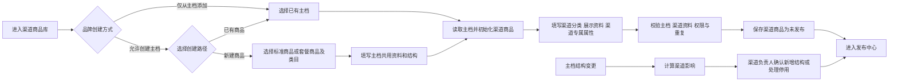
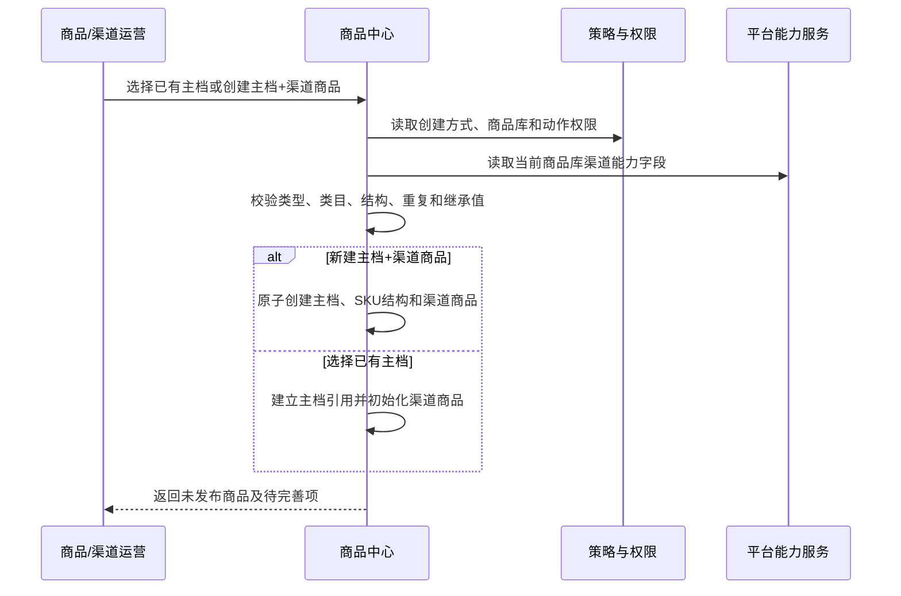
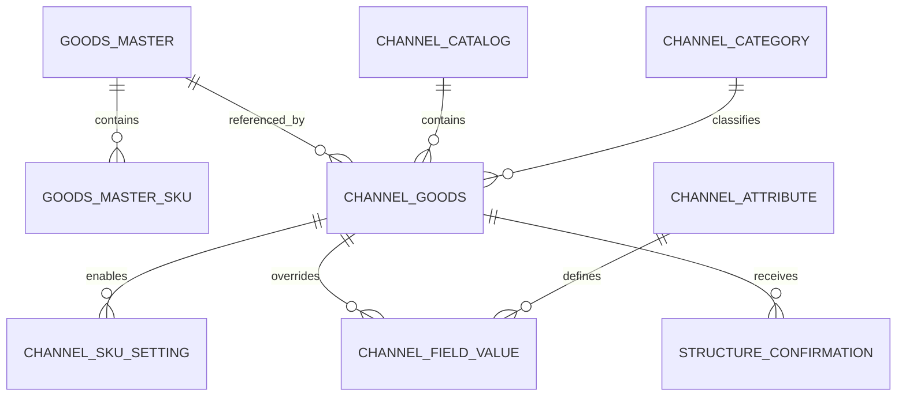
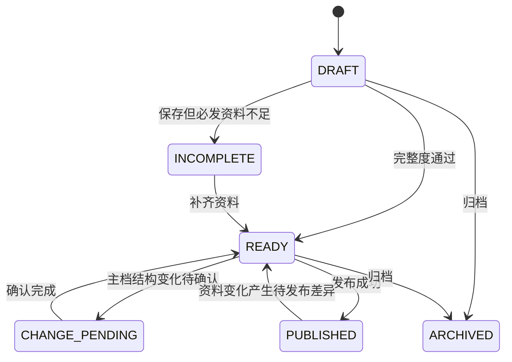

# P02 商品主档与渠道商品库 PRD

> 文档状态：v2.3 评审稿 · 2026-08-11（前台分类由主档定义并提供默认归属，渠道商品库可覆盖归属）
> PRD 档位：重档 L1 流程册  
> 主对象：商品主档 `GoodsMaster`、渠道商品 `ChannelGoods`  
> 功能域前缀：`CGD`  
> 适用入口：商品中心 / 商品主档、渠道商品  
> 核心口径：渠道商品必须引用主档；渠道入口可按品牌配置“仅从主档添加”或“允许一次创建主档+渠道商品”，但共用资料只填写一次，主档与渠道资料的后续编辑入口保持分开

---

## 1. 业务目标

在保留唯一商品身份和标准结构的前提下，由商品主档统一维护后台分类、前台分类定义和商品默认前台分类，为不同渠道商品库提供可覆盖的前台分类归属、品牌级售卖资料、渠道属性及平台扩展，解决旧商品中心中商品主档、模板和平台菜单职责混杂的问题。

相对旧商品中心的主要变化：

- 将原商品库商品收敛为纯净主档，身份、标准/套餐类型、SKU、规格、做法、加料和套餐结构只有一份。
- 新增渠道商品库和渠道商品，承接品牌级渠道售卖资料与渠道扩展。
- 新增分组级数据权限，不再因拥有“渠道商品”菜单就看到全部商品库。
- 渠道商品支持“选择已有主档”和“新建主档+渠道商品”两条路径，后者支持标准商品和套餐商品。
- 一体化创建时共用字段只填写一次；渠道商品创建时默认继承名称、图片、类目、规格、做法、加料和规格售价，不重复要求填写渠道名称和渠道售价。
- 渠道专属资料可在同一创建流程补充，但后续“编辑主档”和“编辑渠道资料”是两个明确动作。
- 商品主档的“分类与属性”统一维护后台分类、前台分类定义和主档属性；商品主档维护默认前台分类归属，渠道商品可在已有分类中覆盖当前商品库归属，并继续维护渠道属性与平台扩展。

## 2. 范围（做 / 不做）

### 2.1 本期做

- 商品主档列表、标准/套餐商品创建、编辑、详情、导入导出和结构影响提示。
- 渠道商品库列表、商品库切换、从主档添加、一次创建、批量加入、编辑渠道资料和发布入口。
- 主档公共资料继承、渠道可覆盖字段、渠道专属字段和平台扩展字段。
- 主档结构变更后的渠道确认、强制停用和待发布差异。
- 渠道分类、渠道属性及其商品关联和发布影响。
- 商品库分组权限、字段权限和跨入口主档编辑权限。

### 2.2 本期不做

- 在渠道层创建独立商品或 SKU 身份。
- 在渠道层新增、删除、改名或重组规格、做法、加料、套餐结构。
- 维护三方平台真实商品权威数据；平台维护渠道仅维护企迈侧渠道/门店渠道商品所需资料。
- 门店即时上下架、库存和沽清；归 P05。
- 发布任务执行和重试；归 P04。

### 2.3 两种协作方式差异

| 维度 | 统一维护 | 分渠道协作 |
|---|---|---|
| 菜单 | 商品主档、渠道商品均展示 | 相同 |
| 商品库 | 一个系统默认商品库 | 多个授权商品库 |
| 默认创建方式 | 可按 P01 配置；推荐允许一体化创建 | 可按 P01 配置 |
| 负责人 | 同一团队可同时拥有主档和默认库权限 | 商品团队与渠道团队通常分开 |
| 主档变更 | 默认库仍需遵守结构确认与发布规则 | 各商品库分别确认 |

## 3. 功能地图与功能点清单

### 3.1 业务能力地图

```text
商品身份与渠道售卖资料
├─ 商品主档：查询、创建、编辑、详情、结构管理
├─ 渠道商品：选已有主档、一次创建、维护渠道资料
├─ 继承与覆盖：共用资料继承、渠道覆盖、结构确认
├─ 渠道基础定义：渠道分类、渠道属性
├─ 批量与导入：批量加入、批量修改、导入导出
└─ 权限与审计：商品库范围、字段、跨入口动作
```

### 3.2 功能点清单

| 功能编号 | 功能名称 | 目标 | 入口/触发 | 主要结果 | 状态 | 关联规则 |
|---|---|---|---|---|---|---|
| CGD-F001 | 查询主档与详情 | 定位唯一商品身份和结构 | 商品主档 | 返回有权主档、引用和状态 | 改造 | R001、R011 |
| CGD-F002 | 创建主档 | 创建标准或套餐商品身份 | 商品主档新增 | 生成主档/SPU/SKU结构 | 沿用改造 | R002、R004 |
| CGD-F003 | 编辑主档 | 维护身份、结构和共用资料 | 主档编辑 | 新主档版本及下游影响 | 改造 | R004、R008 |
| CGD-F004 | 查询渠道商品库 | 按授权商品库管理渠道商品 | 渠道商品 | 返回当前库、渠道和商品 | 新增 | R001、R011 |
| CGD-F005 | 从主档添加 | 复用已有商品，避免重复建品 | 渠道商品主按钮 | 建立主档引用和渠道商品 | 新增 | R002、R003 |
| CGD-F006 | 创建主档+渠道商品 | 一次完成建档和渠道准备 | 渠道商品主按钮 | 原子创建两个对象 | 新增 | R014~R017 |
| CGD-F007 | 编辑渠道资料 | 维护渠道售卖、展示和专属属性 | 行操作“编辑渠道资料” | 生成渠道商品版本 | 新增 | R005~R010 |
| CGD-F008 | 从渠道入口编辑主档 | 在有权限时快捷进入主档维护 | 行操作“编辑主档” | 打开独立主档编辑器 | 新增 | R018 |
| CGD-F009 | 确认主档结构变更 | 控制新增/停用结构进入渠道 | 待确认任务 | 更新渠道启用子集 | 新增 | R008、R019 |
| CGD-F010 | 管理商品分类与渠道属性 | 在主档维护后台/前台分类，在渠道侧维护公共渠道属性和平台扩展定义 | 商品资料“分类与属性”及渠道经营“渠道属性” | 生成定义版本、引用校验和发布差异 | 新增改造 | R020 |
| CGD-F011 | 批量加入与导入修改 | 高效准备大量渠道商品 | 批量/导入 | 返回逐条成功失败 | 新增改造 | R003、R011 |
| CGD-F012 | 归档与发布跳转 | 停止新发布或进入发布中心 | 行/批量操作 | 状态变更或创建 P04 上下文 | 改造 | R012、R013 |
| CGD-F013 | 审计 | 追踪主档、渠道和结构变更 | 系统 | 审计记录 | 新增 | R021 |

## 4. 端到端业务流程



## 5. 系统交互



## 6. 领域对象

### 6.1 对象关系图



### 6.2 对象职责与关键字段

| 对象 | 关键字段 | 业务含义 |
|---|---|---|
| 商品主档 | masterId、productType、backCategoryId、name、structureVersion | 唯一商品身份和标准结构 |
| 主档SKU | skuId、specCombination、standardPrice、status | 完整规格组合及主档标准售价 |
| 渠道商品库 | catalogId、groupId、channelCodes | 共用一套企迈侧售卖资料的渠道范围 |
| 渠道商品 | channelGoodsId、catalogId、masterId、status、channelCategoryId | 引用主档的品牌级渠道售卖对象 |
| 渠道规格值设置 | specValueId、enabled | 按规格值控制当前商品库可售子集；禁用后所有包含该值的 SKU 均不可售 |
| 渠道SKU设置 | skuId、channelPrice、marketPrice、inventoryPolicy、packageFee | 按完整 SKU 组合维护渠道销售值，不能改变 SKU 身份 |
| 字段值 | fieldCode、source、overrideValue、capabilityVersion | 继承/覆盖或渠道专属值 |
| 结构确认 | changeType、structureIds、status、assignee | 主档结构变化后的渠道处理记录 |

商品类型固定为 `STANDARD` 标准商品和 `PACKAGE` 套餐商品；创建前先选择类型，随后只展示该类型可选后台类目和结构字段。

### 6.3 字段分层与归属判定

字段归属是本册的数据契约。页面、导入导出、开放接口、发布快照和迁移均须使用同一 `ownerLayer`，不能根据页面位置临时判断。

| 类型 | 字段层级 | 定义 | 主档变化后 | 渠道能否修改 | 典型字段 |
|---|---|---|---|---|---|
| M1 | 主档强权威 | 决定统一身份、事实、分类定义或标准结构 | 渠道立即读取新值；已发布范围形成待更新/风险 | 否 | 主档ID、类型、后台分类、前台分类定义、商品类目、计量单位、SKU ID、规格结构、条码 |
| M2 | 主档默认、渠道可覆盖 | 主档提供默认有效值，渠道只有主动“独立设置”才保存覆盖 | 未覆盖渠道继续跟随；已覆盖渠道保留覆盖值 | 是，必须显式覆盖 | 标准名称→渠道展示名称、默认前台分类→渠道前台分类、识别图→渠道主图、规格识别图 |
| C1 | 渠道商品公共字段 | 一组渠道共用的品牌级售卖资料；部分字段由主档在创建时初始化 | 创建渠道商品后独立维护，不因主档同类字段变化自动改值 | 是 | SKU售价、市场价、列表简述、售卖时间、启用子集 |
| C2 | 具体渠道扩展字段 | 只对某个自营渠道或三方平台生效 | 与主档无继承关系 | 按渠道能力和权限 | 包装费、POS皮重、平台类目、平台商品特色 |
| S1 | 门店经营字段 | 区域、门店群或具体门店的最终经营值 | 按模板、规则和门店操作计算 | 仅门店执行域 | 实时库存、沽清、门店上下架、门店最终价 |
| R1 | 平台运行时字段 | 平台接口产生或回传的只读事实 | 由平台服务事件更新 | 否 | 平台商品ID、审核状态、发布状态、映射状态、失败原因 |

归属判定顺序：

1. 决定商品/SKU身份、事实、结构或内部统一识别的字段归 M1。
2. 有统一默认值但允许渠道改变营销表达的字段归 M2。
3. 天然属于品牌级渠道卖法、价格或启用范围的字段归 C1。
4. 只适用于某一渠道或平台能力版本的字段归 C2。
5. 因区域/门店不同而变化的字段归 S1，不上收至渠道商品。
6. 由平台执行产生的状态归 R1，只读展示，不混入可编辑商品资料。

### 6.4 商品主档字段白名单

#### 6.4.1 商品身份、内部管理与事实

| 字段 | 类型 | 必填/默认 | 渠道侧表现 | 业务说明 |
|---|---|---|---|---|
| 商品主档ID | M1 | 系统生成 | 只读引用 | 全局唯一商品身份 |
| 商品类型 | M1 | 必填 | 只读 | `STANDARD` / `PACKAGE`；决定类目和结构表单 |
| 商品标准名称 | M2 | 必填 | 默认作为渠道展示名称，可显式覆盖 | 内部识别及渠道初始展示值 |
| 数字助记码 | M1 | 选填 | 不展示/只读 | 内部检索和收银辅助 |
| 后台分类 | M1 | 按品牌配置 | 只读；主档列表快捷筛选 | 内部经营、权限和统计分类 |
| 前台分类 | M2 | 主档按品牌配置默认归属；可多选 | 默认跟随主档；渠道商品可改为当前商品库独立归属，并可用于筛选 | 分类定义由商品主档统一维护；商品主档默认值供历史下游和未覆盖渠道读取，渠道覆盖仅影响当前商品库及其下发范围，不等同于平台类目 |
| 商品类目 | M1 | 必填 | 只读；用于渠道字段规则计算 | 决定动态字段、结构校验和平台类目候选 |
| 计量单位 | M1 | 条件必填 | 只读 | 统一计量事实；平台展示单位另建 C2 |
| 是否称重商品 | M1 | 默认否 | 只读 | 影响 SKU 结构和 POS 售卖方式 |
| 内部备注 | M1 | 选填 | 不发布 | 仅内部可见 |
| 统计标签 | M1 | 选填 | 不作为渠道营销标签 | 统一报表口径 |
| 主档状态 | M1 | 默认草稿 | 只读摘要 | 草稿、启用、停用、归档 |
| 生产地/原料事实 | M1 | 按类目 | 渠道可加工展示文案，但不得改事实 | 客观事实需统一；配方和营养关系在对应业务页维护 |
| 税务分类/开票项目 | M1 | 按财税配置 | 渠道只消费结果 | 统一内部财税归类 |
| 标准成本/参考成本 | M1 | 选填 | 不发布 | 内部经营参考，不等于渠道售价 |

#### 6.4.2 标准素材、SKU 与结构

| 字段 | 类型 | 必填/默认 | 渠道侧表现 | 业务说明 |
|---|---|---|---|---|
| 商品识别图/标准素材图 | M2 | 建议填写 | 默认作为渠道主图，可显式覆盖 | 主档识别和素材复用，不直接等于已发布图片 |
| SKU ID | M1 | 系统生成 | 只读引用 | 订单、库存、映射和统计统一身份 |
| 规格模式 | M1 | 必填 | 只读 | 单规格/多规格 |
| 规格组、规格值、完整组合 | M1 | 多规格必填 | 结构只读；按规格值管理启用子集 | 禁用一个规格值时，所有包含该值的 SKU 均不可售；渠道不得新增、删除、改名、拆分或合并 |
| SKU编码/商品编码/商家标识/条码 | M1 | 按配置 | 只读 | 统一识别和映射依据 |
| 商品分量及单位 | M1 | 选填 | 只读 | SKU 客观事实 |
| 规格识别图 | M2 | 选填 | 默认作为渠道规格图，可覆盖 | 标准素材 |
| 主档规格售价 | 主档初始化值 | 必填 | 创建渠道商品时初始化 C1 渠道规格售价 | 主档标准定价；既有渠道价格不随其自动变化 |
| 规格标准成本 | M1 | 选填 | 不发布 | 内部经营字段 |

不进入主档的字段：市场价、包装费、售卖时间、上下架、实时库存、沽清、POS 皮重、渠道展示标签/角标、平台专属字段以及平台发布/审核/映射状态。

#### 6.4.3 做法、加料和套餐结构

| 模块 | 主档维护（M1） | 渠道维护（C1/C2） |
|---|---|---|
| 做法 | 允许做法集合、身份、编码、标准名称和关系 | 启用子集、排序、默认/必选、加价、渠道提示 |
| 加料 | 允许加料集合、加料商品身份、编码和基础关系 | 启用子集、价格、规格加价、起购限购、必选、排序和未点提示 |
| 套餐 | 套餐身份、标准分组、候选商品/SKU关系 | 渠道有效子集、选择数量、组内加价、计价方式、包装费和展示规则 |

渠道需要增加主档不存在的做法、加料或套餐候选时，必须先编辑主档；平台结构差异由渠道适配规则转换，不反向污染主档。

### 6.5 渠道商品字段白名单

#### 6.5.1 商品库公共售卖资料

| 字段 | 类型 | 创建默认 | 后续维护 | 说明 |
|---|---|---|---|---|
| 渠道展示名称 | M2 | 读取主档标准名称，不重复填写 | 无覆盖时继续跟随主档；独立设置后保存覆盖值 | 不修改主档名称 |
| 前台分类 | M2 | 读取主档默认前台分类，不重复填写 | 可在已有前台分类中独立选择；恢复跟随后删除覆盖值 | 覆盖仅影响当前商品库，不回写主档；分类定义仍在主档维护 |
| 渠道商品主图 | M2 | 读取主档识别图 | 可独立设置；恢复跟随后删除覆盖 | 商品库含小程序时按能力强制必填 |
| 规格展示图 | M2 | 读取主档规格识别图 | 可按能力独立设置 | 不改变规格身份 |
| 渠道商品别名 | C1 | 空 | 渠道团队维护 | 渠道检索/展示用途 |
| 列表页简述、详情描述、视频 | C1 | 空 | 渠道团队维护 | 按渠道能力发布和转换 |
| 描述标签、点单标签、角标、系列 | C1 | 空 | 渠道团队维护 | 渠道营销字段，不等于主档统计标签 |
| 商品展示类型 | C1 | 按能力默认 | 渠道团队维护 | 盲盒、展示商品、团餐、儿童餐等 |
| 渠道规格售价 | C1 | 从主档对应规格售价初始化，不单独要求填写 | 创建后独立维护；主档调价不静默覆盖 | 具体渠道或门店还可继续覆盖 |
| 市场价/划线价 | C1 | 空 | 按渠道能力维护 | 不进入主档 |
| 渠道售卖状态、售卖时间、起购/限购、售卖方式 | C1 | 按品牌默认 | 渠道团队维护 | 品牌级默认卖法 |
| 规格值/做法/加料启用子集 | C1 | 主档当前允许集合默认全启用 | 规格按值启停；做法、加料按候选项启停 | 规格值禁用结果向包含该值的全部 SKU 传导；不得新增主档外对象 |
| 做法/加料/套餐售卖配置 | C1 | 从主档关系初始化 | 维护价格、排序、选择规则和展示规则 | 不改变主档标准结构 |
| 品牌自定义渠道属性 | C1 | 按字段配置 | 渠道团队维护 | 需声明适用类目、渠道、值类型和必填规则 |

#### 6.5.2 具体渠道扩展资料

| 字段域 | 类型 | 存储粒度 | 显示条件 | 说明 |
|---|---|---|---|---|
| 渠道名称/图片/售价/售卖时间覆盖 | C2 | 渠道商品+channelCode | 同一商品库内渠道需差异 | 高于商品库公共值 |
| 包装费、包装标识、单点不送 | C2 | 渠道或渠道SKU | 渠道支持 | 到店外带和外卖规则分开 |
| POS皮重、临时改价、打印/生产配置 | C2 | POS渠道 | 商品库包含 POS | 不向其他渠道展示 |
| 库存策略 | C2 | 渠道 | 渠道启用库存 | 只保存策略；实时库存归 S1 |
| 会员折扣、积分规则 | C2 | 自营渠道 | 对应能力开通 | 不向三方平台泛化 |
| 平台商品类目、特色、提审资料、平台图片 | C2 | 三方channelCode+capabilityVersion | 资料由企迈维护且平台能力要求 | 定义来自平台服务；平台维护资料时不展示 |
| 平台结构转换配置 | C2 | 三方channelCode+capabilityVersion | 平台结构与标准结构不同 | 只影响发布转换，不修改主档 |

### 6.6 不属于主档或渠道商品编辑的字段

| 字段 | 归属 | 在 P02 中的处理 |
|---|---|---|
| 门店实时库存、沽清数量、上下架 | S1 门店渠道商品/库存域 | 只读摘要或跳转 P05 |
| 门店最终售价、门店临时改价 | S1 门店渠道商品/价格策略 | 只读影响，不在渠道公共表单编辑 |
| 区域/门店群覆盖值 | 商品模板或门店规则 | 只展示引用和发布影响 |
| 平台商品ID、平台SKUID | R1 平台服务 | 只读展示和跳转 P06 |
| 发布状态、审核状态、失败原因 | R1 P04/平台服务 | 只读摘要和处理入口 |
| 映射状态、mappingId、生效时间 | R1 平台服务 | 只读摘要；关系修改在 P06 |
| 配方、成本卡、营养成分关系 | 配方与营养域 | 通过 masterId/skuId 关联，不在主档基础表单重复维护 |

### 6.7 最终有效值与来源优先级

| 字段类型 | 最终有效值计算 | 发布快照要求 |
|---|---|---|
| M1 | 商品主档当前权威值 | 保存 masterVersion 和字段值 |
| M2 | 具体渠道覆盖 > 商品库覆盖 > 商品主档当前值 | 保存最终值、来源层级和来源版本 |
| C1 | 具体渠道覆盖 > 商品库公共值；首次公共值可由主档初始化 | 保存渠道商品版本；不得在执行时重新读取主档同类字段 |
| C2 | 当前 channelCode 对应扩展值 | 保存 channelCode、capabilityVersion 和最终值 |
| S1 | 门店操作/门店策略 > 模板/规则 > 渠道有效值 | 保存门店、规则/模板版本和最终值 |
| R1 | 平台服务最新权威状态 | 不写入商品资料快照，只关联任务/映射版本 |

任一字段在详情、编辑、导出和发布预览中都应能说明“当前值、来源层级、是否覆盖、来源版本”。不得同时保存两份无法判断优先级的同语义有效值。

详细渠道能力和现有字段编码对照见：[商品主档与渠道商品库字段归属及渠道能力矩阵](../../plans/商品主档与渠道商品库字段归属及渠道能力矩阵.md)。本册是字段层级和业务规则的权威来源；专项矩阵用于展开渠道能力和存量字段迁移映射。

## 7. 主对象状态机



| 状态 | 含义 | 主要动作 |
|---|---|---|
| DRAFT | 已创建但未完成首次校验 | 编辑、删除草稿 |
| INCOMPLETE | 缺少当前商品库必需资料 | 去完善 |
| READY | 可创建发布批次 | 编辑、发布、归档 |
| CHANGE_PENDING | 主档结构需渠道确认 | 确认新增/停用项 |
| PUBLISHED | 当前版本已至少成功发布一次 | 查看发布、继续编辑 |
| ARCHIVED | 不再参与新发布 | 查看、恢复（有权限时） |

## 8. 页面功能与交互说明

### 8.1 CGD-F004 渠道商品库列表

| 区域 | 字段/控件 | 默认与来源 | 交互/权限 |
|---|---|---|---|
| 商品库上下文 | 商品库名称、包含渠道、当前权限 | P01 生效策略 | 统一维护只有一个默认库；分渠道只显示授权库 |
| 快捷筛选 | 全部、待完善、待确认、可发布、已发布、已归档 | 当前库统计 | 切换回第一页 |
| 分类树 | 前台分类 | 当前商品库最终有效值 | 作为快捷筛选；未覆盖取主档默认值，已覆盖取当前商品库值；可折叠 |
| 结构化筛选 | 商品ID、SKUID、商品类型、完整度、发布状态、渠道属性状态 | 商品中心 | 支持重置、查询 |
| 表格 | 商品、类型、前台分类、规格售价、资料完整度、发布状态、更新时间、操作 | 合并主档和渠道摘要 | 商品识别列和操作列固定 |
| 主操作 | 选择已有主档/新建商品 | P01 `channelCreateMode` | 仅从主档时“选择已有主档”为明显主按钮；允许创建时为下拉主按钮 |

行操作必须分开：`编辑渠道资料`、`编辑主档`（有权限且策略允许）、`详情`、`发布`、`移出/归档`。不得使用含义不清的“维护主档与渠道”。

### 8.2 CGD-F005 从主档添加

| 字段/控件 | 必填 | 默认/来源 | 规则 |
|---|---|---|---|
| 商品库 | 是 | 当前上下文 | 不可在选择器中跨库 |
| 商品类型 | 否 | 全部 | 标准/套餐均可筛选 |
| 后台分类 | 否 | 全部 | 树形筛选 |
| 搜索 | 否 | 空 | 名称、商品ID、SKUID、助记码 |
| 商品列表 | 是，多选 | 有权且未加入当前库的主档 | 已存在、归档、结构无效时置灰并解释 |
| 初始化摘要 | — | 主档当前版本 | 展示将继承的名称、图片、结构和售价，不要求重复填写 |

确认后逐条创建渠道商品；部分失败时成功项保留，失败项显示原因并可仅重试失败项。

### 8.3 CGD-F006 新建商品（主档+渠道商品）

该流程只在 `ALLOW_CREATE_MASTER` 且用户同时拥有当前商品库编辑权限和 `CREATE_MASTER` 权限时出现。

#### 第一步：选择商品类型与类目

| 字段 | 必填 | 规则 |
|---|---|---|
| 商品类型 | 是 | 标准商品/套餐商品；选择后不可直接切换，需确认清空结构 |
| 后台类目 | 是 | 只展示所选类型可用类目；决定主档字段模板 |
| 创建目标 | — | 固定“商品主档 + 当前渠道商品库”，只读展示 |

#### 第二步：填写共用资料与主档结构

| 分组 | 字段 | 必填/默认 | 说明 |
|---|---|---|---|
| 基础资料 | 商品名称、助记码、计量单位、主图、后台分类、前台分类、称重标识 | 按类目配置 | 共用资料只填一次；前台分类作为主档默认归属创建渠道商品时先进入跟随状态，不在渠道步骤重复填写 |
| 标准商品结构 | 规格组、规格值、完整SKU、SKU编码、规格售价、规格库存策略 | 标准商品显示 | 渠道商品首次售价直接继承主档规格售价，不出现重复的渠道售价输入框 |
| 做法/加料 | 允许的做法组、做法值、加料组、加料商品及关系 | 按类目/字段配置 | 定义主档允许全集 |
| 套餐结构 | 套餐分组、可选商品、数量、必选/可选、加价 | 套餐商品显示 | 套餐子项引用有效主档商品/SKU |
| 展示资料 | 详情图、列表简介、标签等共用初始资料 | 按渠道能力 | 共用值首次继承，非重复渠道字段 |

类目应选择一个演示字段较完整的类目模板，原型和评审环境默认展示常用基础、规格、做法、加料、图片和展示字段。本期不提供“渠道商品常用字段设置”入口，渠道表单按产品预置分组展示，不能把大部分业务字段隐藏到无法演示。

#### 第三步：补充渠道资料

| 字段 | 必填/默认 | 显示条件 | 规则 |
|---|---|---|---|
| 渠道展示扩展 | 默认继承共用资料 | 当前库允许独立维护 | 仅在用户主动开启“独立设置”后出现覆盖输入 |
| SKU启用范围 | 默认全部继承并启用 | 主档结构完成 | 只能缩小，不可新增SKU |
| 做法/加料启用范围 | 默认继承主档允许全集 | 存在关系 | 只能缩小，不可改变结构 |
| 渠道专属属性 | 按渠道能力动态出现 | 当前库包含相应渠道 | 公共字段只显示一次，平台特有字段按渠道分组 |

页面不重复展示“渠道商品名称”“渠道前台分类”和“渠道商品售价”作为第二套必填项。创建后如确需渠道差异，由“编辑渠道资料”单独覆盖渠道名称、前台分类等 M2 字段；恢复跟随主档时删除覆盖记录并读取主档最新值。

#### 提交

保存时先校验并创建主档及结构，再创建引用该主档的渠道商品；两者必须形成一个业务结果。任一步失败均不保留半条可见商品，页面保留用户输入并定位错误。支持保存草稿，草稿也必须保持主档与渠道草稿的关联一致。

### 8.4 CGD-F007/F008 编辑入口边界

| 动作 | 可编辑内容 | 不可编辑内容 | 权限 |
|---|---|---|---|
| 编辑渠道资料 | 前台分类归属、展示覆盖、规格值启用、SKU渠道销售价/市场价、库存策略、包装费与包装标识、渠道专属属性、平台类目映射 | 商品类型、后台分类、前台分类定义、主档名称身份、SKU ID、商品标识、商品规格码、商品编码、条码及规格/做法/加料/套餐结构 | 当前商品库 EDIT |
| 编辑主档 | 主档共用资料、后台分类、前台分类、规格、做法、加料、套餐结构 | 渠道覆盖和渠道专属属性 | MASTER_EDIT；从渠道入口进入时仍打开独立主档编辑页 |

编辑商品名称时页面必须明确当前编辑的是“主档商品名称”还是“渠道名称覆盖”。默认渠道商品跟随主档；只有渠道编辑中主动开启独立设置才产生覆盖，不能一次输入同时无提示地改两个对象。

编辑前台分类时应直接选择商品主档已经定义且处于启用状态的分类。保存后写入当前商品库覆盖值，不回写主档，也不改变其他商品库；渠道页不提供新增、改名、移动或停用分类定义。最终有效值按 `当前商品库覆盖值 > 商品主档默认值` 解析，并在详情、筛选、导出和发布预览中显示来源。

#### 规格值与 SKU 销售配置

- “规格值可售范围”不在编辑页常驻展开。SKU 销售配置标题区展示“已禁用 N 个规格值”摘要和“配置规格值”入口；点击后打开中型弹窗，按规格值展示名称、关联 SKU 数和可售开关。用户禁用规格值前，二次确认显示受影响 SKU 数量；确认并保存弹窗后，所有包含该规格值的 SKU 均计算为不可售。一个 SKU 包含多个规格值时，只有全部规格值均启用，该 SKU 才可售。
- 规格值配置弹窗使用草稿态：点击“取消”或关闭不保存本次调整；点击“保存配置”才回写当前编辑表单，最终仍随页面“保存修改”一起提交。主页面默认优先展示 SKU 销售配置，不因低频规格范围设置挤压表格首屏。
- “SKU 销售配置”继续按完整规格组合逐行展示，用于维护渠道销售价、市场价、库存策略/库存值、到店外带包装费与标识、外卖配送包装费与标识。
- SKU ID 不作为日常编辑列表列展示；商品标识、商品规格码、商品编码和商品条码必须展示为主档只读字段，渠道提交时不得携带这些字段的修改值。
- 不展示“主档参考价”列。渠道销售价由创建渠道商品时的主档规格售价初始化，创建后直接展示并维护当前渠道销售价；市场价为空时显示空值，不回退展示主档价格。
- 主档新增规格值在已关联商品库中默认禁用并进入待确认；主档停用规格值时渠道强制不可售，不能重新启用。

### 8.5 CGD-F009 主档结构变更确认

- 主档新增 SKU、做法或加料：出现在已关联渠道商品的“待确认”列表，默认禁用；渠道负责人逐项启用或继续禁用。
- 主档停用结构：下游强制停用，展示受影响模板、门店商品和发布范围，生成待发布差异。
- 结构改名、合并、删除：按主档结构变更规则处理；有引用时禁止物理删除。
- 统一维护也执行以上规则，只是默认商品库负责人通常与主档负责人相同。

### 8.6 CGD-F010 商品分类与渠道属性

| 视图 | 主要字段 | 操作 | 约束 |
|---|---|---|---|
| 后台分类 | 名称、父级、排序、状态、商品数 | 新建、编辑、移动、启停、关联商品 | 主档内部经营分类；删除前校验主档引用 |
| 前台分类 | 名称、父级、图片、排序、展示范围、状态、商品数 | 新建、编辑、移动、启停、关联商品 | 主档共享分类；删除前校验商品、营销活动、卡券等下游引用；变化产生相关渠道发布差异 |
| 公共渠道属性 | 属性名、类型、值域、适用类目/渠道、必填、状态 | 新建、编辑、排序、停用 | 与主档基础属性分开 |
| 平台扩展属性 | 平台、类目、字段编码、能力版本、必填、校验状态 | 查看、填写商品值 | 定义来自平台服务，不在此创建字段 |

### 8.7 字段来源、继承与覆盖交互

| 字段类型 | 创建主档+渠道商品 | 编辑主档 | 编辑渠道资料 | 详情/发布预览 |
|---|---|---|---|---|
| M1 | 在主档分区填写一次；渠道分区不重复出现 | 正常编辑并展示影响范围 | 只读摘要或不展示输入控件 | 标记“主档”，展示 masterVersion |
| M2 | 在主档分区填写一次；渠道默认值即时预览，不出现第二个必填框 | 编辑主档默认值并提示未覆盖渠道影响 | 默认显示“跟随主档”；点击“独立设置”后出现渠道输入，支持“恢复跟随主档” | 展示最终值及“主档/商品库/具体渠道覆盖”来源 |
| C1 | 有主档初始化值的字段不重复填写；无默认值的渠道字段在渠道分区填写 | 不出现 | 商品库公共售卖资料正常编辑 | 标记渠道商品版本；不得显示为持续继承主档 |
| C2 | 仅在当前商品库包含对应渠道且资料由企迈维护时按渠道分组出现 | 不出现 | 在对应渠道区编辑，渠道切换不丢失已填值 | 展示 channelCode 和 capabilityVersion |
| S1 | 不出现 | 不出现 | 不允许编辑，提供“前往门店商品/规则”入口 | 只读展示门店差异数量和影响摘要 |
| R1 | 不出现 | 不出现 | 不允许编辑 | 只读状态、失败原因及“前往发布/映射治理”入口 |

“主档/渠道”分区本身已经表达字段归属，不常驻大段说明卡片。只在字段存在继承、覆盖、必填来源或变更影响时显示紧凑来源标签、帮助提示和操作入口。

## 9. 无直接页面的系统功能说明

| 功能 | 触发 | 处理 | 输出/状态 | 异常恢复 |
|---|---|---|---|---|
| 字段元数据解析 | 进入创建/编辑、类目或渠道变化 | 按 ownerLayer、商品类型、类目、channelCode、资料维护方和 capabilityVersion 计算字段 | 字段集合、必填、控件、权限和校验 | 规则不可用时保留已填值并阻止提交 |
| 继承与最终值解析 | 查询/保存/发布 | M1读主档；M2按具体渠道覆盖>商品库覆盖>主档；C1/C2按渠道层级；S1由下游叠加 | 最终值、来源层级、覆盖状态和版本 | 来源失效标记待完善并阻止发布 |
| 一体化创建编排 | F006提交 | 原子创建主档、结构、渠道商品和初始启用子集 | 两个关联对象 | 失败整体回滚或补偿至不可见草稿 |
| 结构传播 | 主档版本变化 | 计算已关联商品库的新增、停用和影响 | 待确认/待发布事项 | 消费失败进入补偿队列 |
| 平台字段校验 | 渠道资料保存/发布前 | 按渠道能力版本校验 | 完整度和错误码 | 版本变化后重新校验，不丢历史值 |
| 审计 | 所有写操作 | 记录对象、字段来源、前后值、版本和操作者 | 审计记录 | 审计失败写操作回滚 |

## 10. 业务规则矩阵

| 规则号 | 关联功能 | 规则 | 默认/通过结果 | 不通过结果 |
|---|---|---|---|---|
| CGD-R001 | F001、F004、F011 | 渠道与商品库数据权限 | 以账号固定 channelId 范围为稳定授权基础，结合当前分组关系推导可见 groupId/catalogId；公共资料写操作还需完整渠道范围或显式共享操作权限 | 不泄露其他渠道/商品库数量和名称，分组调整不自动扩大固定渠道权限 |
| CGD-R002 | F002、F005、F006 | 渠道商品引用有效主档 | 建立 masterId 引用 | 禁止脱离主档创建 |
| CGD-R003 | F005、F011 | 库内唯一 | catalogId+masterId 唯一 | 重复项失败并定位已有商品 |
| CGD-R004 | F002、F003 | 主档纯净 | 只保存身份、共用资料和标准结构 | 渠道销售/平台属性禁止写入主档 |
| CGD-R005 | F006、F007 | 公共资料继承 | 无覆盖时跟随主档 | 源值非法标记待完善 |
| CGD-R006 | F007 | 渠道覆盖显式化 | 只有主动独立设置才保存覆盖 | 不得无提示复制成独立值 |
| CGD-R007 | F006、F007 | 售价初始继承 | 创建时SKU售价继承主档规格售价 | 不重复要求渠道售价 |
| CGD-R008 | F003、F009 | 主档结构权威 | 渠道只管理启用子集 | 渠道不得增删改结构 |
| CGD-R009 | F007 | 下游只可缩小 | SKU/做法/加料启用集合⊆主档允许集合 | 超出范围阻止保存 |
| CGD-R009A | F007 | 规格值禁用传导 | SKU可售=该SKU包含的全部规格值均启用且主档SKU有效 | 任一规格值禁用时该SKU不可售，不允许单独开启SKU绕过 |
| CGD-R010 | F007、F010 | 渠道字段按能力出现 | 只展示当前库适用字段 | 其他平台字段隐藏 |
| CGD-R011 | F001~F012 | 动作和数据双重鉴权 | 菜单+商品库+字段/动作权限通过 | 只读、隐藏或阻断 |
| CGD-R012 | F012 | 归档保护 | 无进行中发布可归档 | 有任务阻止 |
| CGD-R013 | F012 | 发布跳转 | 仅携带有权且可发布对象到 P04 | 不在本页直接执行异步发布 |
| CGD-R014 | F006 | 创建策略门禁 | 仅 P01允许且有CREATE_MASTER时展示 | 否则只允许选主档 |
| CGD-R015 | F006 | 商品类型完整 | 标准、套餐均支持且先选类型 | 不得只支持标准商品 |
| CGD-R016 | F006 | 共用资料只填一次 | 主档输入作为渠道首次继承 | 不展示重复必填渠道字段 |
| CGD-R017 | F006 | 一体化创建一致性 | 主档与渠道商品同一业务结果 | 禁止半条成功 |
| CGD-R018 | F008 | 编辑入口分离 | 主档与渠道资料分别进入独立编辑器 | 禁止含义不明的合并编辑 |
| CGD-R019 | F009 | 新增待确认/停用强制 | 新增默认禁用；上游停用下游强制停用 | 不允许下游继续启用 |
| CGD-R020 | F010 | 分类与属性定义版本化 | 后台/前台分类及渠道属性变化生成版本、引用影响和发布差异 | 有商品、营销活动、卡券或已发布渠道引用时不可直接物理删除 |
| CGD-R021 | F013 | 审计完整 | 写操作与审计同结果 | 无审计不成功 |
| CGD-R022 | F001~F013 | 字段层级唯一 | 每个 fieldCode 有唯一 ownerLayer 和确定优先级 | 禁止页面或接口按场景临时改归属 |
| CGD-R023 | F002、F003、F006~F008 | M1 强主档 | 渠道只读并直接引用主档当前值 | 渠道提交 M1 值时拒绝保存 |
| CGD-R024 | F003、F006~F008 | M2 跟随直至覆盖 | 无覆盖读取主档；显式独立设置才保存覆盖；恢复跟随删除覆盖 | 不得静默复制成独立值或同时改主档 |
| CGD-R025 | F002、F003、F006、F007 | C1 创建初始化后独立 | 规格售价等创建时由主档初始化，渠道商品形成后按渠道版本维护 | 主档后续同类字段变化不得静默覆盖渠道值 |
| CGD-R026 | F006、F007、F010 | C2 按渠道能力 | 仅在 channelCode、资料维护方和 capabilityVersion 满足时显示、校验和保存 | 其他渠道字段隐藏且服务端拒绝越界值 |
| CGD-R027 | F001、F004、F007、F012 | S1/R1 边界 | 门店经营值和平台运行状态只读摘要或深链 owning 页面 | 禁止混入主档/渠道商品编辑请求 |
| CGD-R028 | F001、F004、F007、F012 | 最终值可追溯 | 展示/导出/发布快照记录最终值、来源层级和版本 | 来源不明时阻止发布 |

## 11. 数据来源与权威系统

| 数据 | 权威来源 | 本册处理 |
|---|---|---|
| 商品主档、SKU、规格、做法、加料、套餐 | 商品中心主档域 | 读写权威数据 |
| 渠道商品库、渠道商品、分类和公共渠道属性 | 商品中心渠道商品域 | 读写权威数据 |
| 商品库分组、创建方式、固定渠道权限及推导商品库范围 | P01/权限中心 | 只读并强制校验；分组变化时按 channelId 重新推导 |
| 平台扩展字段定义和能力版本 | 平台服务 | 只读定义，保存商品填写值及版本 |
| 字段 ownerLayer、继承方式和类目/渠道适用规则 | 商品中心字段元数据；平台扩展规则由平台服务提供 | P02 按 M1/M2/C1/C2/S1/R1 计算页面字段与最终值 |
| 门店实时库存、沽清、上下架和门店最终价 | P05/库存域/价格策略 | 只读摘要，不写入主档或渠道商品 |
| 发布状态 | P04 | 展示摘要和跳转 |
| 映射状态 | P06/平台服务 | 展示摘要，不修改权威关系 |

## 12. 权限门禁

| 能力 | 权限 | 表现 |
|---|---|---|
| 查看主档 | MASTER_VIEW | 返回有权品牌主档 |
| 编辑主档 | MASTER_EDIT | 独立主档编辑入口 |
| 查看/编辑渠道商品 | CATALOG_VIEW/EDIT + group scope | 仅授权商品库 |
| 从渠道入口创建主档 | CREATE_MASTER + CATALOG_EDIT + P01允许 | 显示“新建商品”路径 |
| 发布 | CATALOG_PUBLISH + 门店/渠道范围 | 跳转P04 |
| 管理渠道分类属性 | CATALOG_FOUNDATION_ADMIN | 显示对应页内视图和动作 |

补充：`group scope` 不是静态人工勾选商品库后永久不变，而是由权限中心固定渠道范围与当前渠道商品库分组关系动态推导。商品库切换、选品、批量修改、导入导出、发布、计数和日志必须复用同一服务端范围解析；商品库公共资料编辑需要覆盖商品库全部渠道，或具备明确的共享资料操作权限。

## 13. 异常恢复与断点续办

| 异常 | 页面表现 | 恢复 |
|---|---|---|
| 一体化创建校验失败 | 定位主档或渠道字段，保留所有输入 | 修正后重提 |
| 原子创建中途失败 | 不展示半条商品，记录补偿号 | 系统补偿或用户按原草稿重试 |
| 主档并发变化 | 显示最新版本差异 | 刷新并重新确认 |
| 平台能力版本变化 | 标记受影响字段和旧值 | 按新版本补齐，不丢历史 |
| 批量加入部分失败 | 展示成功、失败及逐条原因 | 仅重试失败项 |
| 分组权限收回 | 立即失去库访问，不改变历史数据 | 联系管理员或转交任务 |

## 14. 错误文案

| 错误码 | 文案 | 下一步 |
|---|---|---|
| CGD-400-001 | 所选主档已失效，请重新选择 | 返回主档选择器 |
| CGD-409-001 | 商品已在当前商品库中 | 定位已有商品 |
| CGD-400-002 | 当前商品类型与类目不匹配 | 重新选择类型或类目 |
| CGD-403-001 | 你只能从主档选择商品，不能在此创建主档 | 选择已有主档或申请权限 |
| CGD-403-002 | 你没有当前商品库的数据权限 | 切换授权商品库 |
| CGD-409-002 | 主档结构已变化，请刷新后确认 | 查看结构变更 |
| CGD-500-001 | 商品保存失败，当前填写内容已保留 | 重试或保存草稿 |

## 15. 日志、审计与通知

- 记录主档、结构、渠道覆盖、渠道分类属性、创建方式来源和商品库范围。
- 一体化创建记录同一业务关联号下的 masterId、channelGoodsId 和失败补偿结果。
- 主档结构变化通知有权商品库负责人；负责人规则由 P09 路由配置决定。

## 16. 非功能要求

| 类型 | 要求 |
|---|---|
| 一致性 | 一体化创建原子或可补偿；渠道商品不得失去主档引用 |
| 性能 | 常规列表P95≤2秒；选择器P95≤1.5秒 |
| 大批量 | 超过1000项进入异步任务并返回逐条结果 |
| 并发 | 主档和渠道商品分别使用版本条件 |
| 安全 | 菜单、商品库、字段和动作分层鉴权 |

## 17. 测试用例矩阵

| 用例号 | 功能 | 规则 | 场景 | 预期结果 |
|---|---|---|---|---|
| CGD-TC001 | F004 | R001、R011 | 用户只有一个分组权限 | 只显示该商品库和商品 |
| CGD-TC002 | F005 | R002、R003 | 选择标准和套餐主档加入 | 均成功；重复项置灰 |
| CGD-TC003 | F006 | R014、R015 | 策略允许一体化创建 | 可选择标准或套餐 |
| CGD-TC004 | F006 | R016、R007 | 创建标准商品 | 名称和规格售价只填一次，渠道默认继承 |
| CGD-TC005 | F006 | R017 | 渠道字段保存失败 | 主档和渠道商品不产生半条可见数据 |
| CGD-TC006 | F007、F008 | R018 | 分别编辑主档和渠道名称 | 两个入口、影响对象和结果清晰分开 |
| CGD-TC007 | F007 | R008、R009 | 渠道尝试新增规格 | 操作不存在且服务端阻断 |
| CGD-TC007A | F007 | R009A | 从SKU表标题进入“配置规格值”，禁用被2个SKU引用的规格值 | 页面默认不展开规格值列表；禁用前提示影响2个SKU，弹窗保存后两个SKU均不可售，重新启用后仅未受其他禁用值影响的SKU恢复；取消弹窗不改变原值 |
| CGD-TC008 | F009 | R019 | 主档新增/停用做法 | 新增待确认，停用强制下游停用 |
| CGD-TC009 | F010 | R020 | 删除有商品引用的前台分类 | 阻止并显示引用范围 |
| CGD-TC010 | F011 | R001、R003 | 批量加入含越权和重复项 | 成功项保留，失败逐条说明 |
| CGD-TC011 | F001 | R001、R011 | 按后台分类查询主档并打开详情 | 仅返回有权主档，身份、结构、引用和状态完整 |
| CGD-TC012 | F002 | R002、R004 | 分别创建标准商品和套餐商品 | 均按对应可选类目生成正确主档和结构 |
| CGD-TC013 | F003 | R004、R008 | 编辑主档公共资料和结构 | 生成新版本并明确提示下游影响 |
| CGD-TC014 | F012 | R012、R013 | 归档渠道商品并从另一商品进入发布 | 归档对象停止新发布；发布跳转携带正确上下文 |
| CGD-TC015 | F013 | R021 | 模拟审计写入失败 | 主档或渠道商品写操作整体失败，不产生半条版本 |
| CGD-TC016 | F003、F007 | R022、R023 | 从渠道编辑提交商品类型、后台类目或规格结构 | 页面不可编辑且服务端拒绝 M1 越界值 |
| CGD-TC017 | F003、F006、F007 | R024 | 未覆盖/已覆盖渠道分别修改主档名称和识别图 | 未覆盖渠道读取新值并产生待发布；已覆盖渠道保留覆盖；恢复跟随后重新读取主档 |
| CGD-TC018 | F003、F006、F007 | R025 | 创建渠道商品后修改主档规格售价 | 创建时不重复填渠道售价；既有渠道售价不被主档调价静默覆盖 |
| CGD-TC019 | F006、F007、F010 | R026 | 商品库同时含小程序和平台维护资料的三方渠道 | 小程序必填字段正常出现；平台维护渠道的专属资料字段不出现且不可提交 |
| CGD-TC020 | F004、F007、F012 | R027 | 尝试在渠道编辑修改实时库存、平台审核状态和 mappingId | 编辑请求不包含这些字段，并提供 P05/P06 处理入口 |
| CGD-TC021 | F004、F007、F012 | R028 | 查看详情、导出并创建发布预览 | 同一字段最终值、来源层级、覆盖状态和版本一致可追溯 |

## 18. 验收标准

| AC编号 | 功能 | 验收条件 | 可观察结果 |
|---|---|---|---|
| CGD-AC001 | F004~F006 | 两种创建策略分别演示 | 主按钮明显、标准/套餐完整、无重复建品 |
| CGD-AC002 | F006 | 完成一体化创建 | 共用字段一次填写，渠道专属字段同流程补充，两个对象一致生成 |
| CGD-AC003 | F007~F008 | 编辑同一商品 | 主档和渠道编辑明确分开，名称/价格归属无歧义 |
| CGD-AC004 | F009 | 主档结构发生新增和停用 | 渠道确认、强制停用和发布差异完整 |
| CGD-AC005 | F010 | 维护商品分类与渠道属性 | 后台/前台分类、渠道属性、商品及下游引用、版本和发布影响可追溯 |
| CGD-AC006 | F001~F012 | 不同分组用户访问 | 列表、选择器、导入导出和操作均不越权 |
| CGD-AC007 | F013 | 执行主档、渠道和结构写操作 | 审计与业务结果一致，失败不产生半条版本 |
| CGD-AC008 | F001~F012 | 按字段白名单检查创建、编辑、详情、导出和发布预览 | M1/M2/C1/C2/S1/R1 归属一致；继承、覆盖、初始化、只读边界和最终值来源均可解释 |

### 18.1 功能覆盖与追溯矩阵

| 功能 | 页面/系统触发 | 规则 | 测试 | 验收 | 完成状态 |
|---|---|---|---|---|---|
| F001~F004 | 主档/渠道列表与详情 | R001、R004、R011 | TC001、TC011~TC013 | AC006 | 规格已补齐 |
| F005~F008 | 选择、新建、两类编辑 | R002~R018 | TC002~TC007 | AC001~AC003 | 规格已补齐 |
| F009~F010 | 结构确认、分类属性 | R019~R020 | TC008~TC009 | AC004~AC005 | 规格已补齐 |
| F011~F013 | 批量、发布入口、审计 | R003、R011~R013、R021 | TC010、TC014~TC015 | AC006~AC007 | 规格已补齐 |
| F001~F012 字段契约 | 主档/渠道创建编辑、详情、导入导出、发布预览 | R022~R028 | TC016~TC021 | AC008 | 字段白名单、继承覆盖和最终值计算已补齐 |
