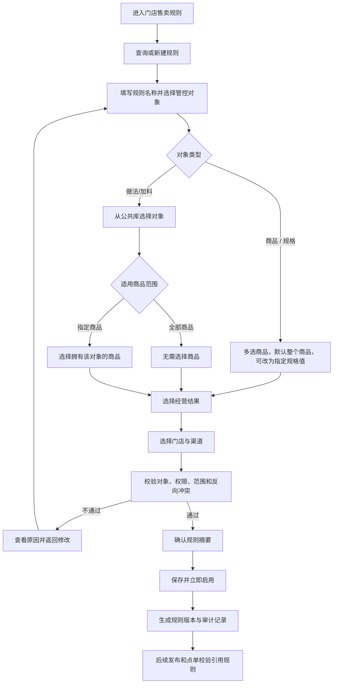
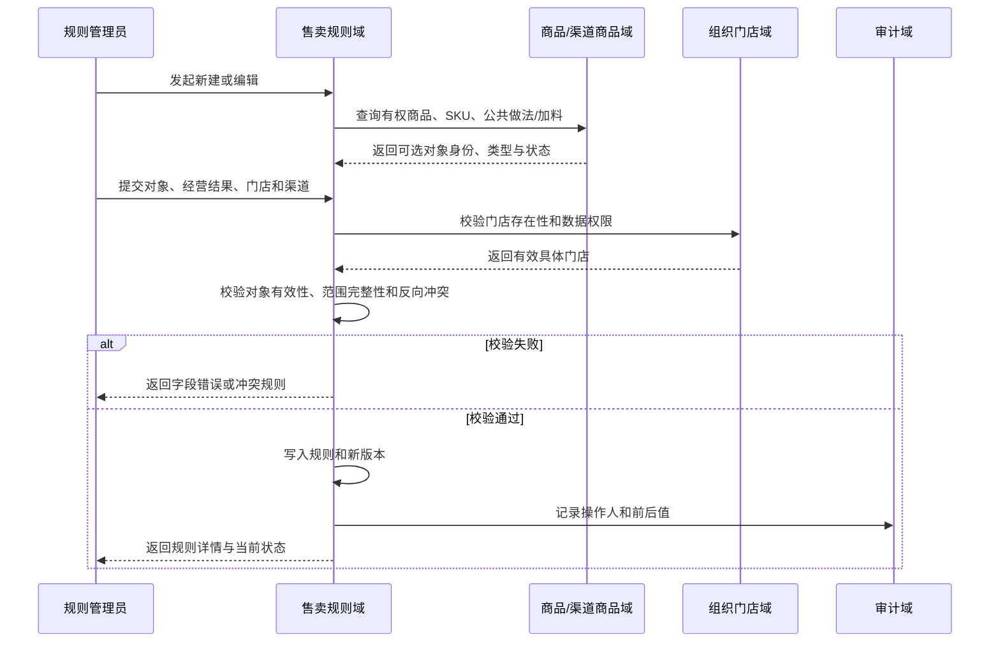
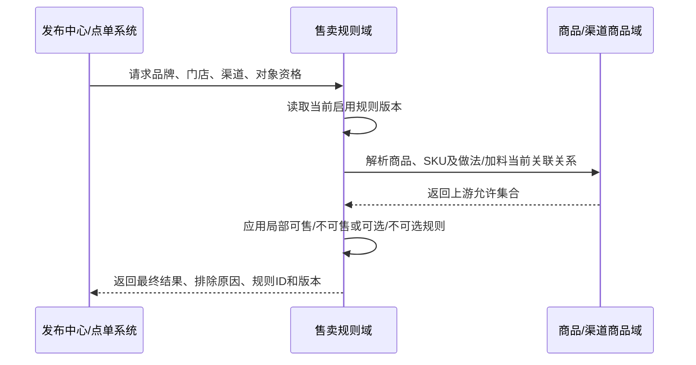
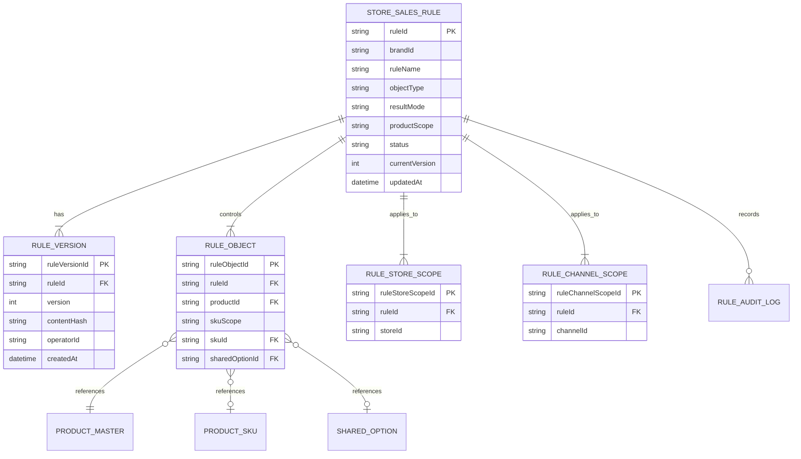
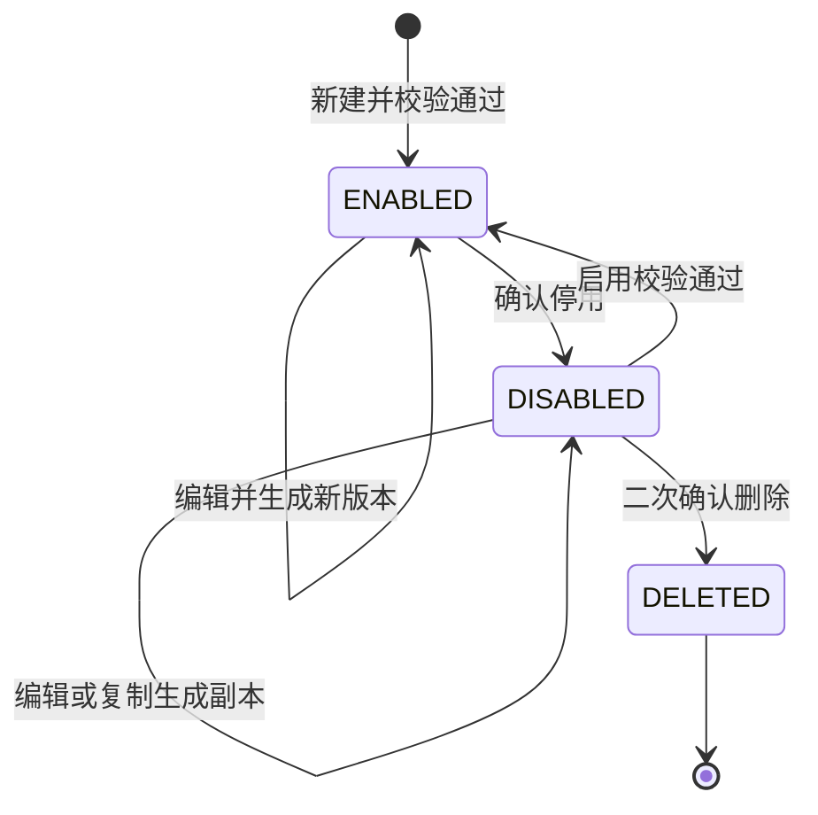

# P08 门店渠道售卖规则管控 PRD

> 文档状态：v2.3 评审稿 · 2026-08-12  
> PRD 档位：重档 L1 流程册  
> 主对象：门店售卖规则 `StoreChannelAssortmentRule`  
> 功能域前缀：`SSR`（Store Sales Rule）  
> 适用入口：商品中心 / 渠道经营 / 销售规则 / 门店售卖规则  
> 依赖：[P02 商品主档与渠道商品库](P02-商品主档与渠道商品库.md)、[P03 商品模板与来源判定](P03-商品模板与来源判定.md)、[P04 全渠道商品发布](P04-全渠道商品发布.md)、[P05 门店渠道商品运营](P05-门店渠道商品运营.md)  
> 设计口径：未配置规则时，商品 SKU、做法和加料在其上游允许范围内默认全部门店可售/可选；商品与规格统一按最终 SKU 集合校验，规则只表达局部例外

---

## 1. 业务目标

商品模板适合维护区域、门店较稳定的默认商品集合和经营差异；当只有少量商品 SKU、做法或加料需要在少量门店、渠道限制经营时，继续复制模板会造成模板膨胀、公共配置重复和变更难追溯。

本需求提供独立的“门店售卖规则”，用于配置门店、渠道维度的局部可售/不可售或可选/不可选例外。

### 1.1 商家使用场景

商家通常不需要为所有门店配置规则。只有出现以下经营差异时才新建规则：

- 某些商品只允许少量试点门店销售；
- 某些商品的全部 SKU，或包含指定规格值的 SKU，在指定门店禁止销售；
- 某种公共做法（例如“去冰”）在指定门店统一不可选；
- 某种公共加料（例如“椰果”）只允许指定门店选择。

没有配置规则时，系统沿用商品主档、渠道商品、商品模板和门店商品形成的默认可售结果。售卖规则不是商品资料，也不会创建商品、做法或加料；它只是在指定门店和渠道增加经营限制。

### 1.2 本册术语说明

| 术语 | 本册含义 | 商家看到的表达 |
|---|---|---|
| 管控对象 | 本条规则要限制的商品 SKU 集合、公共做法或公共加料 | 商品 / 规格、商品做法、商品加料 |
| 经营结果 | 选中门店最终允许还是禁止销售/选择 | 仅选中门店可售、选中门店不可售、仅选中门店可选、选中门店不可选 |
| 适用范围 | 规则在哪些具体门店、渠道生效 | 适用门店、适用渠道 |
| 裁决 | 系统综合上游商品资格和本规则，计算最终是否允许发布或点单 | 页面中使用“校验结果”“可售/不可售”“可选/不可选”，不直接展示“裁决”术语 |
| 反向冲突 | 同一对象、门店、渠道被两条规则同时配置成相反结果 | 保存前提示“与规则 XXX 冲突” |
| 规则版本 | 每次成功编辑形成的一份不可变历史配置 | 详情中的版本号和变更记录 |

| 目标 | 业务结果 | 衡量方式 |
|---|---|---|
| 降低模板复杂度 | 小范围经营差异不再复制整套商品模板 | 同类差异使用售卖规则而非新增模板 |
| 明确对象语义 | 商品与规格统一转换为最终 SKU 集合，公共做法和公共加料独立选择 | 商品下按规格组选择实际关联规格值，不让用户逐条选择 SKU 组合，也不逐商品重复配置公共做法/加料 |
| 预防结果冲突 | 相反规则在保存、编辑和启用前被发现并阻止 | 生效规则中不存在相同对象、门店、渠道的相反结果 |
| 统一门店范围 | 所有局部结果使用同一门店选择器 | 最终按具体门店 ID 保存和校验 |
| 支持研发测试对账 | 每个功能、规则、测试和验收均可追溯 | `F → R → TC → AC` 覆盖矩阵无缺项 |
| 保持结果可追溯 | 规则版本、启停、删除和发布引用可审计 | 可查询操作人、前后值、规则版本及引用记录 |

## 2. 范围（做 / 不做）

### 2.1 本期做

- 商品 / 规格、商品做法、商品加料三类门店售卖规则。
- 商品 / 规格规则先多选商品；每个商品默认管控其全部有效 SKU，也可切换为“指定规格值”，只从该商品实际关联的规格组中选择规格值。
- 做法、加料直接从公共定义库按分组多选，适用商品范围默认“全部商品”，也可以收窄为“指定商品”。
- 两种局部经营结果：
  - 商品 / 规格：仅选中门店可售、选中门店不可售；
  - 做法/加料：仅选中门店可选、选中门店不可选。
- 统一门店选择器：支持按名称、编码、组织、区域、门店类型筛选，保存具体门店 ID。
- 多渠道选择；支持企迈自营渠道及已经接入企迈经营链路的三方渠道。
- 查询、筛选、查看详情、新建、编辑、复制、启用、停用、批量停用、删除和导出规则。
- 新建、编辑、启用前的对象有效性、范围完整性和反向结果冲突校验。
- 规则版本、状态变更、删除和发布/点单校验引用记录。

### 2.2 本期不做

- 新建规则时配置“全部适用门店可售/可选”；没有规则即代表默认全部可售/可选。
- 在新建规则中配置“恢复默认”；停用、删除或缩小规则范围后自然回到上游默认结果。
- 按会员、时段、库存、营销活动动态改变规则结果。
- 多层组织继承、规则优先级编排或允许相反规则同时生效。
- 通过售卖规则新增商品主档、SKU、做法、加料或修改商品结构。
- 把渠道商品未启用、上游不存在的做法/加料强行设为可选。
- 列表常态展示冲突计数、冲突状态和冲突筛选；可预防冲突必须在保存或启用前解决。
- “替换冲突规则”快捷动作；用户需编辑本规则或已有规则，避免隐式裁剪他人规则范围。
- “导出影响范围”；本期只导出规则配置本身。
- 因停用或删除规则自动创建、上架已缺失的门店渠道商品。

### 2.3 页面与业务边界

| 对象/能力 | 本需求承接 | 不承接 |
|---|---|---|
| 商品主档 | 读取商品、SKU、做法、加料身份和关系 | 不修改身份、结构和关系 |
| 渠道商品 | 读取当前商品库的启用子集 | 不修改渠道资料、规格价格和平台字段 |
| 商品模板 | 与规则共同参与发布资格计算 | 不替代模板的商品集合和属性覆盖 |
| 门店商品 | 提供门店经营资格约束 | 不直接维护库存、沽清和人工上下架 |
| 发布中心 | 输出规则裁决结果和规则版本 | 不在本页创建或重试发布批次 |
| 点单校验 | 输出商品/做法/加料是否允许经营 | 不定义下单页面和订单状态机 |

### 2.4 做法、加料的商品范围口径

- 创建做法、加料规则时先直接选择公共做法/加料，不强制先选商品。
- “适用商品范围”默认选择“全部商品”：所有当前或未来拥有该公共做法/加料的商品，命中门店和渠道后均执行规则。
- 用户也可以切换为“指定商品”，再选择需要受规则管控的商品；只有所选商品命中该公共做法/加料时执行规则。
- 商品与做法/加料的可用关系仍由商品主档、渠道商品定义。售卖规则只缩小门店经营范围，不能让商品获得上游不存在的做法或加料。
- “全部商品”是商家页面文案，运行时只对实际拥有该做法/加料的商品产生效果；无该对象的商品不会被强行新增对象。
- 规则变化不回写历史发布快照和历史订单。

## 3. 功能地图与功能点清单

### 3.1 业务能力地图

```text
渠道经营
  └─ 门店售卖范围管理
      ├─ 规则查询与详情
      ├─ 规则创建与对象选择
      ├─ 门店渠道范围配置
      ├─ 保存/启用前校验
      ├─ 规则编辑、复制、启停与删除
      ├─ 批量停用与规则导出
      └─ 发布及点单资格裁决
```

### 3.2 功能点清单

| 功能编号 | 功能名称 | 功能目标 | 使用角色/触发方 | 入口或触发事件 | 前置条件 | 主要业务结果 | 状态 | 关联规则 |
|---|---|---|---|---|---|---|---|---|
| SSR-F001 | 查询售卖规则 | 定位本人有权管理的规则 | 商品/渠道管理员 | 进入列表、执行查询 | 有页面权限 | 返回数据权限范围内的规则 | 本期改造 | SSR-R001 |
| SSR-F002 | 查看规则详情 | 查看完整对象、范围、结果和版本摘要 | 商品/渠道管理员 | 规则名称、查看详情 | 有规则查看权限 | 打开详情并展示当前有效配置 | 本期改造 | SSR-R001 |
| SSR-F003 | 新建售卖规则 | 创建门店渠道经营例外 | 规则管理员 | “新增售卖规则” | 有新建及目标范围权限 | 创建一个立即启用的规则版本 | 本期改造 | SSR-R002~R010 |
| SSR-F004 | 配置管控对象 | 按对象模型准确选择商品、SKU、做法或加料 | 规则管理员 | 新建/编辑第 1 步 | 已选择对象类型 | 形成可校验的对象选择 | 本期改造 | SSR-R002~R005 |
| SSR-F005 | 配置门店与渠道 | 确定规则生效范围 | 规则管理员 | 新建/编辑第 2 步 | 对象配置完整 | 保存具体门店和渠道范围 | 本期改造 | SSR-R006~R007 |
| SSR-F006 | 校验并确认规则 | 保存前预防无效对象和反向冲突 | 规则管理员/系统校验 | 第 3 步、启用确认 | 对象和范围完整 | 校验通过后允许保存/启用 | 本期改造 | SSR-R002~R010 |
| SSR-F007 | 编辑售卖规则 | 调整对象、结果、门店或渠道 | 规则管理员 | 行操作“编辑” | 有编辑和目标范围权限 | 生成新规则版本，状态保持不变 | 本期改造 | SSR-R002~R011 |
| SSR-F008 | 启用/停用规则 | 控制规则是否参与裁决 | 规则管理员 | 状态开关 | 有启停权限 | 确认后改变规则状态并审计 | 本期改造 | SSR-R009~R012 |
| SSR-F009 | 复制规则 | 复用已有配置创建新规则 | 规则管理员 | 更多操作、详情 | 有新建权限 | 生成默认停用的副本 | 本期改造 | SSR-R001、R011 |
| SSR-F010 | 删除规则 | 移除不再需要的规则 | 规则管理员 | 更多操作、详情 | 规则已停用且有删除权限 | 逻辑删除并保留审计 | 本期改造 | SSR-R012 |
| SSR-F011 | 批量停用 | 一次停止多条规则 | 规则管理员 | 勾选规则后“批量停用” | 有所有选中规则启停权限 | 逐条停用并返回成功/失败结果 | 本期改造 | SSR-R001、R012 |
| SSR-F012 | 导出规则 | 线下查看或审计规则配置 | 有导出权限用户 | “导出规则” | 有导出权限 | 导出当前筛选范围内有权查看的规则 | 本期改造 | SSR-R001、R013 |
| SSR-F013 | 发布资格裁决 | 让所有发布路径执行相同售卖限制 | P04 发布中心 | 发布预检 | 规则版本可用 | 返回允许/排除对象及规则来源 | 本期沿用并澄清 | SSR-R009~R011 |
| SSR-F014 | 点单资格校验 | 阻止门店/渠道选择被限制对象 | 门店点单/渠道下单 | 商品、做法、加料可选性校验 | 下游已接入规则能力 | 返回允许/禁止及规则来源 | 本期需接入 | SSR-R009~R011 |
| SSR-F015 | 记录规则审计 | 保留配置、启停和删除证据 | 所有写操作 | 写操作成功 | 操作完成 | 生成前后值和操作人记录 | 本期改造 | SSR-R014 |

## 4. 端到端业务流程



补充路径：

- 复制规则生成停用副本，编辑确认后再手动启用。
- 启用规则时重新执行与保存相同的有效性和冲突校验。
- 停用、删除或缩小规则范围后，相关对象恢复上游默认资格；不自动创建、上架或恢复已缺失的门店渠道商品。

## 5. 系统交互

### 5.1 新建/编辑规则泳道



### 5.2 发布与点单裁决



## 6. 领域对象

本节只定义系统保存什么对象、字段之间如何关联以及枚举含义，不描述页面控件、默认选择、显隐和校验提示；所有用户可见字段与交互统一在第 8 节说明，避免同一规则维护两份。

### 6.1 对象关系图



### 6.2 主对象：门店售卖规则

> 权威来源：商品中心售卖规则域

| 字段 | 类型 | 必填 | 业务含义 | 可选值/约束 | 敏感 |
|---|---|---|---|---|---|
| ruleId | string | 是 | 规则唯一标识 | 品牌内唯一 | 否 |
| brandId | string | 是 | 所属品牌 | 从当前账号上下文获取 | 否 |
| ruleName | string | 是 | 运营识别名称 | 品牌内不重复；1~50 字符 | 否 |
| objectType | enum | 是 | 管控对象类型 | `SKU / METHOD / ADDON`；页面将 `SKU` 表达为“商品 / 规格” | 否 |
| resultMode | enum | 是 | 选中门店的经营结果 | `ONLY_SELECTED / EXCEPT_SELECTED`；做法/加料对应“可选/不可选” | 否 |
| productScope | enum | 条件必填 | 做法/加料适用的商品范围 | `ALL_PRODUCTS / SELECTED_PRODUCTS`；商品 / 规格类型为空 | 否 |
| status | enum | 是 | 业务状态 | `ENABLED / DISABLED / DELETED` | 否 |
| currentVersion | integer | 是 | 当前内容版本 | 从 1 递增 | 否 |
| createdBy / updatedBy | string | 是 | 创建人/最后修改人 | 用户 ID | 内部 |
| createdAt / updatedAt | datetime | 是 | 创建/更新时间 | 服务端时间 | 否 |

### 6.3 规则对象选择

> 权威来源：规则选择由 P08 保存；商品、规格值、SKU、公共做法/加料身份来自 P02；商品结构关系决定可选规格值及其最终影响的 SKU 集合

| 对象类型 | 保存内容 | 运行时解释 |
|---|---|---|
| 商品 / 规格·整个商品 | `productId + ALL_SKUS` | 保存商品范围；运行和冲突校验时展开为该商品当前全部有效 SKU，未来新增有效 SKU 自动纳入 |
| 商品 / 规格·指定规格值 | `productId + SELECTED_SPEC_VALUES + specValueId` 列表 | 规格值必须属于该商品当前有效规格结构；运行时取“包含任一所选规格值”的有效 SKU 并集。未来新增 SKU 如包含已选规格值则自动纳入；新增规格值不会自动纳入 |
| 做法/加料·全部商品 | 一个或多个 `sharedOptionId` + `ALL_PRODUCTS` | 作用于当前及未来拥有该公共对象的全部商品，无需保存商品 ID |
| 做法/加料·指定商品 | 一个或多个 `sharedOptionId` + `SELECTED_PRODUCTS` + productId 列表 | 仅对指定且当前仍拥有该公共对象的商品生效 |

### 6.4 规则范围与版本

| 对象 | 核心字段 | 说明 |
|---|---|---|
| 门店范围 | ruleId、storeId | 选择器可按组织/区域筛选，但保存具体门店 ID |
| 渠道范围 | ruleId、channelId | 只允许品牌已开通且进入企迈经营链路的渠道 |
| 规则版本 | ruleVersionId、ruleId、version、contentHash、operatorId、createdAt | 新建和编辑成功生成新版本；状态切换单独审计 |
| 审计记录 | ruleId、action、before、after、operatorId、operatedAt | 删除后仍保留 |

## 7. 主对象状态机

### 7.1 状态图



### 7.2 状态定义

| 状态 | 含义 | 列表表现 | 可用操作 | 是否参与裁决 |
|---|---|---|---|---|
| ENABLED | 规则当前生效 | 开关开启 | 查看、编辑、复制、停用；不可删除 | 是 |
| DISABLED | 规则停止生效 | 开关关闭 | 查看、编辑、复制、启用、删除 | 否 |
| DELETED | 已逻辑删除 | 正常列表不展示 | 仅审计可查 | 否 |

状态列视觉上只显示完整开关；通过 Tooltip、无障碍名称和启停确认说明“已启用/已停用”。

### 7.3 状态流转

| 当前状态 | 事件 | 校验 | 下一状态 | 失败处理 |
|---|---|---|---|---|
| 无 | 新建保存 | 对象、范围、权限、反向冲突 | ENABLED | 保留输入并定位错误 |
| ENABLED | 编辑保存 | 同新建校验 | ENABLED | 原版本继续生效 |
| ENABLED | 停用确认 | 启停权限 | DISABLED | 保持 ENABLED |
| DISABLED | 启用确认 | 对象仍有效且无反向冲突 | ENABLED | 保持 DISABLED 并展示原因 |
| DISABLED | 删除确认 | 删除权限 | DELETED | 保持 DISABLED |

## 8. 页面功能与交互说明

本节是所有用户可见功能（SSR-F001~F012）的唯一详细说明。每个功能在同一位置同时描述业务目标、页面字段、按钮、校验、结果和失败恢复；第 9 节不再重复页面功能。

### 8.1 页面结构与功能范围

“销售规则”为渠道经营下的菜单，页内视图依次为：门店售卖规则、商品模板（兼容能力）、价格策略、属性互斥、必选商品。本册只定义“门店售卖规则”视图。

### 8.2 SSR-F001/F002 查询列表与查看详情

用户进入页面后，系统先按品牌和数据权限得到可见规则，再在该结果集上执行关键词、对象类型、状态和分页查询。点击规则名称或“查看详情”读取当前版本，不改变规则状态。

**页面图示：门店售卖规则列表**


**功能与交互说明**

- **页面归属**：门店售卖规则是“销售规则”的默认页内视图；商品模板、价格策略、属性互斥和必选商品依次作为同级 Tab。
- **列表语言**：展示“管控对象、经营结果、适用门店、适用渠道、状态”，不使用“命中对象、影响范围”等执行术语；导出动作明确为“导出规则”。
- **状态操作**：状态列只展示完整可见的可操作开关，文字通过 Tooltip/无障碍名称表达；点击后确认并在启用前重新校验。
- **更多操作**：复制和删除收进独立页面浮层；启用规则必须先停用才能删除，删除保留版本和审计，不自动回滚已发布状态。
- **冲突口径**：冲突在新建、编辑和启用前阻断处理，正常列表不常驻“冲突数量/存在冲突”状态。

| 区域 | 字段/操作 | 逻辑要求 |
|---|---|---|
| 顶部摘要 | 商品 / 规格、做法和加料的门店渠道可售范围、规则总数 | 只做紧凑摘要，不重复页面大标题说明 |
| 筛选 | 关键词、对象类型、规则状态 | 关键词匹配规则名称、商品、SKU、做法、加料；查询/重置作用于同一结果集 |
| 操作栏 | 规则数、已选数、批量停用、导出规则 | 批量停用仅选中后可用；导出当前筛选且有权数据 |
| 规则名称 | 名称、规则 ID、更新时间 | 名称可进入详情；长文本截断并可查看完整值 |
| 管控对象 | 类型、对象摘要、商品数、SKU 数或做法/加料项数 | 做法/加料同时展示“全部商品”或“指定 N 个商品”，避免进入详情才能判断范围 |
| 经营结果 | 可售/不可售或可选/不可选 | 使用商家语言，不展示执行代码 |
| 适用门店 | 前两家及剩余数量 | 完整范围在详情查看 |
| 适用渠道 | 前两个标签及剩余数量 | 只展示有权渠道 |
| 状态 | 可操作开关 | 不附加易被裁切的状态文字；点击后必须确认 |
| 固定操作列 | 查看详情、编辑、更多 | 更多菜单为页面级浮层，包含复制、删除；不得被表格滚动容器遮挡 |

正常列表不提供“冲突状态”“冲突筛选”“待处理冲突数量”或“命中对象”；冲突属于保存/启用前校验结果。

### 8.3 SSR-F003/F007 新建与编辑容器

**页面图示：新增售卖规则三步抽屉**


**功能与交互说明**

- **容器与步骤**：使用覆盖列表的宽抽屉，按“管控对象 → 门店与渠道 → 校验确认”推进；打开抽屉不挤压或改变列表宽度。
- **对象模型**：商品与规格合并为“商品 / 规格”。先多选商品，默认整商品全部有效 SKU；需要细分时仅从每个商品实际关联规格组选择规格值，并展开所有包含该值的 SKU。
- **做法/加料**：直接从公共做法/加料库按分组多选，默认作用全部关联商品；只有例外场景才切换为指定商品并打开商品选择器。
- **默认经营结果**：未配置规则即默认全部门店可售/可选，因此不提供“全部适用门店可售”冗余选项；两种规则结果均必须通过统一门店选择器选择门店。
- **提交**：最后一步展示对象、SKU 展开结果、商品范围、门店、渠道和冲突校验；任何对象失效、越权或反向结果冲突都保留输入并返回对应步骤修正。

| 项目 | 需求说明 |
|---|---|
| 打开方式 | 点击“新增售卖规则”或行操作“编辑”后打开右侧抽屉；保留列表筛选、分页和滚动位置 |
| 容器 | 建议宽度 860px，页面高度内滚动；标题区、步骤区和底部操作区固定，只有表单内容滚动 |
| 步骤 | 1 管控对象 → 2 门店与渠道 → 3 校验确认 |
| 步骤跳转 | 可返回已完成步骤；后续步骤只有在当前步骤必填项和前端格式校验通过后可进入 |
| 新建初始值 | 规则名称为空；对象类型默认“商品 / 规格”；经营结果默认“选中门店不可售”；对象、门店、渠道均为空 |
| 编辑初始值 | 加载当前有效版本全部字段；加载完成前展示骨架且禁止提交；编辑成功后保持原启停状态 |
| 切换对象类型 | 已选对象为空时直接切换；已有选择时二次确认，确认后清空与旧类型有关的商品、SKU、做法或加料选择 |
| 未保存离开 | 点击关闭、取消、遮罩或浏览器返回时，若存在变更，提示“放弃本次修改”；继续编辑或放弃修改 |
| 防重复 | 下一步和保存执行期间按钮进入 loading；同一提交未结束前不得重复触发 |

### 8.4 SSR-F004 第 1 步：配置管控对象

| 字段 | 适用对象 | 控件 | 必填 | 数据来源与默认值 | 显示/联动 | 校验与限制 | 提交内容 | 错误反馈 |
|---|---|---|---|---|---|---|---|---|
| 规则名称 | 全部 | 单行输入框 | 是 | 新建为空；编辑取当前版本 | 始终显示 | 去除首尾空格后 1~50 字；品牌内不可与未删除规则重名 | ruleName | 空值、超长或重名时字段下方提示；重名返回已有规则名称/ID |
| 管控对象类型 | 全部 | 三选一分段卡片 | 是 | 新建默认“商品 / 规格”；编辑取当前值 | 商品 / 规格、商品做法、商品加料 | 单选；切换类型会清空不兼容对象并要求确认 | objectType | 无可用对象类型时展示权限/数据原因，不允许进入下一步 |
| 商品 | 商品 / 规格 | 选择器触发框 + 已选商品分组 | 是 | 商品主档/当前渠道商品可管控集合 | 仅商品 / 规格类型显示 | 支持标准商品、套餐商品多选；只展示有权且未删除商品；至少 1 个；新选商品默认“整个商品” | productId 列表 | 无选择提示“请选择至少 1 个商品”；失效或越权商品定位到具体项 |
| 管控范围 | 商品 / 规格 | 商品行内“整个商品 / 指定规格值”分段控件 | 是 | 新建和新选商品默认“整个商品”；编辑取当前值 | 每个已选商品独立设置 | 整个商品表示当前及未来全部有效 SKU；指定规格值只作用于包含任一所选规格值的 SKU | skuScope：ALL_SKUS / SELECTED_SPEC_VALUES | 商品无有效 SKU 时阻止下一步；切回整个商品时清空原规格值选择并明确提示 |
| 规格值 | 商品 / 规格 | 按商品规格组展示的规格值选择弹窗 | 条件必填 | 商品主档当前有效规格组及规格值 | 仅该商品管控范围=指定规格值时可操作 | 只能选择当前商品实际关联的规格值；按规格组展示，跨组可多选；至少 1 项；多项按并集命中，即任一规格值匹配即纳入对应 SKU | productId + specValueId 列表 | 未选规格值时商品行显示错误；规格值失效、越权或不属于商品时定位到具体项并提供重新选择入口 |
| 商品做法 | 商品做法 | 公共做法选择器 + 已选标签 | 是 | 公共做法库 | 仅商品做法类型显示 | 按做法分组多选；只选择未删除的公共做法；至少 1 项 | sharedMethodId 列表 | 空值、失效项或无权项逐项提示 |
| 商品加料 | 商品加料 | 公共加料选择器 + 已选标签 | 是 | 公共加料库 | 仅商品加料类型显示 | 按加料分组多选；只选择未删除的公共加料；至少 1 项 | sharedAddonId 列表 | 空值、失效项或无权项逐项提示 |
| 适用商品范围 | 商品做法/商品加料 | 两个单选卡片 | 是 | 默认“全部商品” | 选择做法/加料后显示；可切换“指定商品” | 全部商品不选商品；指定商品至少选择 1 个与所选做法/加料存在关系的商品 | productScope：全部商品/指定商品 | 未选范围或指定商品为空时禁止下一步 |
| 指定商品 | 商品做法/商品加料 | 商品选择器触发框 + 已选标签 | 条件必填 | 新建为空；编辑取当前 productId 列表 | 仅适用商品范围=指定商品时显示；切回全部商品时清空选择 | 支持多选；候选商品至少拥有一个所选做法/加料；失效关系阻止保存 | productId 列表 | 标出无有效关系、失效或越权商品并提供重新选择入口 |
| 经营结果 | 全部 | 两个单选卡片 | 是 | 默认“选中门店不可售/不可选” | 商品 / 规格显示“仅选中门店可售、选中门店不可售”；做法/加料显示“仅选中门店可选、选中门店不可选” | 只能选择当前对象类型对应的两个结果；切换对象类型后保留原选择，但重算展示文案 | resultMode | 无选择时禁止下一步；页面不展示代码值 |

补充规则：

- 做法、加料不要求先选商品。选择公共对象后，“适用商品范围”默认“全部商品”；只有用户主动切换“指定商品”时才出现商品选择器。
- 商品 / 规格不拆成“商品规则”和“规格规则”。“整个商品”是商品维度管控的交互表达，执行层展开为全部有效 SKU；“指定规格值”保存商品下稳定的规格值身份。
- 同一条商品 / 规格规则可对不同商品分别选择“整个商品”或“指定规格值”；指定多个规格值时按 SKU 并集解析，而不是要求用户选择完整 SKU 组合。
- 同名规格值不能跨商品复用身份；保存、冲突校验、发布和点单均按 `productId + specValueId` 解析为最终 SKU 集合。
- “全部商品”不保存商品 ID；“指定商品”保存明确的 productId 列表。商品与所选做法/加料完全无关系时不能作为指定商品保存。
- 同一规则可选择多个同类型对象，这些对象共用一套经营结果、门店和渠道；需要不同范围或不同结果时拆成多条规则。
- 已选对象超过页面可完整展示数量时只回显前若干项和“另 N 项”，完整清单可再次打开选择器查看。

#### 经营结果的实际含义

| 对象类型 | 经营结果 | 选中门店 | 未选中门店 | 新增门店 |
|---|---|---|---|---|
| 商品 / 规格 | 仅选中门店可售 | 可售，但仍不能突破商品、渠道和模板上限 | 不可售 | 默认不可售，需编辑规则加入后才可售 |
| 商品 / 规格 | 选中门店不可售 | 不可售 | 不增加限制，沿用上游结果 | 不增加限制，沿用上游结果 |
| 做法/加料 | 仅选中门店可选 | 可选，但商品本身必须拥有该公共对象 | 不可选 | 默认不可选，需编辑规则加入后才可选 |
| 做法/加料 | 选中门店不可选 | 不可选 | 不增加限制，沿用上游结果 | 不增加限制，沿用上游结果 |

“仅选中门店可售/可选”会隐式限制未选中的门店，因此只有拥有所选渠道全部适用门店管理范围的用户才能选择该结果；部分门店权限用户只能使用“选中门店不可售/不可选”，避免无意影响无权门店。

### 8.5 SSR-F005 第 2 步：配置门店与渠道

| 字段 | 控件 | 必填 | 数据来源与默认值 | 校验与限制 | 回显与提交 | 错误反馈 |
|---|---|---|---|---|---|---|
| 适用门店 | 统一门店选择器触发框 | 是 | 组织门店域；新建为空，编辑取当前具体门店 | 至少 1 家；仅可选择用户有权且有效门店；组织、区域、门店类型只用于筛选，不作为动态范围保存 | 抽屉回显数量、前 8 家和“另 N 家”；提交 storeId 列表 | 门店停用、迁移或权限变化时标出失效门店并阻止下一步，保留其余有效选择 |
| 适用渠道 | 多选卡片/下拉多选 | 是 | 品牌已开通且企迈参与发布、映射、上下架、库存或接单链路的渠道 | 至少 1 个；自营和符合条件的三方渠道均可选；暂不接入渠道不可选 | 回显渠道标签；提交 channelId 列表 | 授权失效不清空选择，展示失效原因并阻止保存；恢复后可重试 |

“仅选中门店可售/可选”与“选中门店不可售/不可选”都必须选择门店。系统不提供“全部门店可售/可选”，因为没有规则时即采用上游默认可售/可选结果。

### 8.6 SSR-F006 第 3 步：校验并确认

| 摘要/校验项 | 展示内容 | 处理规则 |
|---|---|---|
| 规则名称 | 完整规则名称 | 可返回第 1 步修改 |
| 管控对象 | 对象类型、对象数量、前若干名称；商品/规格同时显示商品数、已选规格值及展开后的 SKU 数 | 做法/加料显示公共对象以及“全部商品”或“指定 N 个商品” |
| 适用商品范围 | 做法/加料的全部商品或指定商品摘要 | 指定商品关系失效时返回第 1 步；商品 / 规格类型不显示本项 |
| 经营结果 | 商家可理解文案 | 不展示枚举代码 |
| 适用门店 | 门店数量、前若干名称 | 可进入门店选择器重新调整 |
| 适用渠道 | 渠道数量和完整标签 | 失效渠道单独标红 |
| 对象校验 | 对象存在、未删除、身份与类型一致；规格值属于对应商品当前有效结构且至少能展开到一个有效 SKU；指定商品与至少一个所选做法/加料存在关系 | 失败定位对象并返回第 1 步 |
| 权限校验 | 商品/公共对象、门店、渠道及操作权限 | 失败不透露无权对象的名称和数量 |
| 范围校验 | 门店、渠道非空且有效 | 失败返回第 2 步 |
| 冲突校验 | 同类型同对象、商品范围、门店、渠道存在相反经营结果 | 商品 / 规格先把 ALL_SKUS 和 SELECTED_SPEC_VALUES 展开为最终 SKU 集合并按交集判断；做法/加料的全部商品与任意商品范围相交，两个指定商品范围按共同 productId 判断。展示冲突规则名称、ID、冲突商品/SKU/门店/渠道摘要，不自动替换 |
| 保存结果 | 新建生成版本 1 并立即启用；编辑生成新版本且保持原状态 | 全部写入和审计成功后才关闭抽屉 |

### 8.7 SSR-F003~F006 步骤按钮与提交状态

| 按钮/入口 | 显示条件 | 禁用/loading | 点击结果 | 失败恢复 |
|---|---|---|---|---|
| 关闭/取消 | 全步骤 | 提交中禁用 | 无改动直接关闭；有改动弹放弃确认 | 继续编辑时保留全部输入和当前步骤 |
| 上一步 | 第 2、3 步 | 无 | 返回前一步，不清空后续已填内容 | — |
| 下一步 | 第 1、2 步 | 当前步骤必填或格式校验不通过时禁用 | 校验当前步骤并进入下一步 | 自动滚动并聚焦第一个错误字段 |
| 保存规则 | 第 3 步 | 校验中、存在错误或请求中禁用 | 服务端重校验后保存 | 保留全部输入；展示字段错误或冲突规则，不关闭抽屉 |
| 返回修改 | 第 3 步校验失败 | 无 | 根据错误类型返回第 1 或第 2 步 | 保留已有选择 |

### 8.8 SSR-F004/F005 选择器与弹窗

| 选择器 | 查询/筛选字段 | 列表字段 | 选择规则 | 底部操作 | 空、失效与权限状态 |
|---|---|---|---|---|---|
| 商品选择器 | 商品名称、商品 ID；商品类型、后台分类、前台分类 | 复选框、商品名称、ID、标准/套餐类型、后台分类、前台分类、状态；商品 / 规格场景补充规格值数和有效 SKU 数；做法/加料指定商品场景补充匹配对象数 | 跨页保留已选；商品 / 规格及指定商品范围均支持多选 | 已选数、清空、取消、确认选择 | 首次空说明无可用商品；筛选空可清空条件；无权商品不展示；与所选做法/加料均无关系的商品不可选并说明原因 |
| 规格值选择器 | 不单独搜索跨商品规格；在当前商品内按规格组查看 | 规格组名称、规格值复选项、分组已选数 | 仅显示当前商品实际关联且有效的规格值；跨规格组多选；至少 1 项；底部实时显示选中规格值数和展开后影响 SKU 数 | 已选数、影响 SKU 数、取消、确认选择 | 商品无规格或无有效 SKU 时提示先维护商品结构；已选规格值失效时标红并要求重新选择 |
| 做法选择器 | 做法名称/编码；做法分组 | 分组、复选框、做法名称、编码、状态 | 跨分组多选；先选择做法，再按商品范围决定是否打开商品选择器 | 已选数、清空、取消、确认选择 | 无公共做法时提示去“分类与属性/做法”维护；无权项不展示 |
| 加料选择器 | 加料名称/编码；加料分组 | 分组、复选框、加料名称、编码、状态 | 跨分组多选；先选择加料，再按商品范围决定是否打开商品选择器 | 已选数、清空、取消、确认选择 | 无公共加料时提示去“分类与属性/加料”维护；无权项不展示 |
| 门店选择器 | 门店名称、编码；组织、区域、门店类型 | 复选框、门店名称/编码、区域、所属组织、门店类型、状态 | 支持当前结果全选和跨页选择；只选择有权有效门店 | 已选数、清空、取消、确认选择 | 无权状态不伪装为空；确认时重新校验失效门店 |

### 8.9 SSR-F002/F008~F012 详情与规则操作

| 功能 | 页面入口与字段 | 处理规则 | 成功结果 | 失败恢复 |
|---|---|---|---|---|
| 查看详情 F002 | 规则名称/查看详情；展示名称、状态、对象、适用商品范围（条件显示）、经营结果、门店、渠道、ID、版本、创建/更新时间和操作人 | 只读当前版本；按字段和范围权限脱敏 | 打开详情，不改变状态 | 无权或读取失败不泄露范围，保留列表位置 |
| 启用/停用 F008 | 状态开关；确认弹窗展示对象数、商品范围、门店数、渠道数和后果 | 启用前重新执行对象、关系、范围、权限和冲突校验；停用不回滚已发布状态 | 状态变化并写审计 | 校验失败保持原状态；弹窗展示原因和处理入口 |
| 复制 F009 | 更多/复制规则 | 复制对象、商品范围、结果、门店和渠道；新 ID，名称追加“副本” | 生成默认停用副本 | 无新建权限时不展示；失败不影响原规则 |
| 删除 F010 | 更多/删除规则 | 仅停用规则可删；二次确认；逻辑删除 | 从列表移除，版本和审计保留 | 启用规则提示先停用；失败保持原记录 |
| 批量停用 F011 | 勾选规则后批量操作 | 逐条校验状态和权限，部分失败不回滚成功项 | 返回成功、失败、无需处理及原因 | 保留失败项选择，可只重试失败项 |
| 导出规则 F012 | 操作栏/导出规则 | 按当前筛选和数据权限导出规则配置，不导出“命中对象”执行指标 | 创建下载任务 | 失败可重试，不影响列表和规则 |

### 8.10 SSR-F001~F012 页面状态

| 状态 | 页面行为 |
|---|---|
| loading | 保留筛选和表头骨架，列表局部加载 |
| success | 正常展示规则和操作 |
| first-empty | 说明未配置规则即默认全部可售/可选，提供“新增售卖规则” |
| filtered-empty | 保留筛选条件，提供清空筛选 |
| error | 展示失败原因和重试，不清空条件 |
| no-permission | 明确无页面权限，不伪装为空列表 |
| partial-permission | 只统计并展示有权门店、渠道和规则 |
| submitting | 禁止重复保存、启停、删除 |
| concurrent-conflict | 编辑保存时版本已变化，展示最新版本并要求重新确认 |
| partial-success | 批量停用返回逐条结果 |

## 9. 无直接页面的系统功能说明

本节只描述由发布、点单或写操作自动触发的 SSR-F013~F015。列表、新建、编辑、启停、复制、删除、批量和导出等用户可见功能已经在第 8 节一次说明，不在本节重复。

### 9.1 SSR-F013/F014 发布与点单校验

- 输入：品牌、门店、渠道、商品/规格值/做法/加料对象及调用场景；规格值规则先按商品结构展开为最终 SKU 集合。
- 先计算商品主档、渠道商品和平台能力形成的允许上限，再应用当前启用规则。
- 商品可售状态由当前有效 SKU 聚合：至少一个 SKU 可售时商品仍可售；全部有效 SKU 均不可售时商品不可售，其做法和加料结果随之被抑制。
- 输出：允许/禁止、命中规则 ID、规则版本和商家可理解原因。
- 同一发布批次固定规则版本和解析结果；重试仍使用原快照，不读取漂移后的规则。
- 历史订单和已完成发布快照不因规则后续变化而重算。

做法/加料的商品范围处理：

- `ALL_PRODUCTS`：只要商品实际拥有所选做法/加料，就执行规则；未来新增关系自动纳入后续校验。
- `SELECTED_PRODUCTS`：商品必须在规则保存的 productId 范围内，并且当前仍拥有该做法/加料，才执行规则。
- 商品没有该做法/加料时，不生成对象、不扩大上游允许集合。

### 9.2 SSR-F015 审计记录

新建、编辑、复制、启停、删除、批量停用和导出成功时自动生成审计记录；写操作与审计必须形成同一业务结果，审计失败时业务操作回滚。审计字段、查看权限和通知口径统一见第 15 节，本节不再重复字段表。

## 10. 业务规则矩阵

本节是服务端判断规则的唯一来源，只定义“在什么条件下允许或阻止”，不重复第 8 节已经说明的控件、显隐和页面文案。

| 规则号 | 关联功能 | 规则名称 | 适用对象/范围 | 触发时机 | 判断或计算逻辑 | 默认/优先级 | 通过结果 | 不通过结果/错误码 | 生效与历史影响 |
|---|---|---|---|---|---|---|---|---|---|
| SSR-R001 | F001、F002、F009、F011、F012 | 数据权限隔离 | 规则、商品、公共做法/加料、门店、渠道 | 查询及所有操作 | 只处理用户有权品牌和数据范围 | 数据权限先于业务筛选 | 返回/处理有权数据 | `SSR-403-001` | 不泄露无权名称、数量和导出数据 |
| SSR-R002 | F003、F004、F006、F007 | 对象身份有效 | 三类对象 | 保存/启用 | 对象存在、未删除且身份唯一 | 无默认降级 | 进入后续校验 | `SSR-400-001` | 立即校验，不改历史快照 |
| SSR-R003 | F004、F006 | 商品 / 规格范围完整 | 商品、规格值、SKU | 选择及保存 | 每个商品必须选择 `ALL_SKUS` 或 `SELECTED_SPEC_VALUES`；后者至少 1 个 specValueId，且每个规格值属于对应商品当前有效规格结构，并至少展开到 1 个有效 SKU | 商品主档结构为权威；新选商品默认 `ALL_SKUS`；多个规格值按包含任一值的 SKU 并集解析 | 保存商品、范围模式及规格值身份 | `SSR-400-002` | `ALL_SKUS` 覆盖当前及未来有效 SKU；指定规格值覆盖当前及未来包含该值的有效 SKU，规格值失效后阻止启用和裁决 |
| SSR-R004 | F004、F006、F013、F014 | 做法/加料商品范围 | 做法/加料 | 选择/保存/校验 | 商品范围必选；默认 `ALL_PRODUCTS` 不保存商品 ID；`SELECTED_PRODUCTS` 至少选择 1 个商品，且每个商品至少拥有一个所选公共对象 | 默认全部商品；上游商品关系优先 | 保存公共对象和商品范围 | `SSR-400-003` | 全部商品模式自动覆盖未来新增关系；指定商品模式只按保存的 productId 生效；历史快照不变 |
| SSR-R005 | F003、F004 | 单规则单对象类型 | 三类对象 | 选择/保存 | 一条规则只能选择“商品 / 规格、做法、加料”中的一种类型，可在该类型内多选；不同类型必须拆规则 | 新建默认商品 / 规格类型 | 保存同类型对象集合 | `SSR-400-004` | 切换对象类型需确认并清空旧类型选择 |
| SSR-R006 | F005、F006 | 门店范围有效 | 门店 | 保存/启用 | 至少 1 家有效且有权门店 | 组织/区域只用于筛选 | 保存具体门店 ID | `SSR-400-005` | 门店后续迁移不改历史版本 |
| SSR-R007 | F005、F006 | 渠道范围有效 | 渠道 | 保存/启用 | 至少 1 个已开通且进入企迈经营链路的渠道 | 合同/配置权威边界优先 | 保存渠道 ID | `SSR-400-006` | 渠道失效后规则不再对其参与裁决并生成治理提醒 |
| SSR-R008 | F003、F007 | 局部结果模型 | 所有对象 | 创建/编辑 | `ONLY_SELECTED`：选中门店允许、未选中门店禁止；`EXCEPT_SELECTED`：选中门店禁止、其他门店不增加限制 | 无规则时默认全部可用；白名单结果要求全门店范围权限 | 保存局部例外 | `SSR-400-007` / `SSR-403-003` | 不生成 ALL_APPLICABLE/FOLLOW_DEFAULT 规则；新增门店按结果语义自动计算 |
| SSR-R009 | F006、F008、F013、F014 | 相反结果冲突 | 同类型对象+商品范围+门店+渠道 | 保存/启用/校验 | 商品 / 规格按当前有效结构把 `ALL_SKUS` 与 `SELECTED_SPEC_VALUES` 均展开为最终 SKU 集合，集合有交集且门店、渠道重叠时再判断结果；做法/加料还需判断商品范围是否相交：全部商品与任意范围相交，两个指定商品范围仅在 productId 有交集时相交。相交范围同时得到“允许”和“禁止”即冲突 | 不设置优先级，冲突必须消除 | 允许保存/启用 | `SSR-409-001` | 白名单的未选门店属于隐式禁止范围；商品结构变化后，启用/发布/点单前须按最新有效结构重新展开并校验 |
| SSR-R010 | F006、F013、F014 | SKU 聚合与子对象抑制 | 商品、SKU 及做法/加料 | 裁决 | 先计算每个有效 SKU 的最终可售性；至少一个 SKU 可售则商品可售，全部 SKU 不可售则商品不可售，做法/加料不能单独变为可选 | SKU 结果为商品状态权威 | 返回 SKU 命中规则；必要时返回商品因全部 SKU 不可售而不可售 | — | 部分 SKU 受限不抑制其他 SKU，也不修改子规则内容 |
| SSR-R011 | F007、F008、F013、F014 | 版本与快照稳定 | 规则版本 | 编辑/裁决 | 新编辑生成新版本；发布批次固定引用版本和解析结果 | 已完成快照优先保持不变 | 新调用使用新版本 | `SSR-409-002` | 历史订单、发布快照不回写 |
| SSR-R012 | F008、F010、F011 | 启停与删除约束 | 规则状态 | 启停/删除 | 启用需重校验；删除前必须停用 | ENABLED 禁止删除 | 完成状态迁移 | `SSR-409-003` | 删除保留版本和审计 |
| SSR-R013 | F012 | 导出权限与口径 | 当前筛选规则 | 导出 | 只导出有权规则的对象、结果、门店、渠道、状态 | 当前查询口径 | 生成导出任务 | `SSR-403-002` | 不导出“影响范围/命中对象”执行指标 |
| SSR-R014 | F003、F007~F011、F015 | 审计完整 | 所有写操作 | 写入成功 | 写操作与审计记录必须同一业务结果 | 无审计不允许成功 | 保存前后值和操作人 | `SSR-500-001` | 审计长期保留周期待全局合规确认 |

## 11. 数据来源与权威系统

| 数据 | 权威来源 | 本模块读取/写入 | 失败是否阻断 | 说明 |
|---|---|---|---|---|
| 商品、规格组、规格值、SKU、公共做法/加料定义及商品结构关系 | P02 商品主档与渠道商品库 | 只读 | 是 | 商品 / 规格规则引用商品和规格值身份并展开最终 SKU 集合；做法/加料指定商品范围读取并校验结构关系，全部商品范围在运行时按当前关系解析 |
| 渠道商品启用子集 | P02 渠道商品库 | 只读 | 是 | 作为规则允许上限 |
| 商品模板默认集合 | P03 商品模板 | 只读 | 裁决时是 | 本模块不修改模板 |
| 门店、组织、区域、门店类型 | 组织门店域 | 只读 | 是 | 选择器筛选并保存门店 ID |
| 品牌开通渠道及企迈经营能力 | 商品中心配置/OP 合同边界 | 只读 | 是 | 只允许进入企迈经营链路的渠道 |
| 门店售卖规则、版本、范围 | P08 售卖规则域 | 读写 | 是 | 本册主数据 |
| 发布快照和发布任务 | P04 发布中心 | 输出裁决结果 | 发布时是 | 发布批次固定引用规则版本 |
| 门店商品实时库存、沽清、人工上下架 | P05 门店商品运营 | 不读写或仅裁决上下文读取 | 否 | 不由本模块保存 |
| 审计记录 | 审计域 | 写入 | 是 | 写操作必须可追溯 |

## 12. 权限门禁

| 权限能力 | 页面/动作表现 | 数据范围约束 |
|---|---|---|
| 规则查看 | 可进入页面和详情 | 只展示有权品牌、商品/公共对象、门店、渠道关联规则 |
| 规则新建 | 显示“新增售卖规则” | 只能选择有权商品或公共做法/加料，以及有权门店和渠道 |
| 白名单结果配置 | “仅选中门店可售/可选”可选择 | 需要拥有所选渠道全部适用门店范围；部分范围用户禁用该选项并说明原因 |
| 规则编辑 | 显示编辑 | 原规则和修改后范围均需有权 |
| 规则启停 | 状态开关可操作 | 无权时仅展示状态或隐藏开关 |
| 规则删除 | 停用规则显示可用删除 | 需独立删除权限 |
| 批量停用 | 选中后可用 | 对无权单项返回失败，不扩大权限 |
| 规则导出 | 显示导出规则 | 导出前再次做行、字段和范围鉴权 |
| 审计查看 | 详情可查看操作记录 | 操作人等内部字段按审计权限展示 |

拥有“销售规则”页面权限不代表拥有全部商品库、门店和渠道数据权限。部分权限视图的数量、搜索和导出均只统计授权范围。

## 13. 异常恢复与断点续办

| 异常 | 用户可见表现 | 系统处理 | 恢复方式 |
|---|---|---|---|
| 商品/SKU 在编辑期间删除 | 第 3 步校验失败并定位对象 | 不写新版本 | 返回第 1 步重新选择 |
| 公共做法/加料被删除或停用 | 第 3 步标出失效公共对象 | 不写新版本、不启用 | 返回第 1 步移除失效对象或到公共定义页处理 |
| 全部商品范围下新增/移除做法或加料关系 | 规则内容不产生待修改项 | 后续校验按商品当前是否拥有该对象执行 | 无需修改规则；历史发布快照和历史订单不重算 |
| 指定商品与所选做法/加料关系失效 | 第 3 步标出失效商品和对象 | 不写新版本、不启用 | 返回第 1 步移除失效商品、重新选择对象或切换全部商品 |
| 门店停用、迁移或越权 | 门店选择校验提示失效数量 | 移除无效待选项，不静默保存 | 重新选择门店 |
| 渠道授权/经营能力失效 | 渠道校验失败 | 不对失效渠道启用规则 | 到对应配置或授权中心处理 |
| 发现反向冲突 | 展示冲突规则名称 | 不保存、不启用 | 编辑本规则或已有规则后重试 |
| 保存时版本已变化 | 并发冲突提示 | 旧版本继续生效 | 刷新最新规则并重新确认 |
| 审计写入失败 | 操作失败 | 规则写入整体回滚 | 重试操作 |
| 批量停用部分失败 | 结果弹窗显示逐条原因 | 成功项不回滚 | 仅重试失败项 |
| 导出任务失败 | 下载中心显示失败原因 | 不影响规则 | 重新发起导出 |
| 裁决依赖暂不可用 | 发布/点单返回明确失败 | 不使用不确定默认值静默放行 | 调用方按幂等键重试或进入人工处理 |

新建/编辑抽屉在校验失败、选择器关闭和短暂请求失败时保留已填数据；用户主动关闭存在修改时提示未保存内容。

## 14. 错误文案

| 错误码 | 场景 | 用户文案 | 下一步 |
|---|---|---|---|
| SSR-400-001 | 对象不存在或已删除 | 所选对象已失效，请重新选择 | 返回管控对象步骤 |
| SSR-400-002 | 商品无有效 SKU、规格值范围为空、规格值不属于商品，或所选规格值已无法展开到有效 SKU | 所选商品规格已变化，请重新确认管控范围 | 定位商品行；选择整个商品或打开规格值选择器 |
| SSR-400-003 | 做法/加料商品范围为空或关系失效 | 指定商品中存在不适用所选做法或加料的商品，请调整范围 | 打开指定商品选择器；公共对象本身失效使用 SSR-400-001 |
| SSR-400-004 | 一条规则混入多个对象类型 | 一条规则只能配置一种管控对象类型 | 确认切换类型并重新选择对象 |
| SSR-400-005 | 门店范围为空或失效 | 至少选择 1 家当前有权门店 | 打开门店选择器 |
| SSR-400-006 | 渠道未开通或不可经营 | 所选渠道当前不可用，请调整渠道范围 | 返回门店与渠道步骤 |
| SSR-400-007 | 经营结果与对象类型不匹配 | 当前管控对象不支持该经营结果，请重新选择 | 返回管控对象步骤 |
| SSR-409-001 | 反向结果冲突 | 与规则“{ruleName}”的对象、门店和渠道范围重叠且结果相反 | 查看冲突规则并调整范围 |
| SSR-409-002 | 并发版本变化 | 规则已被其他人更新，请刷新后重新确认 | 载入最新版本 |
| SSR-409-003 | 启用规则删除 | 启用中的规则不能删除，请先停用 | 执行停用 |
| SSR-403-001 | 数据范围无权 | 你没有该商品或公共对象、门店、渠道的操作权限 | 联系品牌管理员 |
| SSR-403-002 | 无导出权限 | 你没有导出规则的权限 | 联系品牌管理员或继续在线查看 |
| SSR-403-003 | 无全门店范围权限却选择白名单结果 | “仅选中门店可售/可选”会影响未选门店，需要全部适用门店权限 | 改用“选中门店不可售/不可选”或联系管理员 |
| SSR-500-001 | 保存或审计失败 | 规则保存失败，已保留当前填写内容 | 重试或联系管理员 |

错误文案不得只显示“操作失败”，也不得暴露内部堆栈、服务名或内部枚举代码。

## 15. 日志、审计与通知

业务日志与审计必须记录：

- 新建、编辑、复制、启用、停用、批量停用、删除和导出规则。
- 对象类型、对象 ID、做法/加料商品范围、经营结果、门店和渠道的前后变化。
- 校验失败类型及冲突规则 ID；不把失败输入中的无权数据写入普通业务日志。
- 操作人、操作时间、品牌、规则 ID、规则版本、客户端和请求幂等键。
- 发布/点单裁决引用的规则 ID、版本和结果来源。

本期不因每次普通查询发送通知。规则启停、删除是否通知渠道负责人，以及审计保留周期，引用 L0 全局通知/合规策略；未确认前不得硬编码接收人和周期。

## 16. 非功能要求

| 类型 | 要求 |
|---|---|
| 性能 | 列表常规查询 P95 ≤ 2 秒；选择器搜索 P95 ≤ 1.5 秒；同步校验 P95 ≤ 3 秒 |
| 大范围 | 单规则商品/SKU、公共做法/加料或门店数量超过 10,000 时转异步校验并展示进度 |
| 幂等 | 新建、编辑、启停、删除、批量停用和裁决均支持业务幂等键 |
| 一致性 | 规则内容与版本原子写入；审计失败时业务写入回滚 |
| 并发 | 编辑使用版本条件；冲突时不覆盖他人最新修改 |
| 可用性 | 下游依赖失败不得静默采用默认可售；返回可重试错误和来源 |
| 安全 | 页面、按钮、数据范围和导出分别鉴权；日志不记录敏感令牌 |
| 可访问性 | 状态开关有无障碍名称和 Tooltip；更多菜单支持键盘焦点且不被滚动区域遮挡 |
| 可观测性 | 统计保存校验失败率、冲突率、启停失败率、裁决耗时和调用失败率 |

## 17. 测试用例矩阵

| 用例号 | 覆盖功能 | 覆盖规则 | 场景 | 前置 | 操作/触发 | 预期结果 | 状态/数据校验 |
|---|---|---|---|---|---|---|---|
| SSR-TC001 | F001 | R001 | 部分门店权限查询 | 用户仅有 2 家门店权限 | 进入列表并查询 | 只返回关联有权门店的可见规则 | 数量、搜索、导出均不泄露其他门店 |
| SSR-TC002 | F002 | R001 | 查看规则详情 | 有查看权限 | 点击规则名称 | 展示完整对象、结果、门店、渠道和版本 | 无状态变化 |
| SSR-TC003 | F003、F004 | R002、R003、R008 | 新建多商品不可售规则 | 有新建权限 | 选择多个商品并保持默认“全部 SKU”，选择门店和渠道后保存 | 保存并立即启用 | 每个商品保存 ALL_SKUS，裁决时展开全部有效 SKU |
| SSR-TC004 | F004 | R003 | 按商品规格值限制部分 SKU | 商品有杯型、温度、甜度多组规格 | 将该商品切换为“指定规格值”，选择“大杯”和“少冰” | 选择器只展示该商品规格组/规格值，并实时展示影响 SKU 数 | 数据含 productId+SELECTED_SPEC_VALUES+specValueId；运行时命中包含“大杯”或“少冰”的 SKU 并集 |
| SSR-TC005 | F004 | R004、R005 | 公共做法默认全部商品 | “去冰”当前被多个商品使用 | 选择去冰，保持默认全部商品，配置门店和渠道 | 所有当前及未来拥有去冰的商品在目标范围受限 | 保存 sharedMethodId + ALL_PRODUCTS，不保存商品 ID |
| SSR-TC006 | F004 | R004、R005 | 公共加料指定商品 | 椰果被多个商品使用 | 选择椰果，切换指定商品并选择 2 个商品 | 仅两个指定商品命中椰果时受限 | 保存 sharedAddonId + SELECTED_PRODUCTS + 两个 productId |
| SSR-TC007 | F005 | R006、R007 | 门店与渠道选择 | 存在越权门店和失效渠道 | 确认选择 | 越权门店不可见，失效渠道阻止保存 | 仅保存有效具体 ID |
| SSR-TC008 | F006 | R009 | 新建规则与启用规则冲突 | 已有相反结果规则 | 保存新规则 | 阻止保存并显示冲突规则 | 不产生新版本和半条数据 |
| SSR-TC009 | F007 | R009、R011 | 编辑启用规则失败 | 编辑后形成冲突 | 保存 | 保存失败，旧版本继续生效 | currentVersion 不变 |
| SSR-TC010 | F008 | R009、R012 | 停用规则重新启用时冲突 | 停用期间新增相反规则 | 点击启用并确认 | 启用失败并展示冲突 | 状态保持 DISABLED |
| SSR-TC011 | F009 | R001、R011 | 复制规则 | 有新建权限 | 点击更多/复制 | 生成停用副本 | 新 ruleId，状态 DISABLED，原规则不变 |
| SSR-TC012 | F010 | R012 | 删除规则 | 一条启用、一条停用规则 | 分别点击删除 | 启用规则不可删；停用规则确认后删除 | 删除记录逻辑删除且审计保留 |
| SSR-TC013 | F011 | R001、R012 | 批量停用部分无权 | 选中 3 条，其中 1 条无权 | 批量停用 | 返回 2 成功 1 失败 | 成功项 DISABLED，失败项不变 |
| SSR-TC014 | F012 | R001、R013 | 导出规则 | 当前有筛选且部分数据无权 | 导出 | 导出有权规则配置 | 文件不含命中对象、无权数据 |
| SSR-TC015 | F013 | R009~R011 | 发布命中不可售规则 | 商品已在目标门店发布 | 发起发布预检 | 返回排除对象、原因和规则版本 | 发布快照固定结果 |
| SSR-TC016 | F014 | R009、R010 | 商品全部 SKU 不可售但加料规则可选 | 同商品全部有效 SKU 被限制，另有加料可选规则 | 点单资格校验 | 商品聚合结果不可售，做法/加料被抑制 | 返回命中 SKU 规则及商品聚合原因 |
| SSR-TC017 | F007、F013 | R011 | 发布预览后规则变化 | 已生成预览快照 | 编辑规则再重试批次 | 原批次仍使用旧快照 | 历史快照不重算 |
| SSR-TC018 | F015 | R014 | 审计写入失败 | 模拟审计服务失败 | 新建或编辑保存 | 整体失败并保留输入 | 规则和版本不产生 |
| SSR-TC019 | F003 | R002 | 规则名称字段校验 | 已存在同名未删除规则 | 分别提交空名称、超长名称、重复名称 | 对应字段提示明确原因，不能进入保存成功态 | 不产生规则、版本和审计成功记录 |
| SSR-TC020 | F003、F004 | R005 | 已选对象后切换类型 | 已选择 2 个商品 | 切换到商品做法 | 先确认清空，确认后商品和 SKU 数据全部移除 | 只保留 objectType=METHOD，不残留 productId |
| SSR-TC021 | F003、F004 | R004 | 做法/加料商品范围联动 | 对象类型切换为做法或加料 | 检查默认值，再切换指定商品 | 默认全部商品且不显示商品选择器；切换后显示并要求选择商品 | 两种模式分别提交正确 productScope 和 productId |
| SSR-TC022 | F003、F005 | R001、R008 | 部分门店权限用户选择白名单结果 | 用户只有部分门店范围 | 选择“仅选中门店可售/可选” | 选项禁用并解释会影响未选门店 | 不允许绕过前端提交；服务端返回 SSR-403-003 |
| SSR-TC023 | F003~F006 | R002~R009 | 步骤校验与输入保留 | 第 1、2 步均有部分有效输入 | 触发必填错误、服务端冲突后返回修改 | 定位首个错误，已填有效内容和当前选择不丢失 | 不产生半条规则 |
| SSR-TC024 | F003 | R002 | 有修改时关闭抽屉 | 已填写名称并选择对象 | 点击关闭、取消或返回 | 展示放弃修改确认；继续编辑保留输入，确认放弃才清空 | 未提交前不写业务数据和审计成功记录 |

## 18. 验收标准

| AC 编号 | 功能编号 | 验收场景 | 验收条件 | 可观察结果 | 数据/审计证据 |
|---|---|---|---|---|---|
| SSR-AC001 | F001、F002 | 查询与详情 | 不同权限账号进入页面 | 只看到有权规则，详情字段完整 | 查询结果与授权范围一致 |
| SSR-AC002 | F003~F005 | 三步新建 | 商品 / 规格、做法、加料三类对象分别完成一次创建 | 对象、门店、渠道分步清楚，保存成功 | 生成 ENABLED 规则和版本 1 |
| SSR-AC003 | F004 | 商品 / 规格范围选择 | 商品至少有两组规格 | 默认整个商品；切换指定规格值后只能选择当前商品实际关联的规格值 | 保存稳定 specValueId，页面展示影响 SKU 数，冲突校验使用展开后的最终 SKU 集合 |
| SSR-AC004 | F004 | 公共做法/加料规则 | 分别使用全部商品和指定商品创建规则 | 默认全部商品且无需先选商品；切换指定商品后出现商品选择器并校验关系 | 两种范围分别保存正确 productScope 和 productId，运行结果符合范围 |
| SSR-AC005 | F006 | 冲突预防 | 构造相反结果重叠范围 | 保存和启用均被阻止，列表无冲突常态 | 无相反 ENABLED 规则同时存在 |
| SSR-AC006 | F005 | 统一门店选择 | 使用组织、区域、类型筛选 | 选择完回显数量和名称 | 保存具体门店 ID |
| SSR-AC007 | F007、F008 | 编辑和启停 | 编辑启用/停用规则并切换状态 | 失败保留旧版本；启停均有确认 | 版本和状态审计完整 |
| SSR-AC008 | F009、F010 | 复制和删除 | 复制启用规则、删除副本 | 副本默认停用；停用后可删 | 原规则不变，删除审计保留 |
| SSR-AC009 | F011、F012 | 批量停用与导出 | 选择多条规则并设置筛选 | 返回批量结果，导出规则配置 | 无权数据不出现 |
| SSR-AC010 | F013、F014 | 下游裁决 | 发布和点单分别命中规则 | 返回最终结果、原因、规则 ID 和版本 | 发布快照与裁决日志可追溯 |
| SSR-AC011 | F015 | 完整审计 | 执行新建、编辑、启停、删除 | 可回答谁在何时修改了什么 | 前后值、操作人、版本齐全 |
| SSR-AC012 | F003~F006 | 字段级新建规则 | 逐项检查名称、对象类型、对象选择、结果、门店、渠道和步骤按钮 | 每个字段的必填、默认、联动、禁用、错误和提交结果与 §8.3~§8.8 一致 | 请求体无隐藏旧字段，失败不产生半条规则 |

### 18.1 功能覆盖与追溯矩阵

| 功能 | 流程 | 状态 | 规则 | 页面/系统触发 | 权限 | 测试 | 验收 | 完成状态 |
|---|---|---|---|---|---|---|---|---|
| F001~F002 | 查询/详情 | 无变化 | R001 | 列表、详情 | 查看 | TC001~TC002 | AC001 | 规格已补齐 |
| F003~F006 | 新建三步流程 | 无→ENABLED | R002~R010 | 新增、选择器、保存 | 新建+对象/门店/渠道范围 | TC003~TC008、TC019~TC024 | AC002~AC006、AC012 | 规格已补齐 |
| F007 | 编辑 | 状态保持、版本递增 | R002~R011 | 编辑、保存 | 编辑 | TC009、TC017 | AC007 | 规格已补齐 |
| F008 | 启停 | ENABLED↔DISABLED | R009~R012 | 状态开关、确认 | 启停 | TC010 | AC007 | 规格已补齐 |
| F009~F010 | 复制/删除 | 新副本或 DISABLED→DELETED | R001、R011~R012 | 更多、详情、确认 | 新建/删除 | TC011~TC012 | AC008 | 规格已补齐 |
| F011~F012 | 批量/导出 | 部分状态变化/无变化 | R001、R012~R013 | 批量停用、导出 | 启停/导出 | TC013~TC014 | AC009 | 规格已补齐 |
| F013~F014 | 下游裁决 | 不改规则状态 | R009~R011 | 发布/点单系统事件 | 系统调用 | TC015~TC017 | AC010 | 接口待研发设计 |
| F015 | 审计 | 新增审计记录 | R014 | 所有写事件 | 审计 | TC018 | AC011 | 规格已补齐 |
