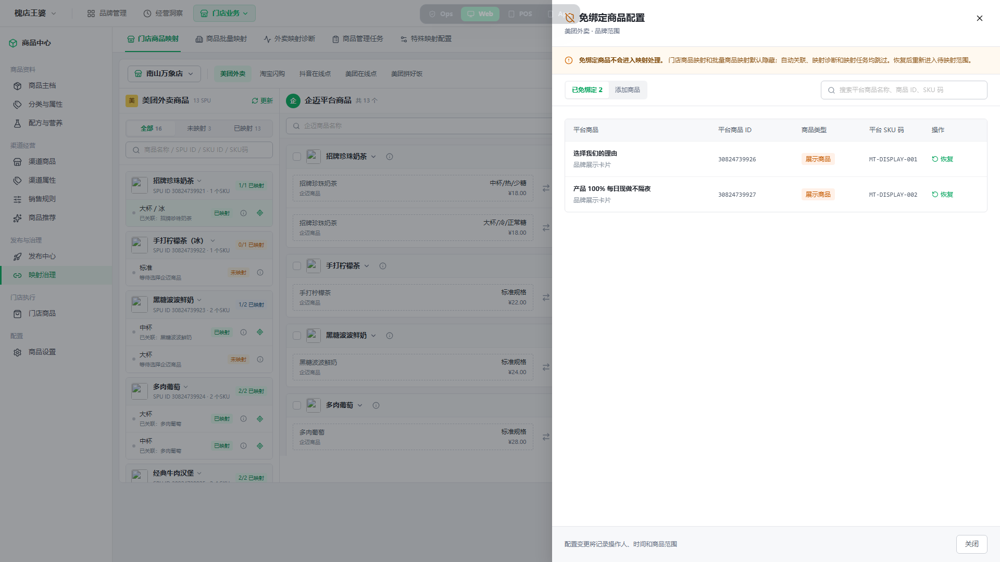
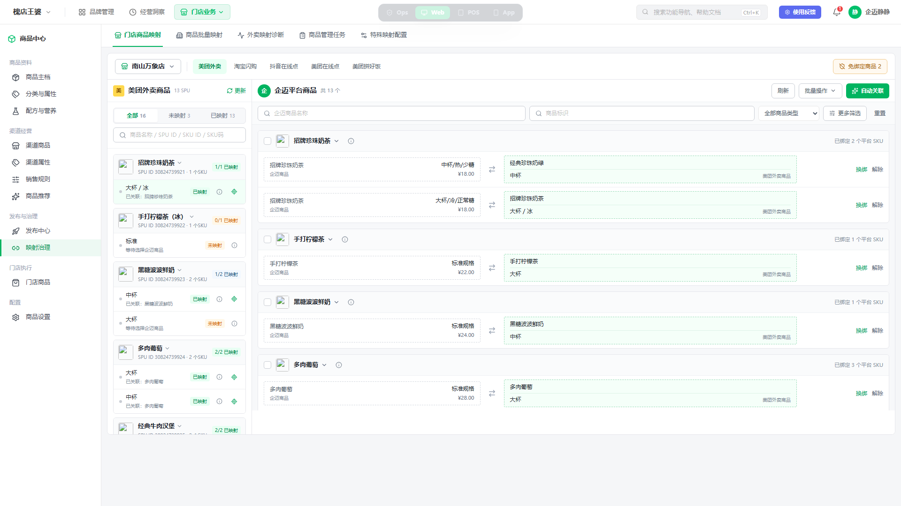
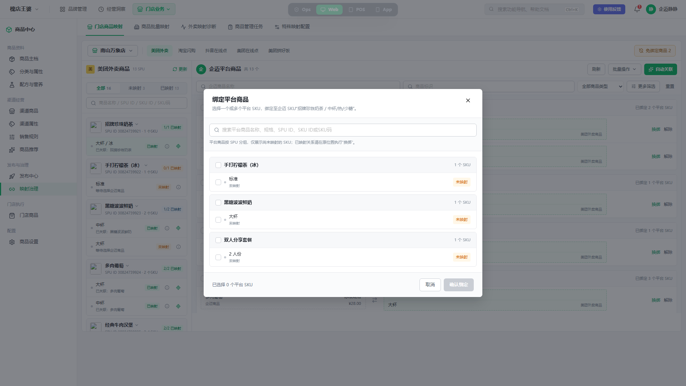
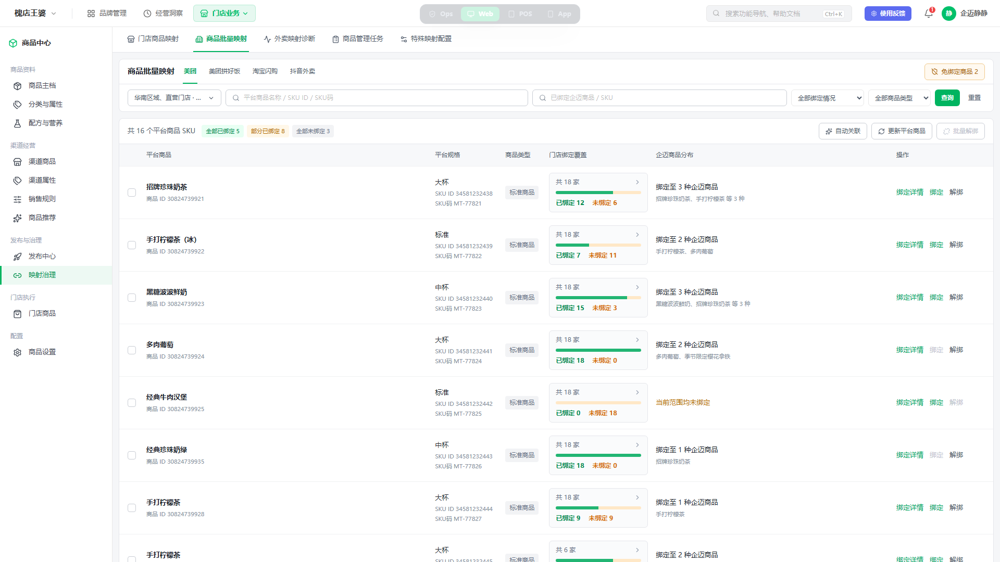
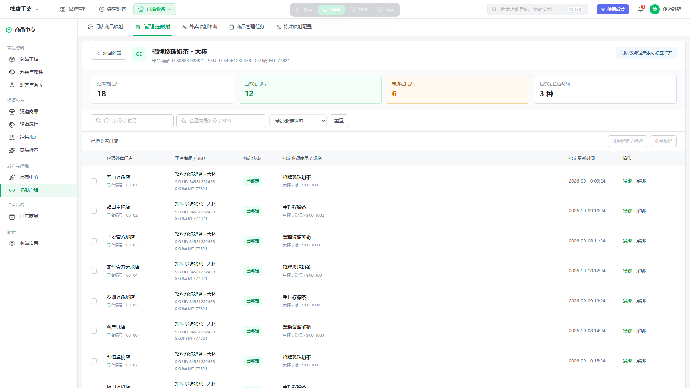
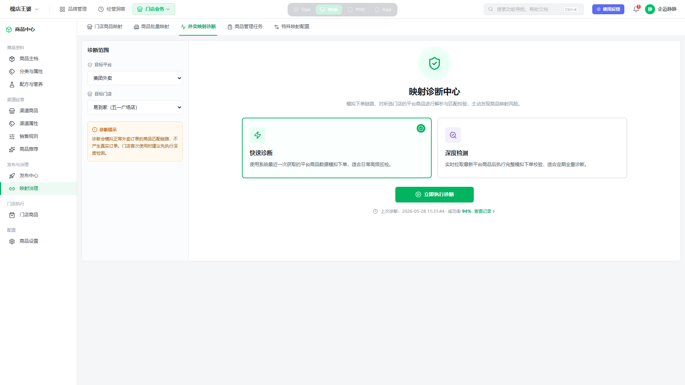
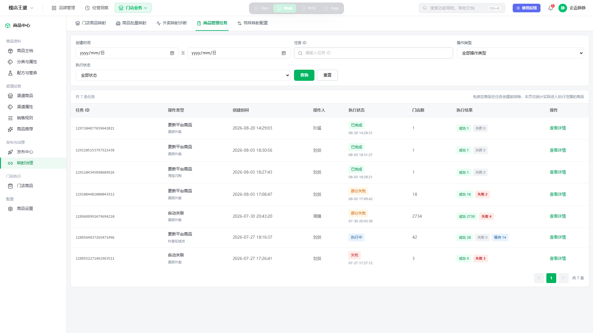
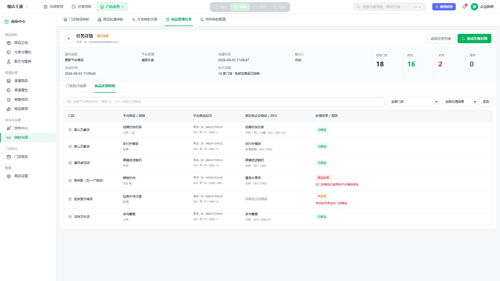
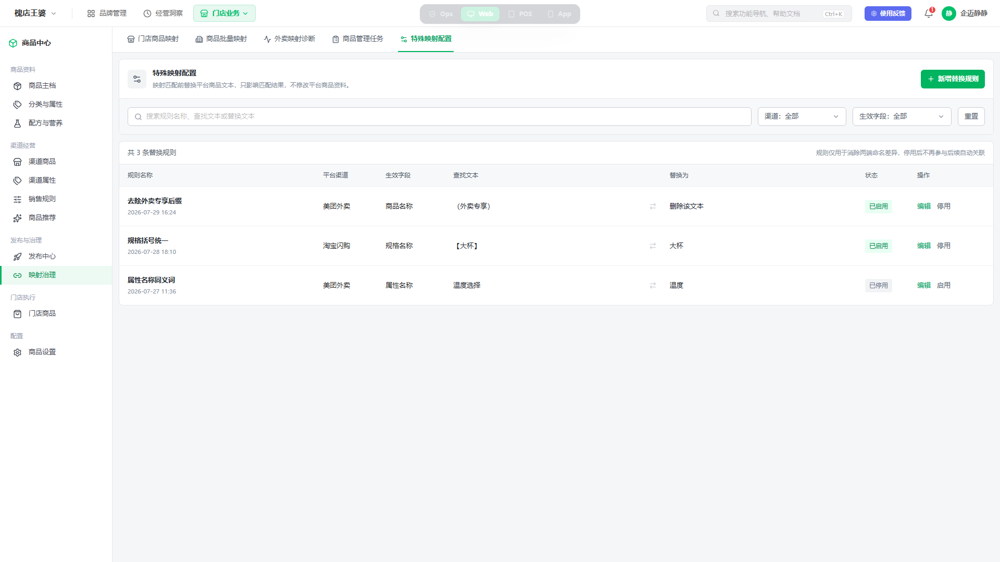

# P01 外卖商品映射治理优化 PRD

> 文档状态：方案评审稿
> 文档版本：v1.0
> 更新时间：2026-09-15
> 业务线：平台中心-技术平台部-基础服务组
> 客户名：无
> 产品经理：周镇
> QA：周镇
> 原型范围：门店商品映射、商品批量映射、外卖映射诊断、商品管理任务、特殊映射配置、免绑定商品配置
> 飞书文档：[外卖商品映射治理优化 PRD](https://qmai.feishu.cn/docx/N068dlIBMoTNs4x4zgmcRhyknJd)
> 飞书同步：2026-09-15 已同步 v1.0（回读校验通过）

## 1. 用户问题与现状证据

品牌运营需要在企迈后台维护美团外卖、淘宝闪购、抖音外卖、美团拼好饭等平台商品与企迈门店商品的 SKU 映射关系。现有生产页面已经具备门店映射、批量映射、更新平台商品、自动关联、任务查询和特殊映射配置等基础能力，但在批量处理、映射核对和异常追踪时仍存在以下问题：

1. 平台存在仅用于门店前台展示、并不参与接单商品识别的商品。当前没有统一的免绑定配置，这类商品仍出现在待映射列表、自动关联和任务范围中，造成无效待办和错误关联风险。
2. 门店商品映射页筛选区和工具区占用空间较大，单位屏幕可见商品少；商品标识、平台 SPU/SKU 信息和映射关系之间缺少清晰层级。
3. 企迈商品与平台商品并非一对一关系。一个企迈 SKU 可能关联多个美团或饿了么平台 SKU，若只展示数量或摘要，运营无法直接核对具体关联对象。
4. 平台多规格商品需要在 SPU 下逐个 SKU 映射。企迈商品也应在 SKU 维度执行绑定、换绑和解除，SPU 只负责分组，不应提供会造成对象歧义的绑定入口。
5. 批量映射页不能只回答“这个平台商品是否绑定”，还需回答目标范围内多少门店已绑定、多少门店未绑定、不同门店分别绑定了哪个企迈商品及 SKU。
6. 批量绑定详情信息量大，弹窗难以承载门店筛选、逐店绑定、批量操作和更新时间核对。
7. 商品管理任务只有任务级完成状态时，运营无法快速判断实际成功、失败和等待数量，也难以定位失败门店、失败商品及原因。
8. 操作成功反馈若以常驻横幅展示，会长期占用列表空间并要求用户手动关闭。

本需求以以下生产页面为基线，不改变其既有业务对象与保存语义：

| 页面 | 生产链接 | 本期处理重点 |
| --- | --- | --- |
| 门店商品映射 | https://console.qmai.co/commonCenter/takeaway/goodsManage/shop | SKU 映射、一对多关系、快速定位、信息密度 |
| 商品批量映射 | https://console.qmai.co/commonCenter/takeaway/goodsManage/store | 门店覆盖、企迈商品分布、逐店详情与操作 |
| 特殊映射配置 | https://console.qmai.co/commonCenter/takeoutSetting/setting | 保留既有规则，统一交互与反馈 |
| 商品管理任务 | https://console.qmai.co/commonCenter/takeaway/goodsManage/taskManagement | 任务结果、门店/商品明细、失败闭环 |

## 2. 目标与非目标

### 2.1 目标

1. 让展示型平台商品可以统一设为免绑定，并从映射列表、自动关联、诊断和异步任务中排除。
2. 在门店维度清晰表达“平台 SPU → 平台 SKU ↔ 企迈 SKU”的真实映射关系，支持一个企迈 SKU 关联多个平台 SKU。
3. 在批量映射列表直接展示门店绑定覆盖及企迈商品分布，并在独立详情页完成逐店核对和修正。
4. 将更新平台商品和自动关联的异步结果收敛到可追溯的任务列表及独立详情页。
5. 压缩低频筛选和提示占用，提升 1440px 及以上桌面端的首屏商品可见数量。

### 2.2 非目标

1. 不处理客户提出的外卖商品主档、售卖属性随模板带入等与映射无关的商品管理需求。
2. 不修改三方平台商品名称、图片、价格、上下架等权威资料。
3. 不新增“关系失效”“映射冲突”两种映射状态；本期映射状态仅使用已映射、未映射。
4. 不在商品批量映射详情中新增“匹配依据”“规格 ID”等生产不存在的字段。
5. 不新增京东外卖映射范围；待渠道正式接入后再按新增渠道流程补齐。

## 3. 角色、范围与对象边界

| 项目 | 规则 |
| --- | --- |
| 主要角色 | 总部/品牌运营、商品运营、实施与售后排查人员 |
| 门店范围 | 仅显示当前账号有权的组织、门店和外卖门店；部分权限需明确提示范围受限 |
| 渠道范围 | 已接入且当前品牌已开通的外卖渠道 |
| 平台商品层级 | SPU 用于分组展示，SKU 是映射及免绑定的最小对象 |
| 企迈商品层级 | SPU 用于分组展示，SKU 是绑定、换绑和解除的最小对象 |
| 关系基数 | 一个企迈 SKU 可关联同门店同平台的一个或多个平台 SKU；不同门店可以关联不同企迈商品/SKU |
| 权威关系 | 映射关系由平台服务维护；商品中心提供查看、配置、诊断和任务闭环入口 |

## 4. 总体信息架构

“映射治理”菜单下保留五个稳定页内视图：

1. 门店商品映射。
2. 商品批量映射。
3. 外卖映射诊断。
4. 商品管理任务。
5. 特殊映射配置。

免绑定商品配置是跨门店映射、批量映射、诊断和任务的低频公共能力，从门店映射及批量映射页提供统一入口，不为每行商品重复放置操作。

## 5. 功能需求

### 5.1 免绑定商品配置

#### 入口与展示

- 门店商品映射和商品批量映射页右上角展示“免绑定商品 N”统一入口。
- 点击后打开右侧配置抽屉；抽屉包含“已免绑定”和“添加免绑定”两个视图。
- 列表按平台 SPU 分组并展示 SKU，支持按平台商品名称、SPU ID、SKU ID、SKU 码搜索。
- 免绑定是低频治理配置，普通商品行不展示“设为免绑定”操作。

#### 操作与生效

- 用户可多选平台 SKU 批量设为免绑定。
- 恢复前进行二次确认；恢复后商品重新进入待映射范围。
- 设置成功后，门店映射和批量映射列表立即移除对应 SKU。
- 后续自动关联、映射诊断、“更新平台商品”和“自动关联”任务在创建执行范围前排除免绑定 SKU。
- 已创建任务按任务创建时的执行快照统计；详情不出现已在创建前排除的免绑定商品。
- 设置、恢复和批量操作使用自动消失的 Toast 反馈，不占用页面固定区域。

*图 5-1：统一入口集中维护展示型平台商品，普通映射列表不重复提供免绑定操作。*

### 5.2 门店商品映射

#### 页面布局与筛选

- 页面顶部先选择门店和平台渠道。
- 页面采用左右双栏：左侧为平台商品，右侧为企迈商品及映射关系。
- 左侧固定较窄宽度，右侧获得主要可视空间；筛选区使用单行紧凑布局，首屏优先展示商品。
- 左侧搜索覆盖平台商品名称、SPU ID、SKU ID、SKU 码；右侧常显企迈商品名称、商品标识、商品类型，其他低频条件进入“更多筛选”。
- 商品标识为企迈 SKU 级字段，搜索时必须匹配到具体 SKU。

#### 平台商品展示

- 左侧按平台 SPU 展示商品标题、平台商品 ID、SKU 映射覆盖数量。
- 展开 SPU 后展示其全部平台 SKU/规格及已映射、未映射状态。
- 已映射平台 SKU 展示关联企迈商品名称，并提供“定位企迈商品”小按钮；点击后右侧滚动并高亮对应企迈 SPU/SKU。
- 平台 SPU ID、SKU ID、SKU 码等核对字段不常驻主列表；用户点击信息按钮后在详情浮层查看，列表搜索仍支持这些字段。

#### 企迈商品与映射关系展示

- 右侧按企迈 SPU 分组，展开后逐行展示企迈 SKU/规格。
- SPU 行只展示分组名称、图片、信息入口和已绑定平台 SKU 数量，不提供绑定入口。
- 每个企迈 SKU 行直接列出所有已关联平台 SKU 的商品名称和规格。一对多关系逐条可见，不只显示数量或“等 N 个”。
- 主列表不常驻展示企迈 SKU ID、商品标识、平台 SKU ID 和 SKU 码；信息按钮/关系详情展示完整标识及绑定更新时间。
- 平台商品关系来源（如企迈发布建立、后台绑定）在关系详情中展示，不与商品标识混为同一字段。

#### 绑定、换绑与解除

- 未映射企迈 SKU 显示“绑定平台商品”。点击后打开平台 SKU 选择弹窗。
- 已映射企迈 SKU 只显示“换绑”“解除”，不重复显示“绑定平台商品”。
- 绑定弹窗按平台 SPU 分组，仅展示当前门店、当前平台下尚未映射且未免绑定的 SKU。
- 用户可勾选一个或多个平台 SKU 绑定至当前企迈 SKU；确认前展示目标企迈商品、规格和已选数量。
- 用户也可将左侧平台 SKU 拖拽到右侧具体企迈 SKU 行完成绑定。
- “换绑”选择新的企迈 SKU 后替换当前关系；“解除”只解除所选 SKU 关系，不影响同一 SPU 的其他 SKU 或同一企迈 SKU 的其他平台关系。
- 移入商品库商品、复制关系到其他门店为独立流程，不要求用户预先勾选当前列表商品；复制流程内再选择全部或部分关系及目标门店。

*图 5-2：平台与企迈商品均按 SPU 分组并展开到 SKU，企迈 SKU 下直接列出一对多平台关系。*

*图 5-3：从当前平台未映射 SKU 中多选，统一绑定到指定企迈 SKU。*

### 5.3 商品批量映射

#### 列表与筛选

- 页面按平台 SKU 维度展示，不新增“规格 ID”字段。
- 常显筛选包括：门店/组织范围、平台商品名称/SKU ID/SKU 码、已绑定企迈商品名称/SKU、绑定情况、商品类型。
- “更多筛选”不得重复放置已常显的查询项。
- 更新平台商品、自动关联与批量解绑放在列表操作区，批量解绑仅在勾选后可用。
- 页面展示全部已绑定、部分已绑定、全部未绑定数量，点击可快速筛选相应场景。

#### 门店覆盖与企迈商品分布

- 每个平台 SKU 展示当前范围门店总数、已绑定门店数、未绑定门店数和覆盖进度。
- “企迈商品分布”展示当前范围绑定到几种企迈商品，并列出前若干名称；完整关系在绑定详情页查看。
- 全部已绑定、部分已绑定、全部未绑定使用明确文字和数量，不能依赖颜色单独表达。

*图 5-4：列表直接展示门店覆盖和企迈商品分布，可一次识别全绑定、部分绑定和全未绑定场景。*

#### 独立绑定详情页

- 点击“绑定详情”进入独立子页面；浏览器返回或“返回列表”恢复原列表筛选和滚动上下文。
- 页面头部展示平台商品、规格、平台商品 ID、SKU ID、SKU 码及当前范围汇总。
- 列表按门店展示平台商品/SKU、绑定状态、对应企迈商品/规格、企迈 SKU 及绑定更新时间。
- 同一平台 SKU 在不同门店可以绑定不同企迈商品和企迈 SKU。
- 未绑定门店可单独绑定；已绑定门店可单独换绑或解除。
- 勾选门店后支持批量绑定/换绑和批量解绑；批量绑定时选择企迈商品及具体 SKU。
- 企迈多规格商品必须展示并保存选中的企迈 SKU，不允许只停留在 SPU 名称。
- 页面不展示“匹配依据”标记。

*图 5-5：独立页面承载门店级映射关系，可逐店核对不同企迈商品/SKU并处理。*

### 5.4 外卖映射诊断

- 用户先选择目标平台和目标门店范围，再选择“快速诊断”或“深度检测”。
- 诊断只模拟下单映射链路，不产生真实订单、不修改商品资料和映射关系。
- 执行结果展示匹配成功率、正常商品数、风险商品数和可追溯诊断记录。
- 免绑定商品不进入诊断分母，也不产生风险项。
- 诊断失败需保留失败原因和重新执行入口。

*图 5-6：按平台、门店和检测模式执行模拟链路并保留记录。*

### 5.5 商品管理任务

#### 任务列表

- 商品管理任务承接“更新平台商品”和“自动关联”两类异步任务。
- 支持按创建时间、任务 ID、操作类型和执行状态筛选。
- 列表展示任务 ID、操作类型、平台、创建时间、操作人、执行状态、门店数以及成功、失败、等待数量。
- 任务完成不等于全部成功；存在失败项时展示“部分失败”及准确数量。
- 免绑定商品在任务创建前排除，任务列表和详情只统计实际进入执行范围的商品。

*图 5-7：任务列表直接显示成功、失败和等待数量，避免将“完成”误解为全部成功。*

#### 独立任务详情页

- 点击“查看详情”进入独立子页面，不使用弹窗或抽屉承载复杂明细。
- 详情头部展示任务类型、平台、创建/完成时间、操作人、执行范围及结果汇总。
- “门店执行结果”展示门店名称/编号、状态、处理数量、失败数量、失败原因和完成时间。
- “商品处理明细”展示门店、平台商品/规格、平台标识、绑定企迈商品/SKU、处理结果和原因。
- 用户可从失败门店进入该门店商品明细，并可对失败范围发起重试；重试不重复处理成功项。
- 运行中任务展示成功、失败、等待的实时数量；接口失败时保留已返回结果并提供刷新。

*图 5-8：独立详情页按门店与商品两层核对执行结果和失败原因。*

### 5.6 特殊映射配置

- 保留生产现有特殊替换规则及保存语义，不新增业务字段。
- 列表展示规则名称、适用渠道、替换类型、原值、目标值、状态和更新时间。
- 新增/编辑使用单一短任务弹窗；启用、停用和删除按既有权限执行。
- 成功反馈使用 Toast；校验失败在字段附近提示并保留用户输入。

*图 5-9：保留既有特殊替换规则，并统一紧凑列表与状态表达。*

## 6. 相对生产页面的改动清单

| 页面/能力 | 生产现状 | 本期改动 |
| --- | --- | --- |
| 导航 | 各映射能力分散在旧外卖中心导航 | 收敛为映射治理下五个稳定页内视图，能力不丢失 |
| 免绑定 | 无统一排除机制 | 新增统一配置；列表、自动关联、诊断和任务前置排除 |
| 门店映射布局 | 顶部操作和筛选占用较多，首屏商品少 | 压缩工具栏和筛选区，双栏保持高密度浏览 |
| 平台商品展示 | 已有 SPU/SKU 结构及标识查看能力 | 保留 SPU 分组；标识从主列表收进信息详情，并新增已映射 SKU 快速定位 |
| 企迈商品展示 | 可按规格绑定，但一对多关系不够直观 | 企迈 SKU 下逐条展示全部平台关系，明确一对多 |
| 绑定入口 | 行操作语义不统一 | SPU 无入口；未绑定 SKU 显示绑定，已绑定 SKU 只显示换绑/解除 |
| 平台商品选择 | 依赖拖拽或单条操作 | 绑定弹窗支持按 SPU 分组、多选平台 SKU；保留拖拽 |
| 批量映射列表 | 难以直观看到门店绑定覆盖及差异 | 增加总门店、已绑定、未绑定、覆盖进度和企迈商品分布 |
| 批量绑定详情 | 弹窗/多层跳转承载复杂明细 | 改为独立页面，支持筛选、逐店绑定/换绑/解除和批量操作 |
| 任务结果 | 状态和结果需多层查看 | 列表直接展示成功/失败/等待，详情改独立页面并支持失败重试 |
| 操作反馈 | 常驻横幅占用空间且需关闭 | 普通结果统一使用自动消失 Toast；阻断性问题就地展示 |

## 7. 通用规则与异常场景

| 场景 | 前置条件 | 系统处理 | 用户反馈 |
| --- | --- | --- | --- |
| 正常绑定 | 平台 SKU 未免绑定且用户有操作权限 | 保存 SKU 映射并刷新两侧状态 | Toast 提示成功；关系立即可见 |
| 一对多绑定 | 同一企迈 SKU 已有平台关系 | 追加所选平台 SKU，不覆盖其他关系 | 展示最新关系总数和逐条明细 |
| 平台 SKU 已被映射 | 提交时关系已被其他用户修改 | 重新校验并阻止覆盖 | 提示关系已变化，刷新后重新选择 |
| 设置免绑定 | 平台 SKU 已存在映射 | 保存前提示需先解除关系或按既有规则处理，不静默删除映射 | 明确阻断原因和关联对象 |
| 部分成功 | 跨门店批量操作部分失败 | 保留成功项，失败项单独记录 | 展示成功/失败/等待数量和失败原因，可重试失败项 |
| 授权失效 | 平台店铺授权过期 | 不继续拉取、诊断或自动关联 | 明确授权失效和处理入口 |
| 无页面权限 | 用户缺少映射治理页面权限 | 不展示页面内容 | 显示无权限说明，不伪装为空数据 |
| 部分数据权限 | 用户仅有部分门店 | 仅计算和展示有权门店范围 | 明确“当前仅展示有权范围” |
| 空数据 | 当前范围无平台商品或均已免绑定 | 展示原因区分的空状态 | 支持切换范围、恢复免绑定或刷新平台商品 |
| 接口失败 | 列表、详情或保存请求失败 | 保留当前筛选和未提交内容 | 就地错误及重试入口，不清空上下文 |

## 8. 权限、审计与兼容

### 8.1 权限

- 页面权限、门店/渠道数据范围、绑定操作权限、免绑定配置权限、任务重试权限分别校验。
- 查看权限不自动包含绑定、换绑、解除、免绑定和重试权限。
- 跨门店批量操作只允许作用于当前用户有权门店；无权门店不计入可操作数量。

### 8.2 审计

- 记录绑定、换绑、解除、免绑定、恢复、复制关系、批量解绑和失败重试。
- 审计内容至少包含操作人、时间、门店、渠道、平台 SPU/SKU、企迈 SPU/SKU、操作前后关系和任务 ID（如有）。
- 任务和诊断记录保留其执行范围快照，避免后续商品或权限变化导致历史结果不可解释。

### 8.3 历史兼容

- 现有映射关系、平台商品 ID、企迈商品 ID 和历史任务不重建、不删除。
- 页面升级后按原关系直接回显；一个企迈 SKU 已关联多个平台 SKU 时必须完整展示。
- 旧任务无等待数量或商品明细时按可用数据展示，不伪造明细；需明确标注历史数据不完整。
- 特殊映射配置沿用原规则数据和启停状态。

## 9. 质量与页面状态

- 1440px 宽度下顶部操作不换行，门店映射和批量映射首屏至少完整显示 5 条主要商品记录。
- 长商品名、长规格名、长门店名使用截断和 Tooltip，关键数量、状态和操作保持完整可见。
- 左右双栏各自滚动时保留当前选中项和定位高亮；键盘和触控板可滚动。
- 所有页面覆盖 loading、success、first-empty、filtered-empty、error、no-permission、partial-permission、submitting。
- 批量和异步场景额外覆盖 partial-success、并发变化、授权失效和等待状态。
- 状态必须有文字，不能只靠颜色或图标表达。

## 10. 核心测试场景

| 编号 | 场景 | 预期 |
| --- | --- | --- |
| MAP-TC001 | 将 2 个展示型平台 SKU 设为免绑定 | 两个映射列表均不再出现；诊断和新建任务不统计 |
| MAP-TC002 | 恢复一个免绑定 SKU | SKU 重新进入未映射列表并参与后续任务 |
| MAP-TC003 | 一个企迈 SKU 绑定 3 个平台 SKU | 右侧逐条展示 3 个具体平台商品/规格；关系详情完整 |
| MAP-TC004 | 点击左侧已映射 SKU 的定位按钮 | 右侧滚动并高亮对应企迈 SPU/SKU |
| MAP-TC005 | 查看平台标识 | 主列表保持紧凑；详情展示 SPU ID、SKU ID、SKU 码和更新时间 |
| MAP-TC006 | 未绑定企迈 SKU 点击绑定 | 弹窗按平台 SPU 分组，可多选未映射平台 SKU |
| MAP-TC007 | 已绑定企迈 SKU | 仅显示换绑、解除，不显示绑定平台商品 |
| MAP-TC008 | 商品批量映射存在 12 家已绑定、6 家未绑定 | 列表准确展示 18/12/6 和企迈商品分布 |
| MAP-TC009 | 同一平台 SKU 在三家门店绑定三种企迈商品 | 独立详情逐店显示对应企迈商品及 SKU |
| MAP-TC010 | 多规格企迈商品逐店绑定 | 必须选中并回显具体企迈 SKU 和绑定更新时间 |
| MAP-TC011 | 批量解绑部分失败 | 成功关系保留；失败门店及原因可查看和重试 |
| MAP-TC012 | 自动关联任务 2734 家门店中 4 家失败 | 任务列表显示部分失败；详情可定位四家门店及失败商品 |
| MAP-TC013 | 任务仍在执行 | 成功、失败、等待数量之和等于执行范围，页面可刷新 |
| MAP-TC014 | 快速诊断与深度检测 | 均不创建真实订单；结果和记录可追溯，免绑定商品不计入 |
| MAP-TC015 | 复制关系到其他门店 | 无需预勾选列表；流程内选择全部/部分关系和目标门店 |
| MAP-TC016 | 普通操作成功 | 展示自动消失 Toast，不出现需手动关闭的常驻横幅 |

## 11. 验收标准

1. 映射治理下五个页内视图均可访问，生产现有映射、诊断、任务和特殊配置能力没有丢失。
2. 免绑定商品只通过统一入口维护，普通商品行无重复入口；免绑定 SKU 从列表、诊断和新建任务中排除。
3. 门店商品映射按平台 SPU 和企迈 SPU 分组、按 SKU 建立关系；企迈 SPU 行没有绑定入口。
4. 一个企迈 SKU 可绑定多个平台 SKU，页面逐条显示具体平台商品和规格。
5. 已映射平台 SKU 可快速定位到对应企迈商品/SKU；平台与企迈标识可搜索，并在信息详情中查看。
6. 未映射企迈 SKU 显示“绑定平台商品”；已映射 SKU 只显示“换绑”“解除”。
7. 商品批量映射列表准确显示范围门店、已绑定、未绑定和企迈商品分布，覆盖全绑定、部分绑定和全未绑定场景。
8. 批量映射绑定详情使用独立页面，支持逐店和批量绑定/换绑/解除；多规格企迈商品回显具体 SKU 和更新时间。
9. 批量映射无“规格 ID”，绑定详情无“匹配依据”，常显筛选与更多筛选不存在重复项。
10. 商品管理任务列表直接展示成功、失败、等待数量；复杂详情进入独立页面并可按失败范围重试。
11. 普通操作反馈使用 Toast，不常驻占用顶部空间；阻断、权限和接口错误在相关区域明确展示。
12. 1440px、长文案、空数据、无权限、部分权限、接口失败、并发变化和部分成功状态均符合本需求规则。

## 12. 依赖与待确认项

1. 依赖平台服务提供平台商品快照、SKU 映射权威关系、任务进度、失败原因、失败重试和诊断执行结果。
2. 依赖统一权限服务返回渠道、组织和门店数据范围，以及查看/维护/重试动作权限。
3. 免绑定配置的历史数据初始化策略和已存在映射时的处理方式需在技术方案中确认；产品行为必须满足“不静默删除现有映射”。
4. 历史任务能够回溯到商品级明细的时间范围由平台服务确认；无法回溯时页面需明确标注。
