# P01 必选商品方案与适用门店 PRD

> 文档状态：方案评审稿
> 文档版本：v1.13
> 更新时间：2026-09-21
> 原型范围：品牌必选商品列表、品牌方案新建/编辑、特例设置
> 飞书文档：[必选商品方案 PRD](https://qmai.feishu.cn/docx/DRQOdYvSuoqf4Gxh8olcy7SbnGe)
> 飞书同步：已同步 v1.13（2026-09-21，线上 revision 215）

## 1. 背景与问题

系统当前同时存在分类必选与必选商品两类能力：

- 分类必选：订单必须包含指定分类中的商品；继续保留并独立维护。
- 必选商品：支持自动加入购物车或下单前检查，覆盖锅底、餐具、口味、茶位等场景。

历史饮食客户主要按“品牌方案选择适用门店”的方式使用，客户数量和既有数据均占多数。历史正餐客户曾使用“品牌下发门店、门店保留副本并可调整”的方式。融合后若统一改为下发模式，会改变多数饮食客户的操作习惯，并增加下发、版本、门店副本、失败重试和离线一致性成本。

本期因此采用品牌直读模型：品牌维护方案及适用门店，小程序和 POS 直接读取品牌有效规则，不再下发，也不建立门店业务副本。

## 2. 目标与非目标

### 2.1 目标

1. 保持饮食客户现有“适用门店”配置习惯和历史规则连续生效。
2. 补齐正餐必选方案中的渠道、桌位类型、门店桌位区域、时间和高级设置能力，同时保持饮食客户默认配置简单。
3. 支持“自动加入购物车”和“下单前检查”两种必选类型。
4. 支持“全部商品必选”和“任选一种”两种选择规则；“任选一种”仅适用于下单前检查。
5. 方案先选择适用场景（堂食、外卖、外带），再按商品分别启用可见的订单类型并配置必选数量；堂食支持固定数量或按用餐人数，外卖与外带仅支持固定数量。
6. 小程序与联网 POS 直接读取品牌最新有效方案；POS 断网仍可按最近成功缓存执行。
7. 特例设置保持品牌唯一配置，解决只购买饮料、米饭等商品时无需重复选择必选商品的问题；该设置只豁免必选商品方案，不影响分类必选。
8. 保留历史正餐门店副本的后续迁移设计边界，本期不实施正餐历史数据迁移。

### 2.2 非目标

- 不合并或替代分类必选。
- 不建设方案下发页面、下发任务、同步时间或门店失败重试。
- 不生成门店必选方案副本，不提供门店方案编辑菜单。
- 不支持门店直接修改品牌方案；门店差异由品牌创建不同方案并配置不同适用门店。
- 不把 POS 离线缓存建模为门店经营数据。
- 同一门店、同一渠道、同一订单类型不允许存在多个启用方案；本期不建设规则优先级或叠加执行。

## 3. 用户与核心场景

| 用户/场景 | 任务 | 产品行为 |
| --- | --- | --- |
| 饮食总部运营 | 维护锅底、餐具等规则 | 在品牌方案内选择适用门店，保存后直接生效 |
| 麻辣烫总部运营 | 要求主餐必须选一种口味 | 使用“下单前检查 + 任选一种”，任一候选口味达到配置数量后通过 |
| 顾客追加饮料或米饭 | 不希望再次选择必选商品 | 订单全部为特例商品时仅跳过必选商品方案；分类必选仍按其独立规则执行 |
| 正餐总部运营 | 按包间、时段、用餐人数设置茶位 | 使用桌位、时间及高级设置，并选择适用门店 |
| 连锁品牌区域差异 | 部分门店规则不同 | 建立多个品牌方案，分别选择不同门店范围 |
| POS 断网点单 | 本地继续执行必选规则 | 使用当前门店最近成功的完整品牌规则缓存 |

## 4. 总体方案

### 4.1 数据权威与范围

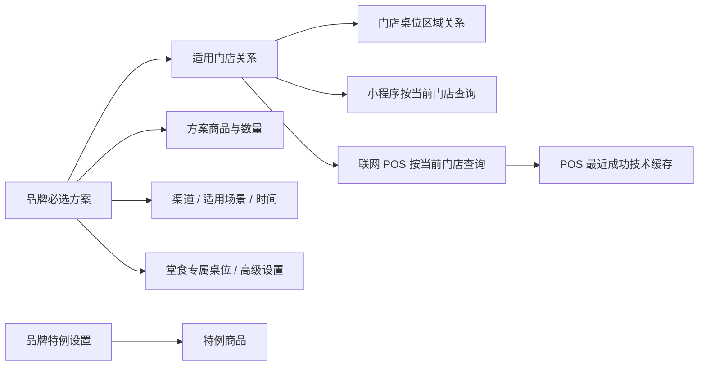

权威数据只有品牌方案和品牌特例设置。适用门店是品牌方案的范围关系，不是同步目标。POS 缓存只用于断网执行，不提供门店后台查看、编辑或恢复入口。

### 4.2 保存与运行时流程

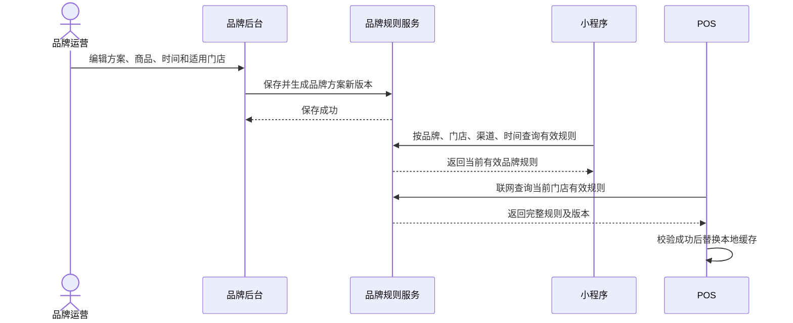

保存成功后，后续订单读取新版本；不额外创建下发任务。已进入结算的订单按服务端既有订单快照策略处理，不在结算中途切换规则。

新建方案保存成功后，系统生成方案 ID 和 V1 记录、默认状态为“启用”，返回品牌方案列表并在首行展示新记录，同时提示“创建成功，已启用”。编辑已有方案时保留其原启用/禁用状态并生成递增版本。保存失败时停留在编辑页，保留全部已填内容并定位首个错误字段。

### 4.3 点单裁决

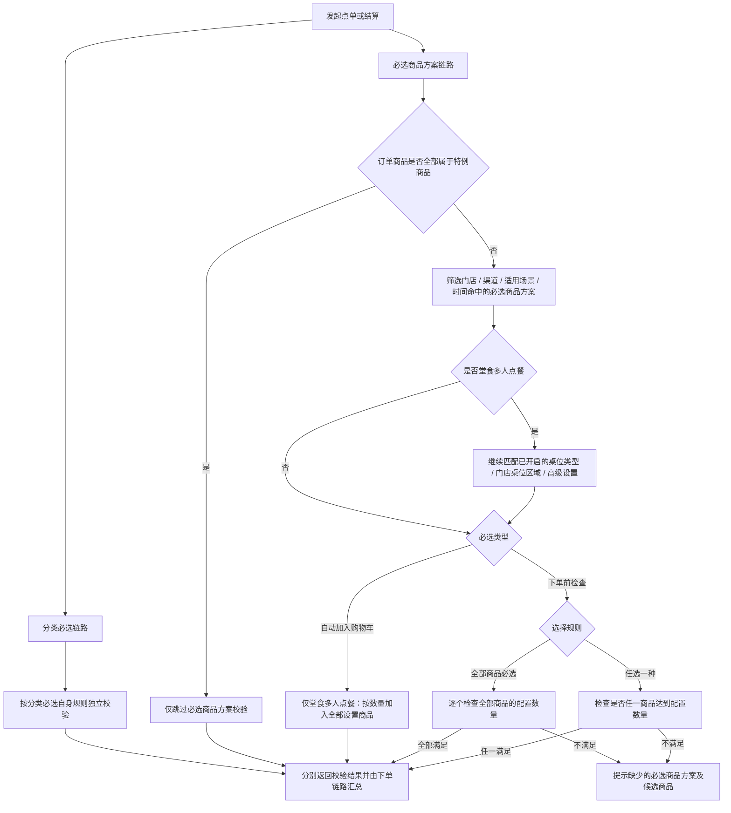

分类必选与必选商品是两套独立规则。分类必选不读取品牌特例设置，也不会因订单商品属于特例集合而跳过；特例设置只参与必选商品方案链路的判断。

### 4.4 方案唯一性与冲突

- 同一门店、同一渠道、同一订单类型（堂食 / 外卖 / 外带）只能存在一个启用方案，不设置优先级或叠加执行。
- 仅当两个方案在“适用门店、适用渠道、适用场景”三个维度都存在交集时判定冲突；任一维度无交集均可并存。
- 新建方案默认启用，因此创建保存前必须校验；编辑已启用方案并修改上述任一范围时同样必须校验。
- 禁用方案重新启用前必须校验；发现冲突时保持禁用，不自动覆盖、禁用或修改已有方案。
- 冲突反馈需展示冲突方案名称，以及实际重叠的门店、渠道和订单类型，用户可据此调整当前方案或先处理已有方案。

## 5. 信息架构与权限

```text
渠道经营 / 销售规则 / 必选商品
  ├─ 品牌方案列表
  ├─ 新建 / 编辑 / 查看方案
  └─ 特例设置
```

“门店商品”区域不增加“门店必选商品”菜单。

| 能力 | 品牌管理员 | 品牌运营 | 门店角色 |
| --- | --- | --- | --- |
| 查看品牌方案 | 是 | 按授权 | 否 |
| 新建/编辑方案 | 是 | 按授权 | 否 |
| 启用/禁用方案 | 是 | 按授权 | 否 |
| 删除已禁用方案 | 是 | 按授权 | 否 |
| 维护适用门店 | 是 | 按门店数据范围 | 否 |
| 维护特例设置 | 是 | 独立权限 | 否 |

无门店数据范围时不得展示为“0 家门店”，应明确提示无范围权限；部分权限只允许选择有权门店，详情对无权门店按统一范围脱敏策略处理。

## 6. 功能需求

### 6.1 品牌方案列表

页面主任务是查询和维护必选方案，并识别每个方案的适用门店。

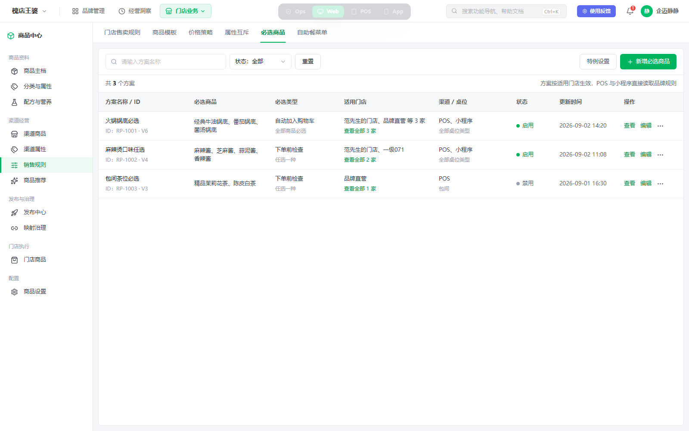

*图 6-1：列表保留适用门店，不再展示下发入口、最近下发或门店同步状态。*

#### 筛选与操作

| 区域 | 项目 | 规则 |
| --- | --- | --- |
| 搜索 | 方案名称 | 仅按方案名称模糊搜索 |
| 筛选 | 状态 | 全部、启用、禁用 |
| 次操作 | 特例设置 | 打开品牌唯一特例配置弹窗 |
| 主操作 | 新增必选商品 | 进入独立新建页 |

不展示下发入口、下发门店、最近下发、同步状态或迁移标签。

#### 列表字段

| 字段 | 展示规则 |
| --- | --- |
| 方案名称 / ID | 名称、方案 ID、版本号 |
| 必选商品 | 商品名称摘要，超长截断并可在详情查看 |
| 必选类型 | 自动加入购物车 / 下单前检查，并在次行展示选择规则 |
| 适用门店 | 前两家名称及总数，可查看全部 |
| 渠道 / 适用场景 | POS、小程序及堂食、外卖、外带场景；含堂食时补充桌位限定摘要 |
| 状态 | 启用 / 禁用，必须有文字 |
| 更新时间 | 最近一次品牌方案更新时间 |
| 操作 | 查看、编辑、更多（启禁用、复制、删除） |

启用、禁用会直接改变适用门店后续订单的规则命中。删除前必须先禁用；删除后适用门店不再命中该方案，并保留审计。

启用禁用方案前按“门店 × 渠道 × 订单类型”校验唯一性。若与其他启用方案冲突，保持当前方案禁用并展示冲突明细。

### 6.2 新建/编辑方案

独立长表单按以下顺序组织：

1. 基础设置。
2. 时间设置。
3. 适用门店。
4. 高级设置。

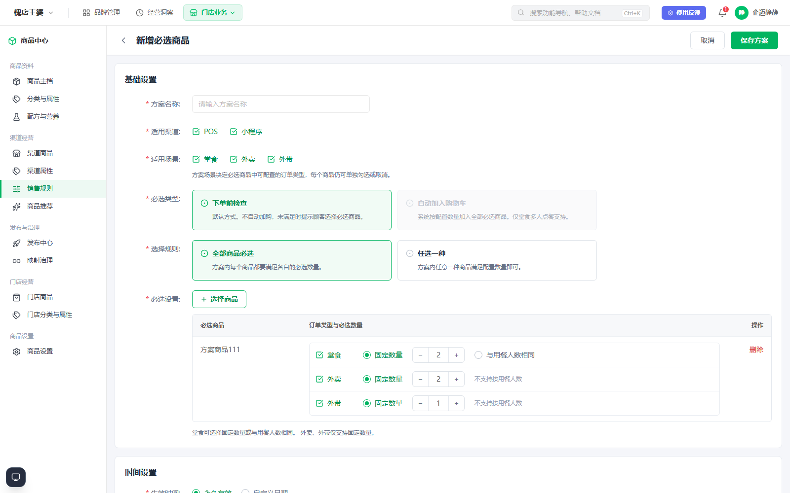

*图 6-2：适用场景决定必选商品内可见的订单类型；当包含外卖或外带时，“自动加入购物车”不可选。*

#### 基础设置

| 字段 | 必填 | 默认值 | 规则 |
| --- | --- | --- | --- |
| 方案名称 | 是 | 空 | 品牌内名称不可重复，支持 1–30 字 |
| 适用渠道 | 是 | POS、小程序 | 至少选择一个 |
| 适用场景 | 是 | 堂食、外卖、外带 | 至少选择一个；决定商品行中可配置的订单类型 |
| 必选类型 | 是 | 下单前检查 | 与自动加入购物车互斥；自动加入仅在适用场景仅勾选堂食时可选 |
| 选择规则 | 是 | 全部商品必选 | 全部商品必选 / 任选一种；自动加入购物车时固定为全部商品必选 |
| 必选商品 | 是 | 空 | 至少选择一个有效商品 |

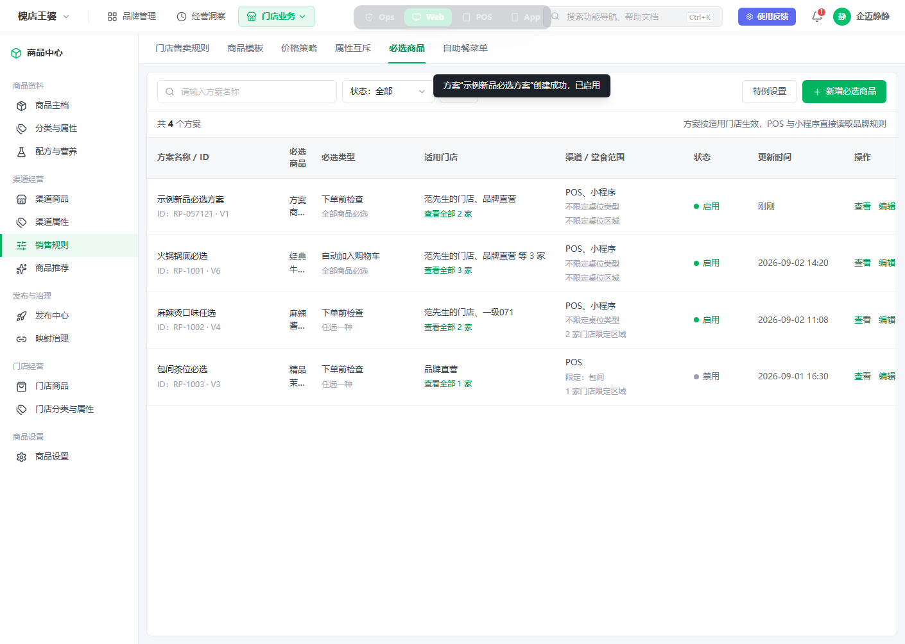

*图 6-2A：新建保存成功后返回列表，新方案生成 ID 与 V1 记录并默认启用。*

创建和编辑已启用方案保存时，系统以当前适用门店、适用渠道和适用场景组成有效范围，与其他启用方案做交集校验。任一组合重复即阻止保存，保留用户已填写内容，并提示冲突方案和具体重复组合。

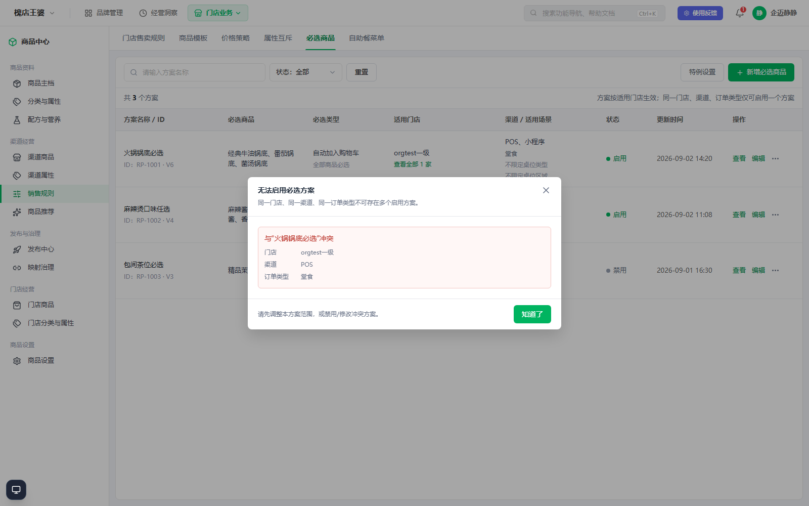

*图 6-2B：禁用方案重新启用时发现“门店 / 渠道 / 订单类型”重复，系统保持禁用并展示冲突方案和重叠范围。*

### 6.3 必选商品、适用场景、订单类型与数量

适用场景是方案级范围，必选商品内的订单类型是商品级开关：

1. 方案勾选哪些适用场景，商品行中才展示对应订单类型。
2. 每个商品仍可单独勾选或取消对应订单类型，不是选中场景后强制所有商品生效。
3. 取消方案场景时隐藏对应商品行并清除其生效状态；再次勾选时，新展示的商品订单类型默认启用，用户可逐商品取消。
4. 每个已选商品至少启用一个当前可见的订单类型，否则阻止保存。

页面在“订单类型与必选数量”单元格中按当前适用场景逐行配置，使启用状态、数量模式和数量值保持同一阅读路径。

| 数量模式 | 堂食 | 外卖 | 外带 | 规则 |
| --- | --- | --- | --- | --- |
| 固定数量 | 支持 | 支持 | 支持 | 数量为大于 0 的整数 |
| 与用餐人数相同 | 支持 | 不支持 | 不支持 | 与堂食固定数量互斥；外卖、外带不提供该可选项 |

堂食支持在“固定数量”和“与用餐人数相同”之间二选一。外卖和外带都仅支持固定数量；为避免把能力缺失误解为当前方案未启用，固定在外卖、外带行显示“不支持按用餐人数”，不使用“不使用用餐人数”等状态型文案。未启用的订单类型保留整行但降低数量区域强调，便于用户随时开启，同时不误认为数量配置已生效。

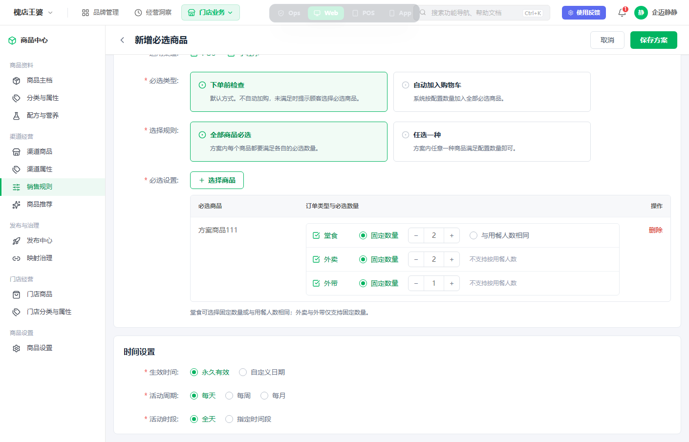

*图 6-3：堂食、外卖、外带逐行开启，数量规则与对应订单类型保持在同一行；仅堂食支持按用餐人数，外卖、外带明确提示不支持。*

“自动加入购物车”固定使用“全部商品必选”，按设置的每个商品分别加入。“下单前检查”可选择“全部商品必选”或“任选一种”：前者要求每个商品都达到其配置数量；后者只需任意一种候选商品达到其配置数量。切换为自动加入购物车时，系统自动把选择规则恢复为“全部商品必选”。

自动加入购物车仅支持堂食多人点餐，且仅支持“单规格且未配置做法、加料”的商品：

1. 适用场景包含外卖或外带时，“自动加入购物车”禁用，描述固定展示“仅堂食多人点餐支持”。
2. 已选自动加入后再勾选外卖或外带，系统自动切换为“下单前检查”并说明原因。
3. 适用场景仅保留堂食时，才可选择自动加入购物车。
4. 切换为自动加入购物车时校验当前已选商品；存在不兼容商品时保持原必选类型，并列出需处理商品。
5. 自动加入购物车模式的商品选择器直接过滤多规格、含做法或含加料的商品，不展示不符合条件的候选项；选择器顶部说明当前筛选条件。
6. 保存时再次校验适用场景和商品最新状态，防止商品在编辑期间被其他人新增规格、做法或加料。

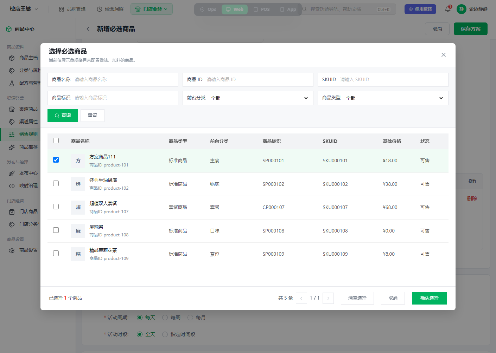

*图 6-4：选择器只展示符合自动加入条件的商品，并在顶部说明当前筛选条件。*

### 6.4 时间、桌位与高级设置

| 分组 | 字段 | 规则 |
| --- | --- | --- |
| 时间 | 生效时间 | 永久有效 / 自定义日期；开始不得晚于结束 |
| 时间 | 活动周期 | 每天 / 每周 / 每月；选择后显示对应周期值 |
| 时间 | 活动时段 | 全天 / 指定时间段；开始必须早于结束 |
| 高级 | 限定桌位类型 | 独立开关，默认关闭；开启后使用下拉选择至少一个桌位类型，仅对堂食多人点餐生效 |
| 高级 | 增加人数再次触发必选 | 用餐人数增加后重新检查或补充必选商品，仅对堂食多人点餐生效 |
| 高级 | 允许修改必选商品数量 | 允许点餐端调整自动加入数量，但不得低于方案最低数量；仅对堂食多人点餐生效 |

桌位类型不开启时不参与方案命中，不以“全部桌位类型”作为默认值或页面回显。这样没有桌位类型数据的饮食品牌无需理解或维护该配置。

若适用场景未勾选堂食，整个“高级设置”分组不展示，不对外卖或外带保存任何桌位、人数重触发或数量编辑配置。若用户从已勾选堂食切换为不含堂食，系统清理本次编辑中的堂食专属草稿值，防止不可见配置被保存。

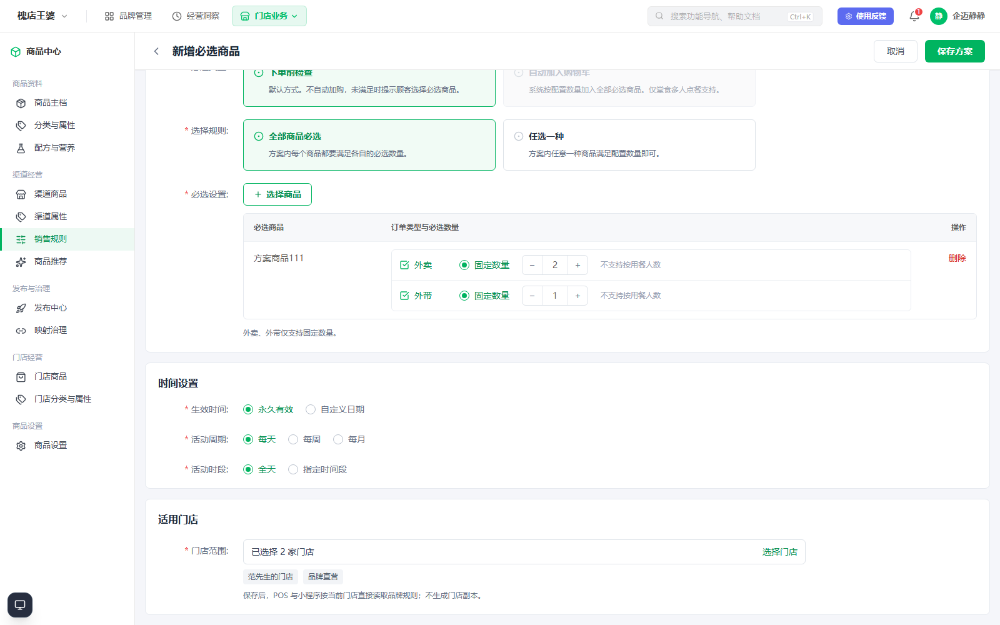

*图 6-5：方案仅适用外卖、外带时，商品中只展示对应订单类型，适用门店不展示桌位区域，页面不展示高级设置。*

### 6.5 适用门店

- 使用系统统一组织/门店选择器，不在表单中平铺门店。
- 支持按门店名称、编码、组织、区域和门店类型筛选。
- 至少选择一家门店；按具体门店 ID 保存，不保存动态筛选条件。
- 仅展示和选择当前操作者有权门店。
- 保存后新订单直接按新范围查询品牌规则。
- 从适用范围移除门店后，该门店新订单不再命中；POS 下一次联网刷新缓存后更新。
- 方案编辑期间门店被停用或移出权限时，保存前提示失效门店并要求移除或刷新。

#### 按门店限定桌位区域

桌位区域是门店级字典，不同门店的区域 ID 和名称均可能不同，因此不能使用一个品牌级下拉框混选。仅当适用场景勾选堂食时，适用门店区域才展示可选项“按门店限定桌位区域”，默认关闭；关闭时桌位区域不参与方案命中。该配置仅对堂食多人点餐生效。

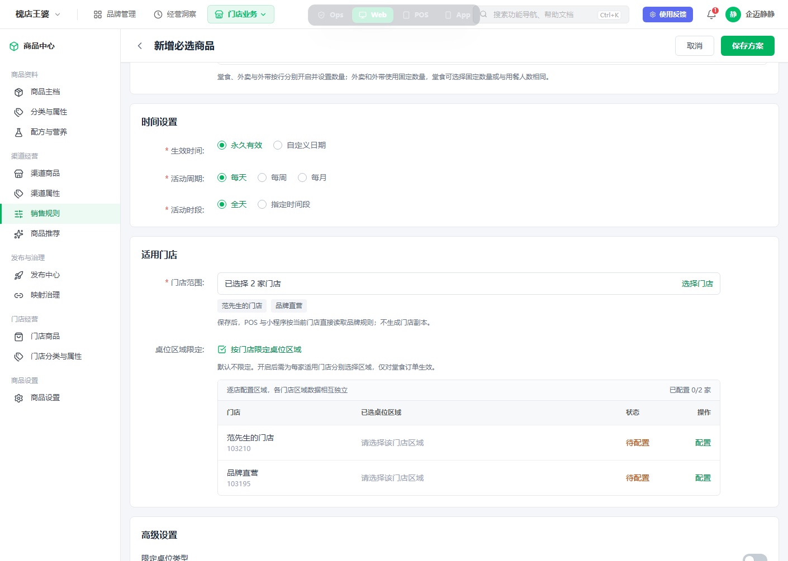

*图 6-6：开启后以门店列表承载配置进度，每家门店独立显示已选区域与待配置状态。*

开启后的操作与校验如下：

1. 已选门店按行展示门店名称、编码、区域配置摘要和状态；点击“配置/修改”打开当前门店专属弹窗。
2. 弹窗只加载当前门店的有效桌位区域，支持多选；确认后回写本门店配置，不允许跨店复用区域 ID。
3. 保存方案前，每个适用门店必须至少选择一个区域；未完成门店在列表中标记“待配置”并阻止保存。
4. 新增适用门店后，新门店默认为待配置；移除门店时同时删除该门店在本方案中的区域关系。
5. 某门店没有桌位区域时展示“该门店未维护桌位区域”，提供前往门店桌位设置的入口，且在补齐前不能保存已开启区域限定的方案。
6. 桌位类型限定与桌位区域限定同时开启时，堂食多人点餐必须同时命中类型和当前门店区域；任一限定关闭即不参与判断。
7. 取消堂食场景时立即隐藏本配置并清理草稿中的逐店区域关系；重新勾选堂食后默认不开启区域限定，需用户重新配置。

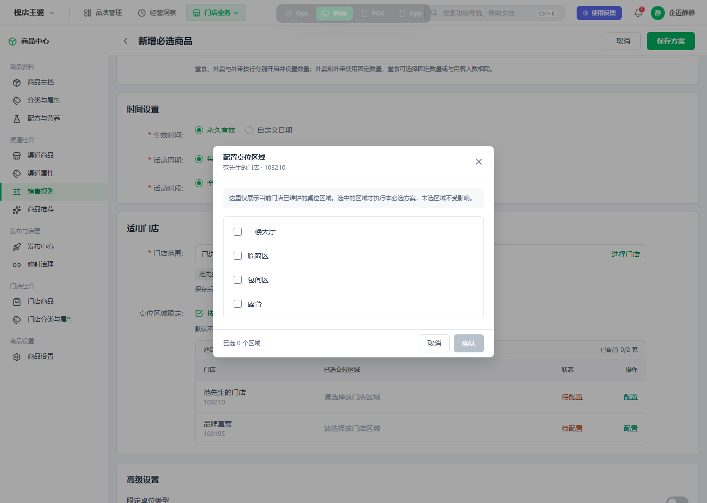

*图 6-7：弹窗明确当前门店上下文，只展示该门店维护的桌位区域。*

### 6.6 特例设置

特例设置是品牌唯一配置，不选择适用门店，所有门店共用。

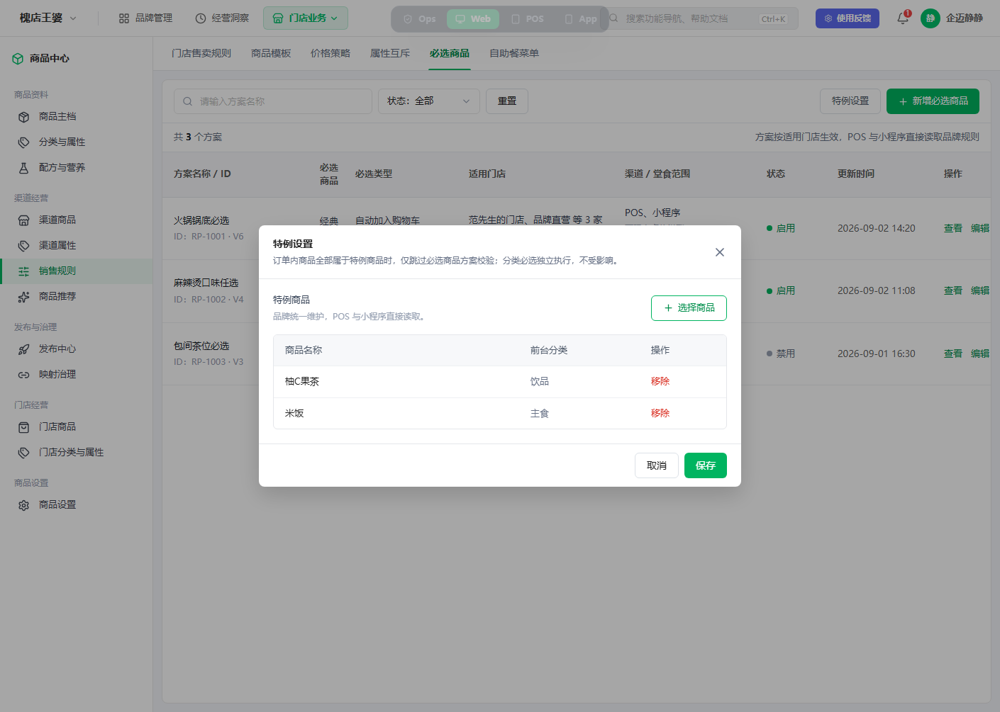

*图 6-8：特例设置仅控制必选商品方案校验；分类必选是独立功能，不读取特例设置，仍按自身规则执行。*

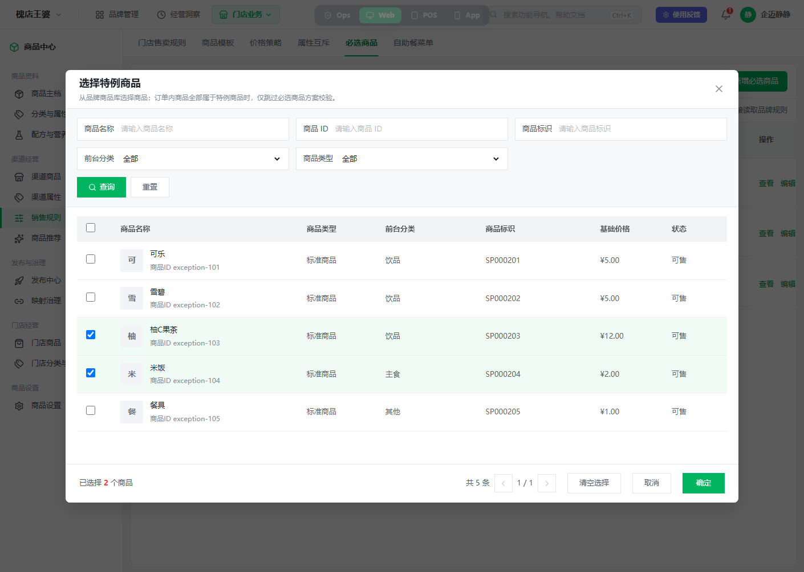

*图 6-9：从特例设置进入通用商品选择器，沿用商品名称、商品 ID、商品标识、前台分类和商品类型筛选；不展示门店、下发或同步信息。*

| 项目 | 规则 |
| --- | --- |
| 入口 | 品牌必选商品列表顶部“特例设置” |
| 配置对象 | 品牌商品；点击“选择商品”进入系统通用商品选择器，可多选、搜索、清空选择和分页 |
| 生效条件 | 当前订单全部商品均属于特例集合 |
| 生效结果 | 仅跳过必选商品方案校验；分类必选不受影响 |
| 混合订单 | 包含任一非特例商品时正常执行必选商品方案校验 |
| 数据读取 | 小程序与联网 POS 读取品牌配置；POS 断网使用最近缓存 |

特例设置不建立门店副本、同步状态、失败重试或门店查看入口，也不被分类必选读取或引用。

特例弹窗打开时以已保存商品生成编辑草稿；通用选择器“确定”只回填弹窗草稿，仍需点击特例设置弹窗“保存”才更新品牌配置。关闭或取消任一层级均不修改已保存配置。已选商品在特例弹窗中按名称与前台分类回显，可单条移除。

### 6.7 分类必选边界

分类必选继续在原分类能力中独立维护。本期不迁移、不合并、不把分类规则转换为必选商品方案。分类必选不校验、不读取特例设置；即使订单全部商品均为特例商品，分类必选仍按自身规则独立执行。

## 7. 数据与状态

### 7.1 核心对象

| 对象 | 说明 |
| --- | --- |
| 品牌必选方案 | 方案名称、状态、渠道、适用场景、时间、堂食专属桌位与高级设置、版本 |
| 方案商品规则 | 商品、必选类型、选择规则、订单类型、数量模式和数量值 |
| 方案适用门店 | 方案 ID 与具体门店 ID 的多对多关系 |
| 方案门店桌位区域 | 方案 ID、门店 ID 与该门店桌位区域 ID 的关系，仅开启区域限定时存在 |
| 品牌特例设置 | 品牌唯一版本及特例商品集合 |
| POS 规则缓存 | 当前门店最近成功的完整有效规则及特例快照，技术数据 |

不建立下发任务、门店任务明细、门店方案副本或门店覆盖对象。

### 7.2 状态

方案状态仅有启用、禁用。是否命中还需同时满足适用门店、渠道、适用场景和时间；堂食多人点餐再进一步匹配已开启的桌位类型/桌位区域条件。“已生效”不是可维护状态，不在列表使用。

新建方案默认启用，保存前执行唯一性校验；禁用方案启用前再次校验。校验失败不改变原状态，也不生成不完整版本。

### 7.3 并发与版本

- 每次保存生成递增版本并记录字段差异。
- 编辑时若品牌方案已被他人更新，阻止覆盖并提示刷新后重试。
- 运行时只返回完整、已启用且当前条件命中的版本。
- POS 只在完整快照校验成功后替换本地缓存，失败时继续使用上一成功版本。

## 8. 历史数据迁移

### 8.1 饮食历史方案

1. 原方案字段和适用门店关系原样迁移。
2. 原启用状态保持不变，避免升级后规则失效。
3. 缺少适用场景的历史方案，按原有堂食/外卖必选数量配置反推场景；历史自动加入购物车方案按堂食迁移；其他无法反推的方案默认堂食、外卖、外带全部适用，以保留升级前可见配置范围。
4. 缺少新增正餐字段时使用兼容默认值：不限定桌位类型、不限定桌位区域、永久有效、每天全天，高级设置按旧行为映射；不得把无桌位数据迁移为“全部桌位类型”。
5. 迁移前后按品牌方案数、方案商品数、适用门店关系数和启用状态核对。
6. 迁移预检按“门店 × 渠道 × 订单类型”识别历史启用方案冲突；冲突数据进入迁移异常清单，不允许在新链路中继续新增冲突。

### 8.2 正餐历史方案与门店副本（暂不考虑）

以下仅保留后续演进设计边界，本期不执行正餐历史方案与门店副本迁移。后续若启动迁移，正餐数据拟从“品牌方案 + 门店副本”回收为品牌方案范围：

1. 对每个门店副本生成标准化规则指纹，字段包含商品、数量、渠道、桌位、时间、高级设置和启用状态。
2. 同一品牌下规则指纹相同的门店副本聚合为一个品牌方案，相关门店写入适用门店关系。
3. 同源品牌方案若门店副本存在差异，按差异版本拆为多个品牌方案，并在名称后增加可识别后缀；不得静默丢弃门店差异。
4. 历史已停用副本迁移为禁用方案或排除门店关系，具体按原数据能否表达逐店状态确定；无法无损转换时进入迁移异常清单人工确认。
5. 保存旧品牌方案 ID、旧门店副本 ID 与新方案 ID 的映射，支持审计和回滚。
6. 切换前生成迁移快照；校验失败保持旧链路生效，不做部分切换。
7. 聚合或拆分后若形成同一门店、渠道、订单类型的多个启用方案，必须在切换前由业务确认保留方案或调整范围；系统不得静默选择优先级或自动停用其中一个方案。

### 8.3 迁移验收

| 指标 | 要求 |
| --- | --- |
| 饮食方案数与关系数 | 与迁移前一致，排除已确认废弃数据 |
| 规则内容 | 商品、数量、渠道、适用场景、桌位、时间和高级设置无静默丢失 |
| 启用状态 | 新旧执行结果一致 |
| 唯一性 | 切换到新读取链路的启用数据不存在相同门店、渠道、订单类型重复方案 |
| 可追溯 | 任一新方案可追溯旧方案；暂不迁移的正餐门店副本仍保留旧链路 |
| 回滚 | 灰度失败可恢复旧读取链路和数据快照 |

## 9. 异常、离线与降级

| 场景 | 产品行为 |
| --- | --- |
| 品牌规则服务短暂不可用 | 小程序按统一下单降级策略处理；不得静默绕过必选 |
| POS 断网 | 使用当前门店最近成功的完整缓存；界面提示离线状态及缓存更新时间 |
| POS 首次使用且无缓存 | 阻止依赖必选规则的离线结算，提示联网同步 |
| 缓存校验失败 | 保留上一成功版本并记录错误，不切换半份数据 |
| 方案引用商品失效 | 保存/启用前阻止；运行时发现异常需记录并走统一规则降级 |
| 未选适用场景 | 阻止保存并定位“适用场景”，提示至少选择一个 |
| 已选场景没有任何商品启用对应订单类型 | 阻止保存并提示具体场景需配置必选商品 |
| 创建或编辑启用方案时范围冲突 | 阻止保存，保留表单内容，展示冲突方案及重叠门店、渠道、订单类型 |
| 启用禁用方案时范围冲突 | 保持方案禁用，弹窗展示全部冲突方案及各自重叠范围 |
| 已选自动加入后勾选外卖或外带 | 自动切换为下单前检查，提示自动加入仅堂食多人点餐支持 |
| 未选堂食 | 不展示桌位区域和高级设置，不保存隐藏的堂食专属配置 |
| 切换为自动加入但已选商品不兼容 | 保持下单前检查，列出多规格、含做法或含加料的商品并要求移除 |
| 自动加入商品在编辑期间变为不兼容 | 保存时重新校验并阻止，提示刷新商品信息 |
| 开启桌位类型限定但未选择类型 | 阻止保存并定位高级设置 |
| 开启桌位区域限定但存在未配置门店 | 阻止保存并定位首家待配置门店 |
| 适用门店未维护桌位区域 | 标记异常并引导维护门店桌位区域，不允许以空集合保存 |
| 门店无适用方案 | 正常下单，不执行商品必选；分类必选仍独立判断 |
| 品牌特例暂不可用 | 不默认把全部商品视为特例；按统一安全降级策略处理 |

## 10. 审计与非功能要求

- 记录方案新建、编辑、复制、启用、禁用、删除、适用门店变化及字段前后值。
- 记录特例商品添加、移除、操作人和时间。
- 记录历史迁移映射、异常、重试和回滚结果。
- 品牌规则查询应支持按品牌、门店、渠道、桌位、时间一次返回完整有效规则，避免点单逐方案请求。
- POS 缓存需包含版本、完整性校验值、获取时间和适用门店；缓存数据加密及存储周期遵循终端安全规范。
- 列表和选择器覆盖 loading、first-empty、filtered-empty、error、no-permission、partial-permission 和 submitting。

## 11. 核心测试场景

| 编号 | 场景 | 预期 |
| --- | --- | --- |
| TC-01 | 新建方案未选门店 | 阻止保存并定位适用门店 |
| TC-01A | 新建方案填写合法配置并保存 | 返回列表并生成方案 ID、V1 记录，状态默认为启用，展示创建成功提示 |
| TC-02 | 编辑适用门店并保存 | 新范围内门店读取新规则，移除门店不再命中 |
| TC-03 | 自动加入购物车，堂食固定 2 份 | 每个设置商品加入 2 份 |
| TC-03A | 新建方案首次进入 | 默认选中下单前检查 |
| TC-03AA | 新建方案首次进入的适用场景 | 默认勾选堂食、外卖、外带，商品展示三种订单类型 |
| TC-03AB | 适用场景包含外卖或外带 | 自动加入购物车不可选，展示“仅堂食多人点餐支持” |
| TC-03AC | 已选自动加入后勾选外卖 | 系统切换为下单前检查并提示原因 |
| TC-03AD | 取消方案的外带场景 | 所有商品隐藏外带行且不保存外带生效状态 |
| TC-03B | 自动加入模式打开商品选择器 | 多规格、含做法或含加料商品被过滤，不出现在候选列表中 |
| TC-03C | 已选不兼容商品后切换自动加入 | 不切换类型，提示先移除不兼容商品 |
| TC-03D | 单个商品启用外带并配置 2 份 | 外带订单按 2 份执行，堂食/外卖配置不受影响 |
| TC-03E | 外带数量配置 | 仅支持固定数量，并展示“不支持按用餐人数” |
| TC-03F | 外卖数量配置 | 仅支持固定数量，并展示“不支持按用餐人数” |
| TC-04 | 下单前检查，4 个口味至少选 1 个 | 未选时提示，任一候选满足后通过 |
| TC-04A | 下单前检查并选择全部商品必选 | 每个设置商品均达到对应数量后通过 |
| TC-04B | 已选任选一种后切换为自动加入购物车 | 选择规则自动恢复为全部商品必选，任选一种不可选 |
| TC-05 | 新建启用方案与已有方案在门店、渠道、订单类型均重叠 | 阻止保存，保留表单内容并展示冲突方案及具体重叠组合 |
| TC-05A | 禁用方案启用时与已有方案范围冲突 | 保持禁用，弹窗展示全部冲突方案和重叠门店、渠道、订单类型 |
| TC-05B | 两方案门店重叠但渠道无交集 | 允许保存或启用，两方案分别在各自渠道生效 |
| TC-05C | 两方案门店、渠道重叠但订单类型无交集 | 允许保存或启用，两方案分别在各自订单类型生效 |
| TC-05D | 编辑启用方案扩大适用范围后产生冲突 | 阻止保存，不覆盖原启用版本 |
| TC-06 | 包间限定方案在散台下单 | 不命中该方案 |
| TC-06A | 未开启桌位类型和区域限定 | 任意桌位类型、区域均不因此被排除 |
| TC-06B | 两家门店分别配置不同桌位区域 | 各门店仅按本店选中区域命中，不串用区域 ID |
| TC-06C | 开启区域限定后新增门店未配置 | 阻止保存并标记新增门店待配置 |
| TC-06D | 取消堂食场景 | 桌位区域与高级设置整组隐藏，已填堂食专属草稿清理 |
| TC-06E | 重新勾选堂食场景 | 堂食商品行默认启用；桌位区域和高级设置默认关闭 |
| TC-07 | 指定时段外下单 | 不命中该方案 |
| TC-08 | 增加堂食人数 | 开启高级设置时重新检查或补充 |
| TC-09 | 允许修改数量关闭 | 点餐端不可减少自动加入商品 |
| TC-10 | 订单只有米饭和饮料且均为特例 | 仅跳过必选商品方案校验；分类必选仍独立执行 |
| TC-10A | 订单商品均为特例，但不满足分类必选 | 必选商品方案不校验；分类必选仍阻止下单并按自身规则提示 |
| TC-11 | 特例商品与主餐混合 | 正常执行必选校验 |
| TC-11A | 特例设置选择商品后取消外层弹窗 | 不更新品牌特例集合；重新打开仍显示原配置 |
| TC-12 | 禁用方案 | 适用门店新订单不再命中 |
| TC-13 | POS 断网且有缓存 | 按最近成功缓存执行 |
| TC-14 | POS 断网且无缓存 | 阻止相关离线结算并提示联网 |
| TC-15 | 饮食历史迁移 | 原方案与适用门店关系继续生效 |

## 12. 验收标准

1. 品牌列表只按方案名称搜索，状态使用启用/禁用。
2. 列表展示适用门店，不出现下发、最近下发、同步状态或门店调整标签。
3. 新建/编辑页在适用渠道下展示适用场景（堂食、外卖、外带），至少选择一个；必选商品只展示已选场景对应的订单类型，每个商品仍可独立勾选或取消。
4. 每个已选适用场景至少有一个必选商品启用对应订单类型，否则阻止保存并提示具体场景。
5. 新建方案默认下单前检查；保存成功后返回列表、生成方案 ID 和 V1 记录且默认启用；自动加入购物车仅堂食多人点餐支持，适用场景包含外卖或外带时不可选，且只允许全部商品必选、单规格、无做法、无加料商品；选择器过滤不兼容商品，场景变更、类型切换和保存均有兜底校验。
6. 创建、编辑已启用方案和启用禁用方案时，系统按“门店 × 渠道 × 订单类型”校验唯一性；三个维度均有交集即阻止，且明确展示冲突方案及重叠范围；任一维度无交集时允许并存。
7. 堂食支持固定数量或与用餐人数相同；外卖与外带仅支持固定数量，并显示“不支持按用餐人数”。
8. 仅当适用场景勾选堂食时，适用门店才展示桌位区域，页面才展示高级设置；其中的桌位类型、桌位区域、人数重触发和数量修改均明确说明“仅对堂食多人点餐生效”。
9. 桌位类型限定位于高级设置，默认关闭且不预选全部；开启后必须显式选择至少一个类型。
10. 适用门店使用统一选择器，至少选择一家并按具体门店 ID 保存；桌位区域限定默认关闭，开启后必须按每个已选门店分别配置至少一个本店区域。
11. 保存后小程序与联网 POS 可按当前门店读取品牌最新有效规则，无门店业务副本。
12. 门店商品区域无“门店必选商品”菜单。
13. 特例设置不选择门店，并使用系统通用商品选择器；纯特例订单仅跳过必选商品方案，分类必选始终按自身规则独立执行；混合订单正常执行必选商品方案校验，取消编辑不更新已保存配置。
14. POS 断网使用完整缓存，缓存失败不覆盖上一成功版本。
15. 饮食历史规则无损保留；历史启用冲突在切换新链路前进入异常清单并完成处理；正餐门店副本本期暂不迁移。
16. 订单类型与必选数量按当前已选场景同行配置；仅堂食支持固定数量或按人数，外卖与外带仅支持固定数量。
17. 原型通过 1440px、长方案名、长门店名、空状态、无权限和保存中状态验收。

## 13. 待确认项

1. 后续是否扩展“任选 N 种”；本期仅支持“全部商品必选 / 任选一种”。
2. 品牌规则修改后，联网 POS 的刷新触发采用订单前拉取、长连接通知还是短周期轮询，由技术方案确认，但不得要求人工下发。
3. 小程序在品牌规则服务不可用时的阻断/降级口径需与交易稳定性负责人确认。
4. 后续若启动正餐门店副本迁移，逐店启用状态无法无损映射时，异常清单由谁审批确认。
